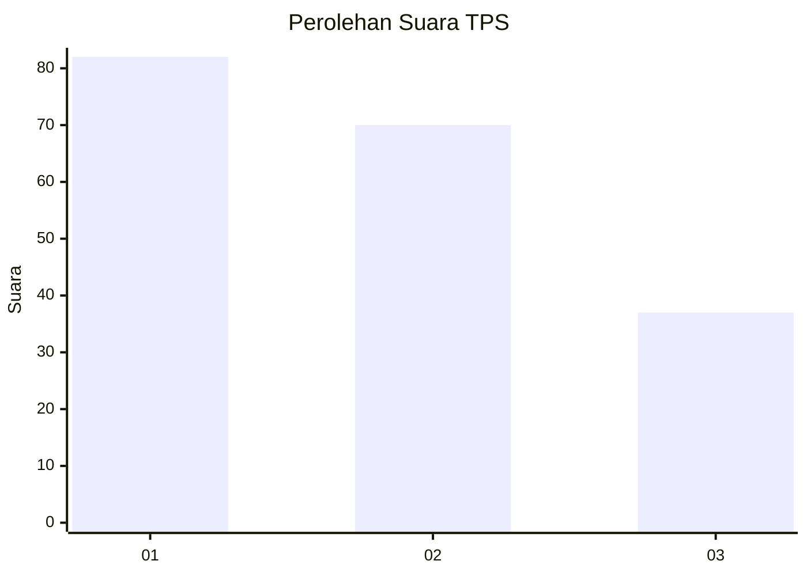
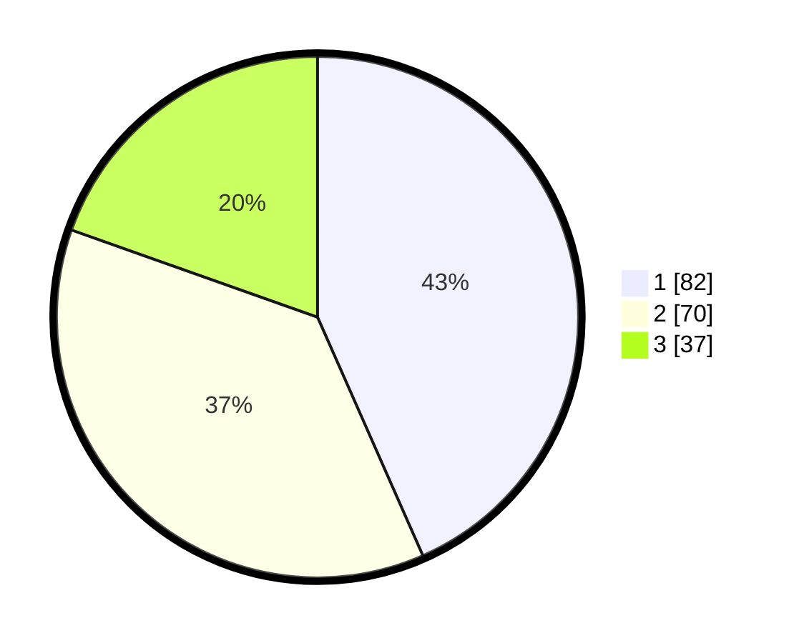

# Hasil

## Grafik

## Tabel

| No. | Nama Paslon    | Suara | Suara (raw) | Persentase |
|:--- |:-------------- | -----:| -----------:| ----------:|
| 1   | ANIES MUHAIMIN | 82    | [82][p-1]   | 43,39      |
| 2   | PRABOWO GIBRAN | 70    | [70][p-2]   | 37,04      |
| 3   | GANJAR MAHFUD  | 37    | [37][p-3]   | 19,58      |

[p-1]: https://github.com/gigit-pemilu/pemilu-2024-35-jawa-timur/blob/main/pilpres/hitung-suara/sub/35-jawa-timur/sub/29-sumenep/sub/07-lenteng/sub/2007-poreh/sub/006-tps/sub/paslon-1.txt
[p-2]: https://github.com/gigit-pemilu/pemilu-2024-35-jawa-timur/blob/main/pilpres/hitung-suara/sub/35-jawa-timur/sub/29-sumenep/sub/07-lenteng/sub/2007-poreh/sub/006-tps/sub/paslon-2.txt
[p-3]: https://github.com/gigit-pemilu/pemilu-2024-35-jawa-timur/blob/main/pilpres/hitung-suara/sub/35-jawa-timur/sub/29-sumenep/sub/07-lenteng/sub/2007-poreh/sub/006-tps/sub/paslon-3.txt

## Foto C Plano

https://sirekap-obj-formc.kpu.go.id/083b/pemilu/ppwp/35/29/07/20/07/3529072007006-20240215-204836--01b84109-79fb-4c3c-a67e-14b5fc6ebffa.jpg

https://sirekap-obj-formc.kpu.go.id/083b/pemilu/ppwp/35/29/07/20/07/3529072007006-20240215-204909--c27aba03-e7fa-48cb-a3bc-6c61fae86064.jpg

https://sirekap-obj-formc.kpu.go.id/083b/pemilu/ppwp/35/29/07/20/07/3529072007006-20240214-212820--62affbeb-c956-4ae1-8166-5ed1ae1b2b2e.jpg

## Metadata

| Key        | Value               |
| ---------- | ------------------- |
| Time Stamp | 2024-02-24 22:31:28 |

