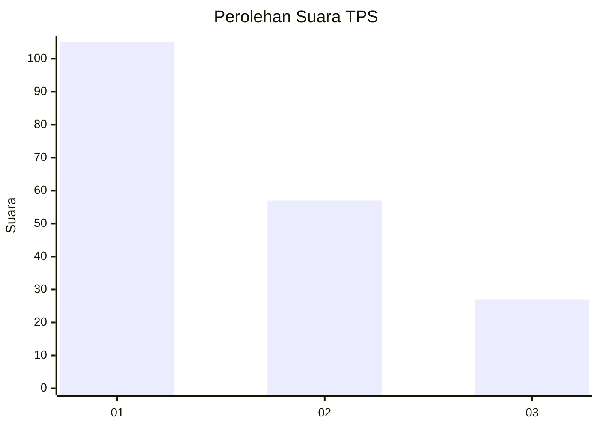
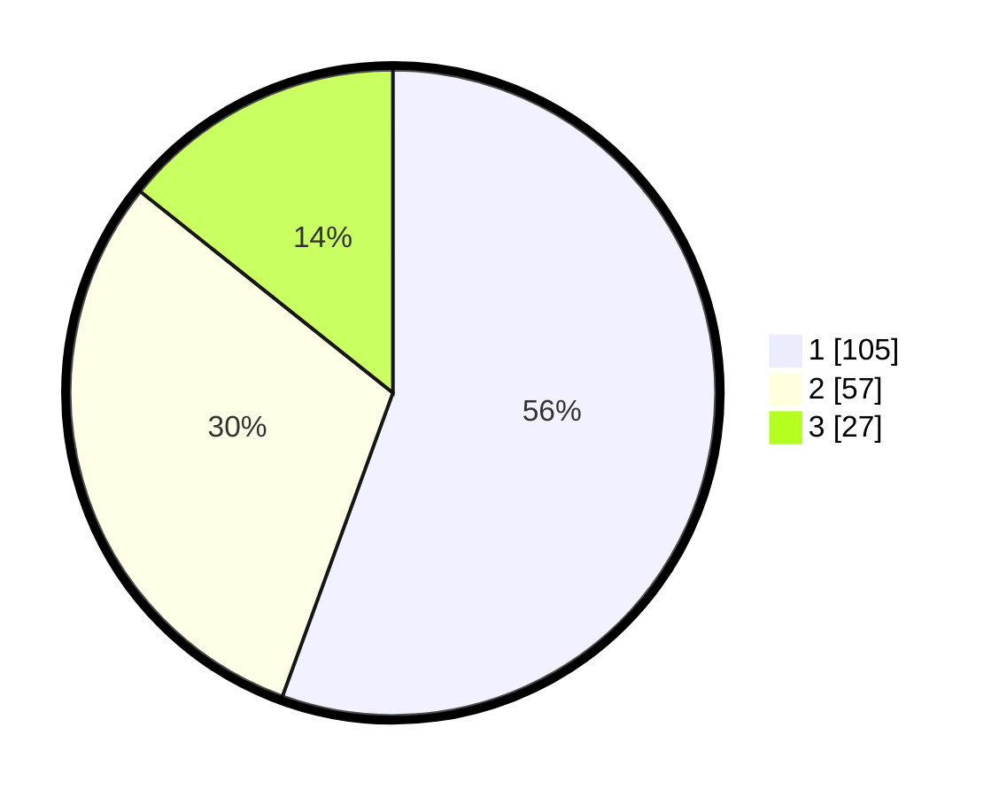

# Hasil

## Grafik

## Tabel

| No. | Nama Paslon    | Suara | Suara (raw) | Persentase |
|:--- |:-------------- | -----:| -----------:| ----------:|
| 1   | ANIES MUHAIMIN | 105   | [105][p-1]  | 55,56      |
| 2   | PRABOWO GIBRAN | 57    | [57][p-2]   | 30,16      |
| 3   | GANJAR MAHFUD  | 27    | [27][p-3]   | 14,29      |

[p-1]: https://github.com/gigit-pemilu/pemilu-2024/blob/main/pilpres/hitung-suara/sub/35-jawa-timur/sub/29-sumenep/sub/07-lenteng/sub/2008-lenteng-timur/sub/001-tps/sub/paslon-1.txt
[p-2]: https://github.com/gigit-pemilu/pemilu-2024/blob/main/pilpres/hitung-suara/sub/35-jawa-timur/sub/29-sumenep/sub/07-lenteng/sub/2008-lenteng-timur/sub/001-tps/sub/paslon-2.txt
[p-3]: https://github.com/gigit-pemilu/pemilu-2024/blob/main/pilpres/hitung-suara/sub/35-jawa-timur/sub/29-sumenep/sub/07-lenteng/sub/2008-lenteng-timur/sub/001-tps/sub/paslon-3.txt

## Foto C Plano

https://sirekap-obj-formc.kpu.go.id/9dc8/pemilu/ppwp/35/29/07/20/08/3529072008001-20240215-002133--4a288229-9f9e-449d-a1ee-50c4630366cb.jpg

https://sirekap-obj-formc.kpu.go.id/9dc8/pemilu/ppwp/35/29/07/20/08/3529072008001-20240215-002303--9689bb54-3020-4700-84bc-4aa60cb95026.jpg

https://sirekap-obj-formc.kpu.go.id/9dc8/pemilu/ppwp/35/29/07/20/08/3529072008001-20240215-002454--33f66640-6c65-42da-bf21-3ac21ee4fe4c.jpg

## Metadata

| Key        | Value               |
| ---------- | ------------------- |
| Time Stamp | 2024-02-15 21:01:18 |

