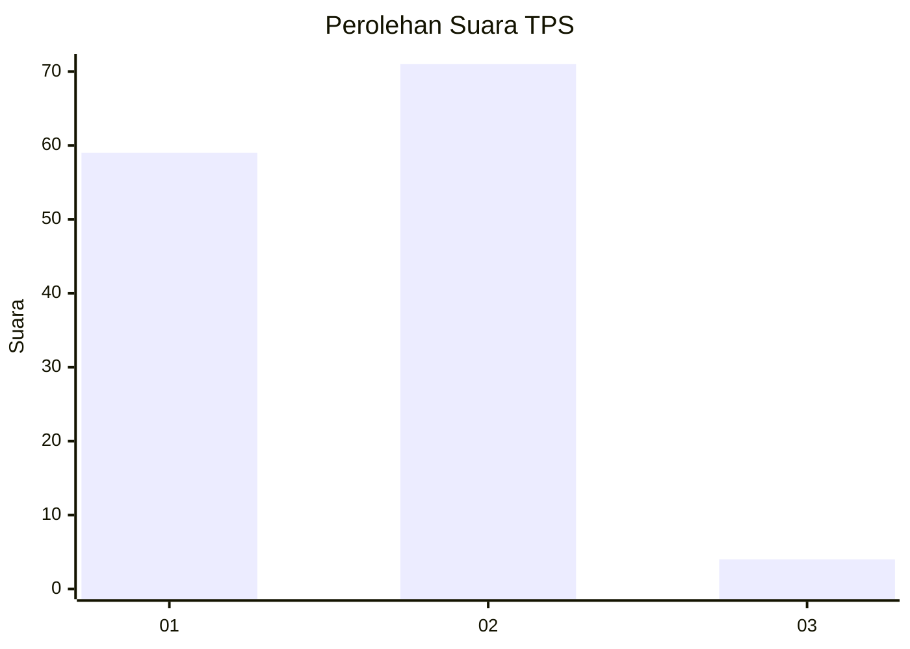
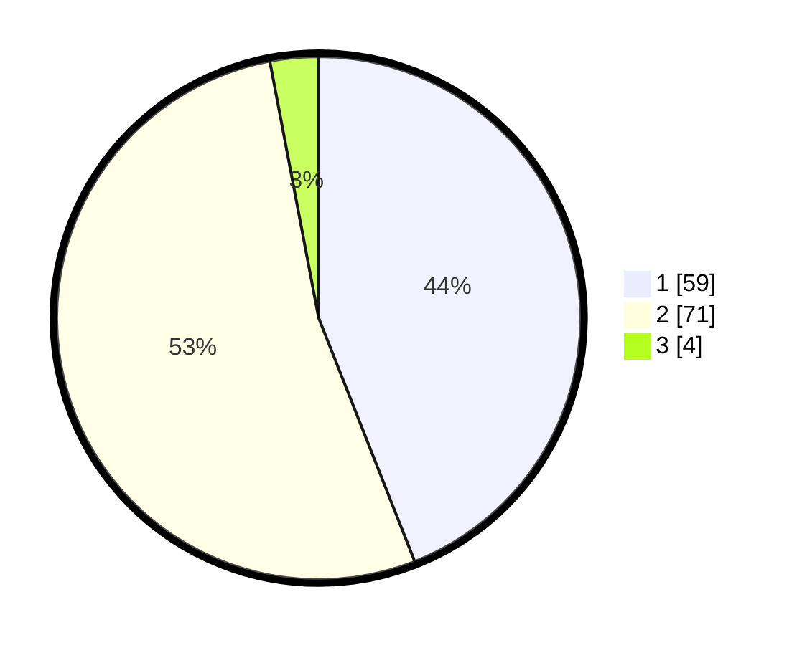

# Hasil

## Grafik

## Tabel

| No. | Nama Paslon    | Suara | Suara (raw) | Persentase |
|:--- |:-------------- | -----:| -----------:| ----------:|
| 1   | ANIES MUHAIMIN | 59    | [59][p-1]   | 44,03      |
| 2   | PRABOWO GIBRAN | 71    | [71][p-2]   | 52,99      |
| 3   | GANJAR MAHFUD  | 4     | [4][p-3]    | 2,99       |

[p-1]: https://github.com/gigit-pemilu/pemilu-2024/blob/main/pilpres/hitung-suara/sub/35-jawa-timur/sub/29-sumenep/sub/07-lenteng/sub/2008-lenteng-timur/sub/008-tps/sub/paslon-1.txt
[p-2]: https://github.com/gigit-pemilu/pemilu-2024/blob/main/pilpres/hitung-suara/sub/35-jawa-timur/sub/29-sumenep/sub/07-lenteng/sub/2008-lenteng-timur/sub/008-tps/sub/paslon-2.txt
[p-3]: https://github.com/gigit-pemilu/pemilu-2024/blob/main/pilpres/hitung-suara/sub/35-jawa-timur/sub/29-sumenep/sub/07-lenteng/sub/2008-lenteng-timur/sub/008-tps/sub/paslon-3.txt

## Foto C Plano

https://sirekap-obj-formc.kpu.go.id/a617/pemilu/ppwp/35/29/07/20/08/3529072008008-20240214-214449--fd0c55b2-c494-4d65-ad6e-56021145870b.jpg

https://sirekap-obj-formc.kpu.go.id/a617/pemilu/ppwp/35/29/07/20/08/3529072008008-20240214-155708--ad7d1db8-692b-412b-acc1-588e37495676.jpg

https://sirekap-obj-formc.kpu.go.id/a617/pemilu/ppwp/35/29/07/20/08/3529072008008-20240214-214234--5edd3377-e0de-4787-8673-13aa432dd040.jpg

## Metadata

| Key        | Value               |
| ---------- | ------------------- |
| Time Stamp | 2024-02-14 21:46:01 |

