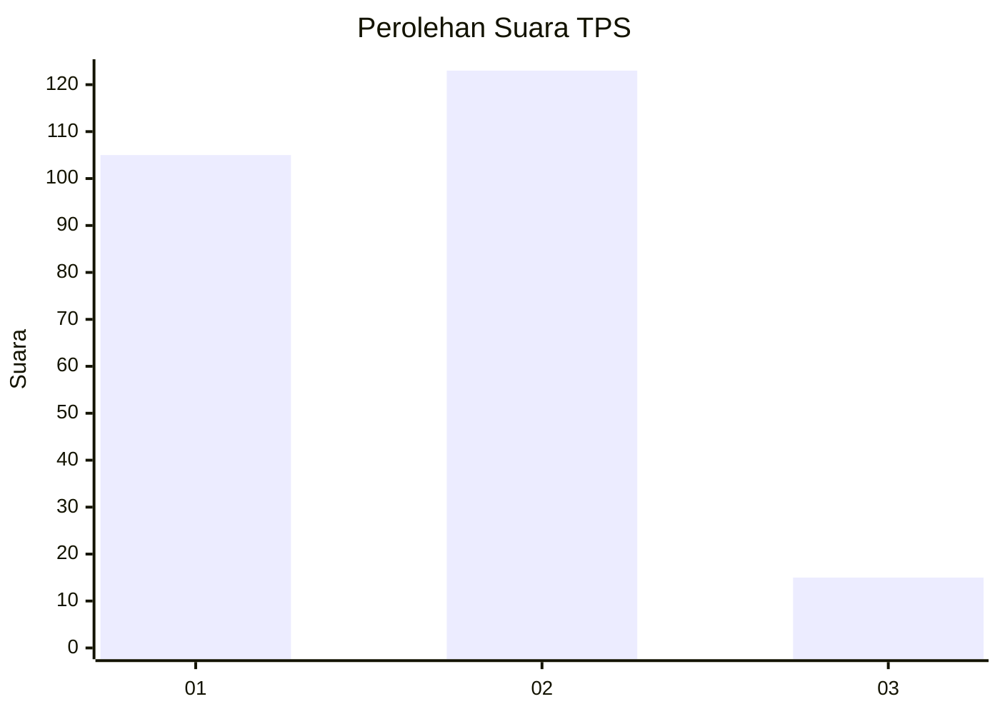
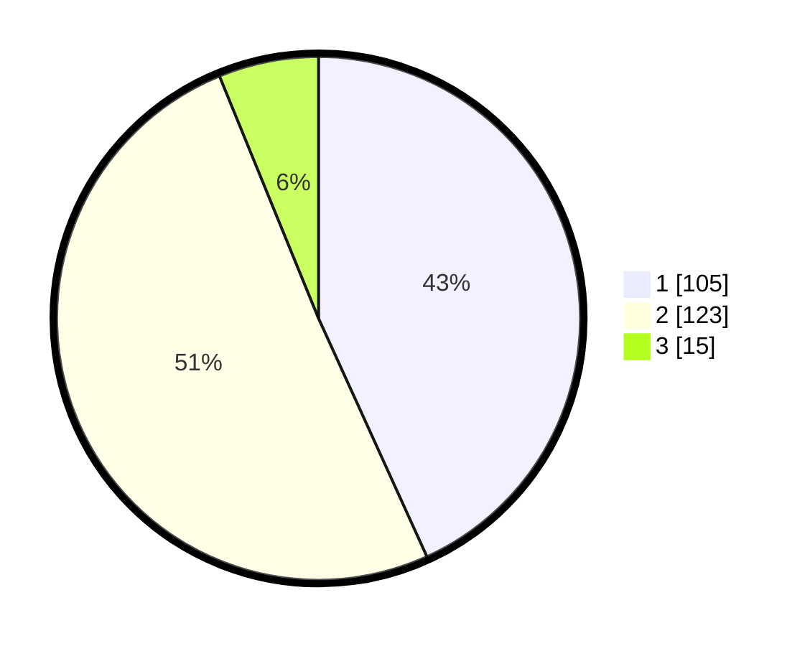

# Hasil

## Grafik

## Tabel

| No. | Nama Paslon    | Suara | Suara (raw) | Persentase |
|:--- |:-------------- | -----:| -----------:| ----------:|
| 1   | ANIES MUHAIMIN | 105   | [105][p-1]  | 43,21      |
| 2   | PRABOWO GIBRAN | 123   | [123][p-2]  | 50,62      |
| 3   | GANJAR MAHFUD  | 15    | [15][p-3]   | 6,17       |

[p-1]: https://github.com/gigit-pemilu/pemilu-2024/blob/main/pilpres/hitung-suara/sub/35-jawa-timur/sub/29-sumenep/sub/07-lenteng/sub/2010-lenteng-barat/sub/005-tps/sub/paslon-1.txt
[p-2]: https://github.com/gigit-pemilu/pemilu-2024/blob/main/pilpres/hitung-suara/sub/35-jawa-timur/sub/29-sumenep/sub/07-lenteng/sub/2010-lenteng-barat/sub/005-tps/sub/paslon-2.txt
[p-3]: https://github.com/gigit-pemilu/pemilu-2024/blob/main/pilpres/hitung-suara/sub/35-jawa-timur/sub/29-sumenep/sub/07-lenteng/sub/2010-lenteng-barat/sub/005-tps/sub/paslon-3.txt

## Foto C Plano

https://sirekap-obj-formc.kpu.go.id/b06e/pemilu/ppwp/35/29/07/20/10/3529072010005-20240214-225509--7df5f950-ba26-408e-bc43-0a77652e5468.jpg

https://sirekap-obj-formc.kpu.go.id/b06e/pemilu/ppwp/35/29/07/20/10/3529072010005-20240215-072515--6a41f5c0-20c0-4248-84b0-e591cd5a4df5.jpg

https://sirekap-obj-formc.kpu.go.id/b06e/pemilu/ppwp/35/29/07/20/10/3529072010005-20240214-225859--76033dae-149e-424d-83b9-ebede7487cf9.jpg

## Metadata

| Key        | Value               |
| ---------- | ------------------- |
| Time Stamp | 2024-02-15 22:30:27 |

