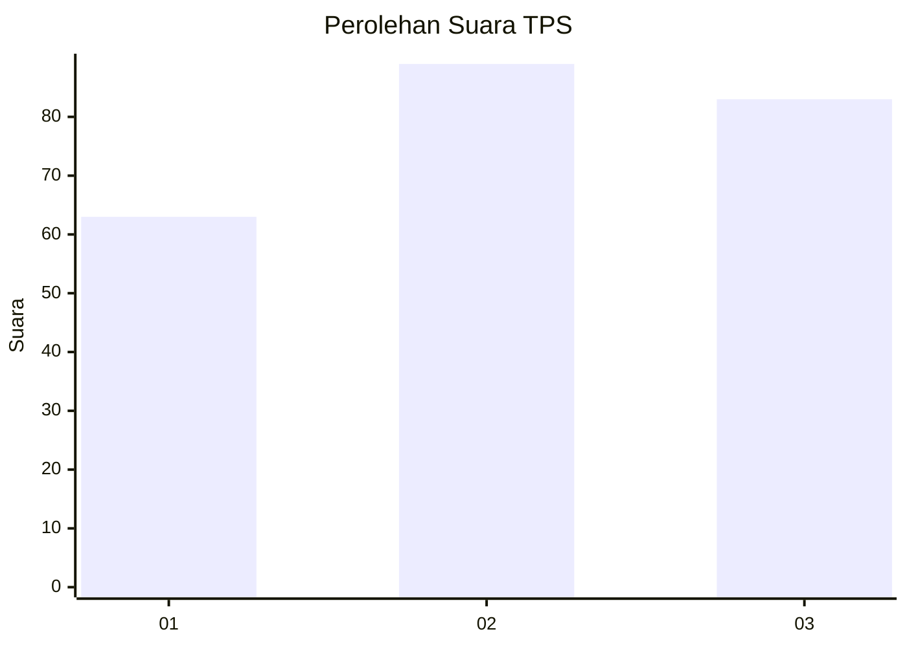
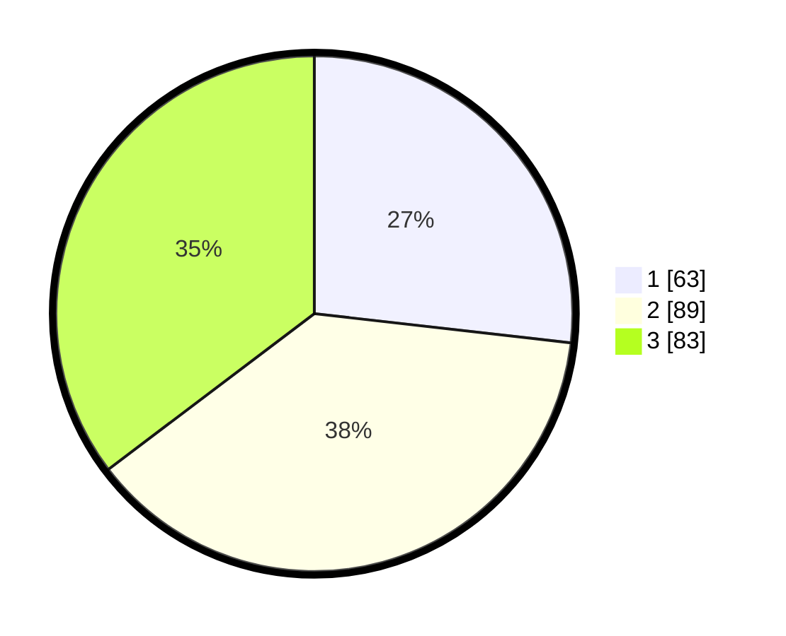

# Hasil

## Grafik

## Tabel

| No. | Nama Paslon    | Suara | Suara (raw) | Persentase |
|:--- |:-------------- | -----:| -----------:| ----------:|
| 1   | ANIES MUHAIMIN | 63    | [63][p-1]   | 26,81      |
| 2   | PRABOWO GIBRAN | 89    | [89][p-2]   | 37,87      |
| 3   | GANJAR MAHFUD  | 83    | [83][p-3]   | 35,32      |

[p-1]: https://github.com/gigit-pemilu/pemilu-2024-35-jawa-timur/blob/main/pilpres/hitung-suara/sub/35-jawa-timur/sub/29-sumenep/sub/07-lenteng/sub/2010-lenteng-barat/sub/011-tps/sub/paslon-1.txt
[p-2]: https://github.com/gigit-pemilu/pemilu-2024-35-jawa-timur/blob/main/pilpres/hitung-suara/sub/35-jawa-timur/sub/29-sumenep/sub/07-lenteng/sub/2010-lenteng-barat/sub/011-tps/sub/paslon-2.txt
[p-3]: https://github.com/gigit-pemilu/pemilu-2024-35-jawa-timur/blob/main/pilpres/hitung-suara/sub/35-jawa-timur/sub/29-sumenep/sub/07-lenteng/sub/2010-lenteng-barat/sub/011-tps/sub/paslon-3.txt

## Foto C Plano

https://sirekap-obj-formc.kpu.go.id/3263/pemilu/ppwp/35/29/07/20/10/3529072010011-20240215-054452--3b3170a9-d7fb-4765-9748-0173e33d3d83.jpg

https://sirekap-obj-formc.kpu.go.id/3263/pemilu/ppwp/35/29/07/20/10/3529072010011-20240215-054455--10a85143-0e91-4148-823d-9adda7367e1d.jpg

https://sirekap-obj-formc.kpu.go.id/3263/pemilu/ppwp/35/29/07/20/10/3529072010011-20240215-054457--e944827a-8478-402b-a8ef-a5a5170e6a7b.jpg

## Metadata

| Key        | Value               |
| ---------- | ------------------- |
| Time Stamp | 2024-02-15 22:00:27 |

