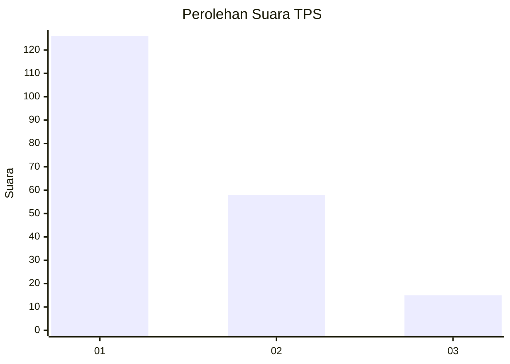
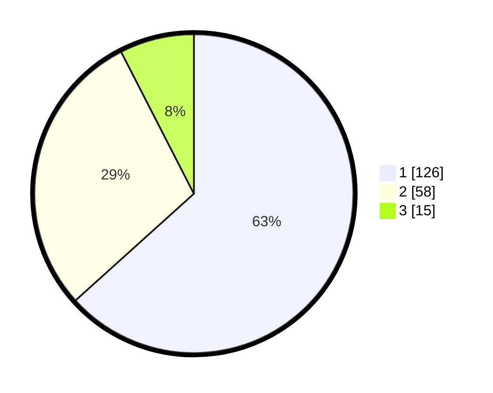

# Hasil

## Grafik

## Tabel

| No. | Nama Paslon    | Suara | Suara (raw) | Persentase |
|:--- |:-------------- | -----:| -----------:| ----------:|
| 1   | ANIES MUHAIMIN | 126   | [126][p-1]  | 63,32      |
| 2   | PRABOWO GIBRAN | 58    | [58][p-2]   | 29,15      |
| 3   | GANJAR MAHFUD  | 15    | [15][p-3]   | 7,54       |

[p-1]: https://github.com/gigit-pemilu/pemilu-2024/blob/main/pilpres/hitung-suara/sub/35-jawa-timur/sub/29-sumenep/sub/07-lenteng/sub/2011-banaresep-barat/sub/001-tps/sub/paslon-1.txt
[p-2]: https://github.com/gigit-pemilu/pemilu-2024/blob/main/pilpres/hitung-suara/sub/35-jawa-timur/sub/29-sumenep/sub/07-lenteng/sub/2011-banaresep-barat/sub/001-tps/sub/paslon-2.txt
[p-3]: https://github.com/gigit-pemilu/pemilu-2024/blob/main/pilpres/hitung-suara/sub/35-jawa-timur/sub/29-sumenep/sub/07-lenteng/sub/2011-banaresep-barat/sub/001-tps/sub/paslon-3.txt

## Foto C Plano

https://sirekap-obj-formc.kpu.go.id/c504/pemilu/ppwp/35/29/07/20/11/3529072011001-20240215-002255--01436578-4a17-4b37-bfcb-155ea6bf6067.jpg

https://sirekap-obj-formc.kpu.go.id/c504/pemilu/ppwp/35/29/07/20/11/3529072011001-20240215-002323--4e2e6e20-12e3-4409-a38d-91d77d0be9bc.jpg

https://sirekap-obj-formc.kpu.go.id/c504/pemilu/ppwp/35/29/07/20/11/3529072011001-20240215-002354--aa18625a-c2cc-4b93-9e93-a17fd58a41b4.jpg

## Metadata

| Key        | Value               |
| ---------- | ------------------- |
| Time Stamp | 2024-02-16 12:51:22 |

