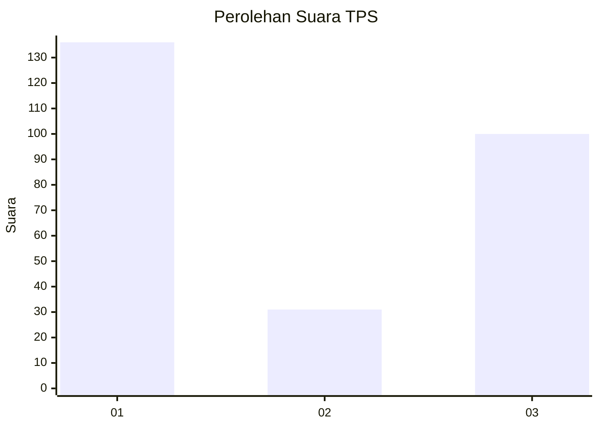
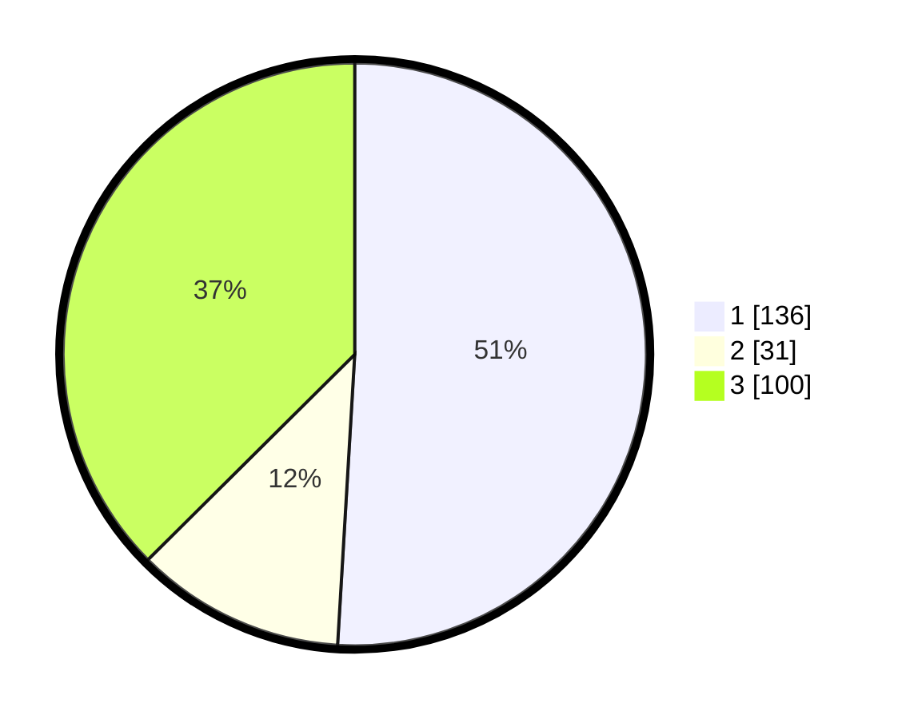

# Hasil

## Grafik

## Tabel

| No. | Nama Paslon    | Suara | Suara (raw) | Persentase |
|:--- |:-------------- | -----:| -----------:| ----------:|
| 1   | ANIES MUHAIMIN | 136   | [136][p-1]  | 50,94      |
| 2   | PRABOWO GIBRAN | 31    | [31][p-2]   | 11,61      |
| 3   | GANJAR MAHFUD  | 100   | [100][p-3]  | 37,45      |

[p-1]: https://github.com/gigit-pemilu/pemilu-2024-35-jawa-timur/blob/main/pilpres/hitung-suara/sub/35-jawa-timur/sub/29-sumenep/sub/07-lenteng/sub/2012-billapora-rebba/sub/010-tps/sub/paslon-1.txt
[p-2]: https://github.com/gigit-pemilu/pemilu-2024-35-jawa-timur/blob/main/pilpres/hitung-suara/sub/35-jawa-timur/sub/29-sumenep/sub/07-lenteng/sub/2012-billapora-rebba/sub/010-tps/sub/paslon-2.txt
[p-3]: https://github.com/gigit-pemilu/pemilu-2024-35-jawa-timur/blob/main/pilpres/hitung-suara/sub/35-jawa-timur/sub/29-sumenep/sub/07-lenteng/sub/2012-billapora-rebba/sub/010-tps/sub/paslon-3.txt

## Foto C Plano

https://sirekap-obj-formc.kpu.go.id/eba6/pemilu/ppwp/35/29/07/20/12/3529072012010-20240214-203213--9a4ad63c-eac7-44d7-8b65-04c8c7f76a3d.jpg

https://sirekap-obj-formc.kpu.go.id/eba6/pemilu/ppwp/35/29/07/20/12/3529072012010-20240214-203307--b8fdfdc9-1a20-428f-882b-5661445d0480.jpg

## Metadata

| Key        | Value               |
| ---------- | ------------------- |
| Time Stamp | 2024-02-25 15:00:00 |

