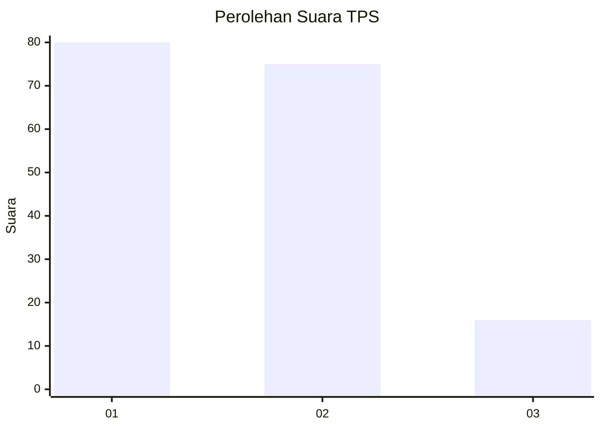
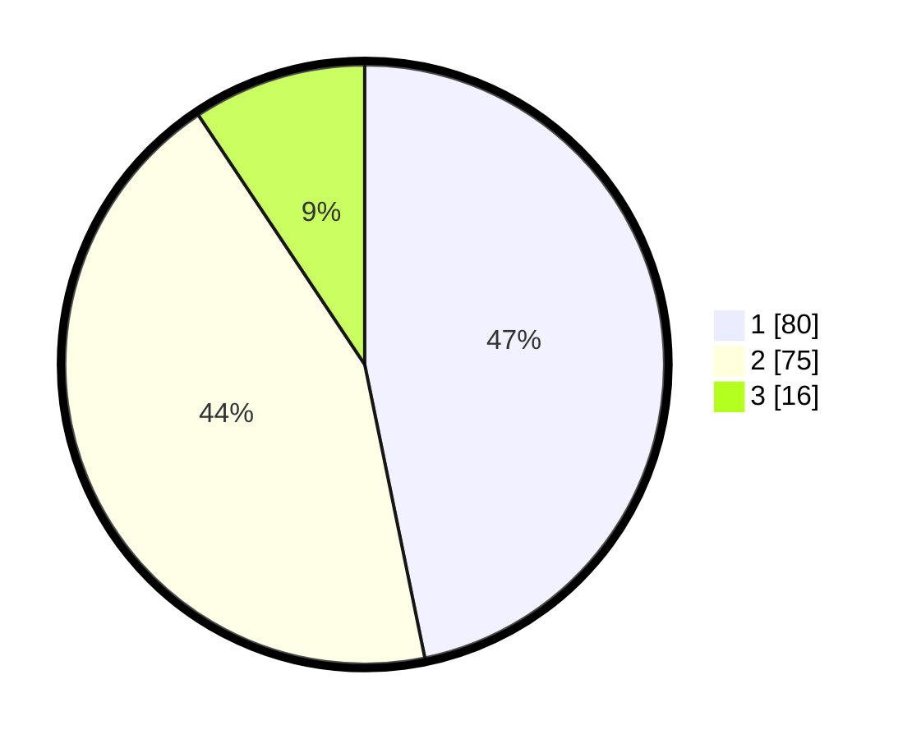

# Hasil

## Grafik

## Tabel

| No. | Nama Paslon    | Suara | Suara (raw) | Persentase |
|:--- |:-------------- | -----:| -----------:| ----------:|
| 1   | ANIES MUHAIMIN | 80    | [80][p-1]   | 46,78      |
| 2   | PRABOWO GIBRAN | 75    | [75][p-2]   | 43,86      |
| 3   | GANJAR MAHFUD  | 16    | [16][p-3]   | 9,36       |

[p-1]: https://github.com/gigit-pemilu/pemilu-2024-35-jawa-timur/blob/main/pilpres/hitung-suara/sub/35-jawa-timur/sub/29-sumenep/sub/07-lenteng/sub/2013-lembung-barat/sub/001-tps/sub/paslon-1.txt
[p-2]: https://github.com/gigit-pemilu/pemilu-2024-35-jawa-timur/blob/main/pilpres/hitung-suara/sub/35-jawa-timur/sub/29-sumenep/sub/07-lenteng/sub/2013-lembung-barat/sub/001-tps/sub/paslon-2.txt
[p-3]: https://github.com/gigit-pemilu/pemilu-2024-35-jawa-timur/blob/main/pilpres/hitung-suara/sub/35-jawa-timur/sub/29-sumenep/sub/07-lenteng/sub/2013-lembung-barat/sub/001-tps/sub/paslon-3.txt

## Foto C Plano

https://sirekap-obj-formc.kpu.go.id/18da/pemilu/ppwp/35/29/07/20/13/3529072013001-20240215-134227--692597fb-cc6b-43ee-b436-fc8ca3390333.jpg

https://sirekap-obj-formc.kpu.go.id/18da/pemilu/ppwp/35/29/07/20/13/3529072013001-20240215-134326--7a617dae-4a54-41b3-a804-25b36c3fd49b.jpg

https://sirekap-obj-formc.kpu.go.id/18da/pemilu/ppwp/35/29/07/20/13/3529072013001-20240215-134404--b51dd51c-b2f9-4c20-ba0f-fd268e421934.jpg

## Metadata

| Key        | Value               |
| ---------- | ------------------- |
| Time Stamp | 2024-02-16 12:51:22 |

