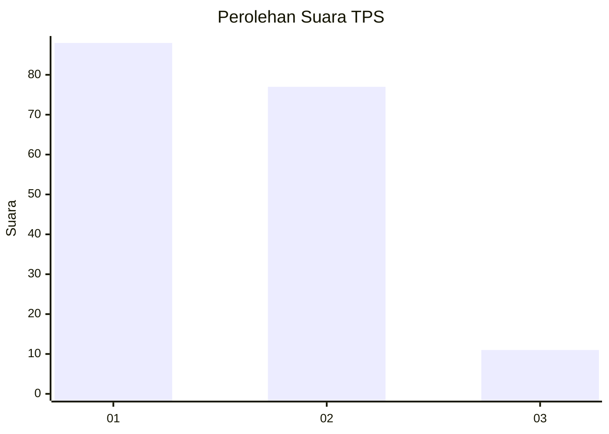
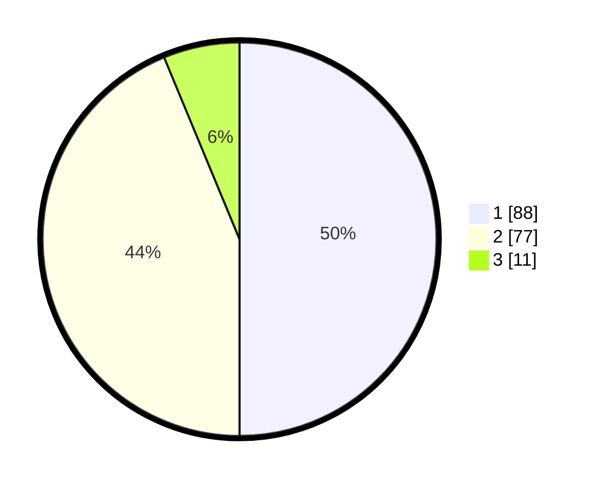

# Hasil

## Grafik

## Tabel

| No. | Nama Paslon    | Suara | Suara (raw) | Persentase |
|:--- |:-------------- | -----:| -----------:| ----------:|
| 1   | ANIES MUHAIMIN | 88    | [88][p-1]   | 50,00      |
| 2   | PRABOWO GIBRAN | 77    | [77][p-2]   | 43,75      |
| 3   | GANJAR MAHFUD  | 11    | [11][p-3]   | 6,25       |

[p-1]: https://github.com/gigit-pemilu/pemilu-2024/blob/main/pilpres/hitung-suara/sub/35-jawa-timur/sub/29-sumenep/sub/07-lenteng/sub/2013-lembung-barat/sub/002-tps/sub/paslon-1.txt
[p-2]: https://github.com/gigit-pemilu/pemilu-2024/blob/main/pilpres/hitung-suara/sub/35-jawa-timur/sub/29-sumenep/sub/07-lenteng/sub/2013-lembung-barat/sub/002-tps/sub/paslon-2.txt
[p-3]: https://github.com/gigit-pemilu/pemilu-2024/blob/main/pilpres/hitung-suara/sub/35-jawa-timur/sub/29-sumenep/sub/07-lenteng/sub/2013-lembung-barat/sub/002-tps/sub/paslon-3.txt

## Foto C Plano

https://sirekap-obj-formc.kpu.go.id/18ca/pemilu/ppwp/35/29/07/20/13/3529072013002-20240215-131750--5b9fb6fe-682d-41c9-9c45-26b191f8493a.jpg

https://sirekap-obj-formc.kpu.go.id/18ca/pemilu/ppwp/35/29/07/20/13/3529072013002-20240215-131900--ec36d704-add7-4bb6-9b62-91a5aaea9c3f.jpg

https://sirekap-obj-formc.kpu.go.id/18ca/pemilu/ppwp/35/29/07/20/13/3529072013002-20240215-131940--f2f66760-cc09-4a53-8389-187833a80577.jpg

## Metadata

| Key        | Value               |
| ---------- | ------------------- |
| Time Stamp | 2024-02-25 11:00:00 |

