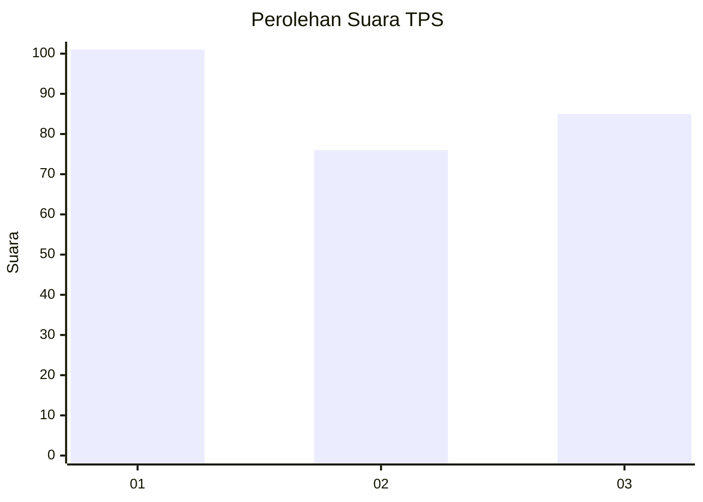
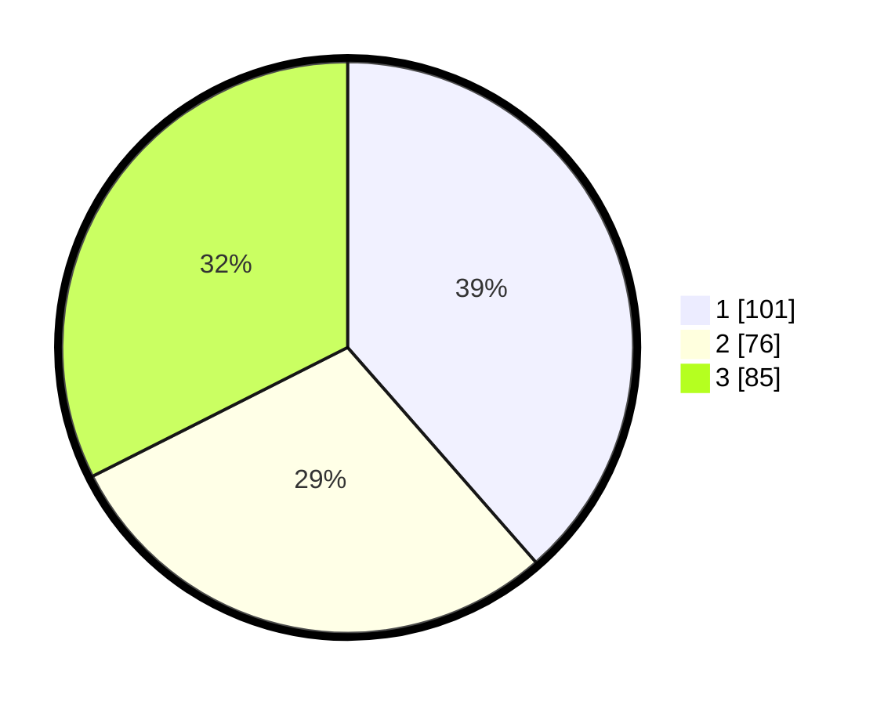

# Hasil

## Grafik

## Tabel

| No. | Nama Paslon    | Suara | Suara (raw) | Persentase |
|:--- |:-------------- | -----:| -----------:| ----------:|
| 1   | ANIES MUHAIMIN | 101   | [101][p-1]  | 38,55      |
| 2   | PRABOWO GIBRAN | 76    | [76][p-2]   | 29,01      |
| 3   | GANJAR MAHFUD  | 85    | [85][p-3]   | 32,44      |

[p-1]: https://github.com/gigit-pemilu/pemilu-2024-35-jawa-timur/blob/main/pilpres/hitung-suara/sub/35-jawa-timur/sub/29-sumenep/sub/07-lenteng/sub/2013-lembung-barat/sub/008-tps/sub/paslon-1.txt
[p-2]: https://github.com/gigit-pemilu/pemilu-2024-35-jawa-timur/blob/main/pilpres/hitung-suara/sub/35-jawa-timur/sub/29-sumenep/sub/07-lenteng/sub/2013-lembung-barat/sub/008-tps/sub/paslon-2.txt
[p-3]: https://github.com/gigit-pemilu/pemilu-2024-35-jawa-timur/blob/main/pilpres/hitung-suara/sub/35-jawa-timur/sub/29-sumenep/sub/07-lenteng/sub/2013-lembung-barat/sub/008-tps/sub/paslon-3.txt

## Foto C Plano

https://sirekap-obj-formc.kpu.go.id/6386/pemilu/ppwp/35/29/07/20/13/3529072013008-20240215-131929--27a97a17-e8a5-4fa3-bb9b-768abfa2ca52.jpg

https://sirekap-obj-formc.kpu.go.id/6386/pemilu/ppwp/35/29/07/20/13/3529072013008-20240215-132312--af6fd9dd-88f8-4b19-bc3d-42ba4fdba4b3.jpg

https://sirekap-obj-formc.kpu.go.id/6386/pemilu/ppwp/35/29/07/20/13/3529072013008-20240215-132406--192433d7-8bf4-4035-af0e-a8e4bf5d359e.jpg

## Metadata

| Key        | Value               |
| ---------- | ------------------- |
| Time Stamp | 2024-02-25 08:00:00 |

