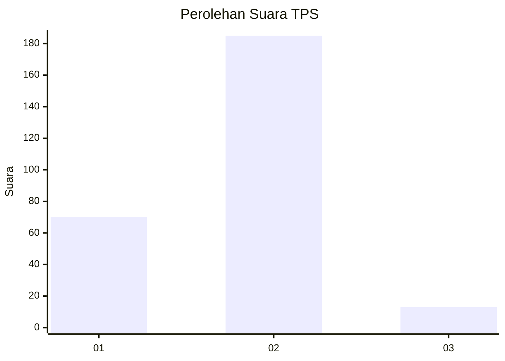
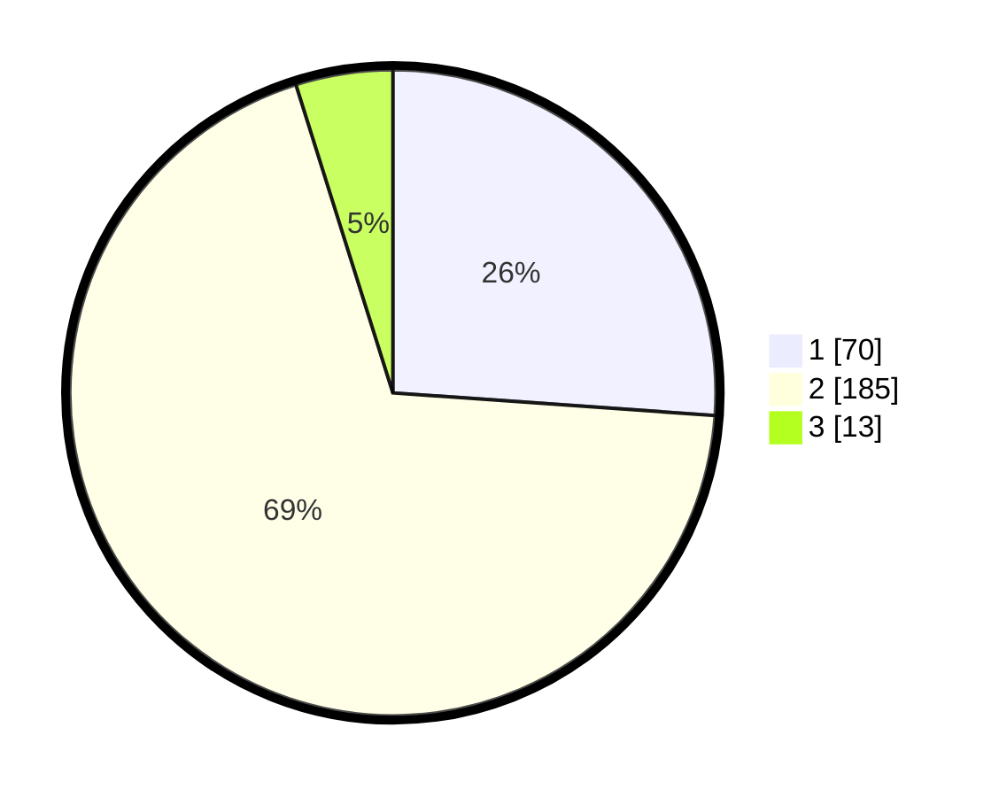

# Hasil

## Grafik

## Tabel

| No. | Nama Paslon    | Suara | Suara (raw) | Persentase |
|:--- |:-------------- | -----:| -----------:| ----------:|
| 1   | ANIES MUHAIMIN | 70    | [70][p-1]   | 26,12      |
| 2   | PRABOWO GIBRAN | 185   | [185][p-2]  | 69,03      |
| 3   | GANJAR MAHFUD  | 13    | [13][p-3]   | 4,85       |

[p-1]: https://github.com/gigit-pemilu/pemilu-2024-35-jawa-timur/blob/main/pilpres/hitung-suara/sub/35-jawa-timur/sub/29-sumenep/sub/07-lenteng/sub/2017-jambu/sub/002-tps/sub/paslon-1.txt
[p-2]: https://github.com/gigit-pemilu/pemilu-2024-35-jawa-timur/blob/main/pilpres/hitung-suara/sub/35-jawa-timur/sub/29-sumenep/sub/07-lenteng/sub/2017-jambu/sub/002-tps/sub/paslon-2.txt
[p-3]: https://github.com/gigit-pemilu/pemilu-2024-35-jawa-timur/blob/main/pilpres/hitung-suara/sub/35-jawa-timur/sub/29-sumenep/sub/07-lenteng/sub/2017-jambu/sub/002-tps/sub/paslon-3.txt

## Foto C Plano

https://sirekap-obj-formc.kpu.go.id/2b16/pemilu/ppwp/35/29/07/20/17/3529072017002-20240215-095022--27553ce2-be0a-45c0-84ed-7436e68ae623.jpg

https://sirekap-obj-formc.kpu.go.id/2b16/pemilu/ppwp/35/29/07/20/17/3529072017002-20240215-095151--83cfb54c-4bd5-4ae6-96fb-72a1b34acee7.jpg

https://sirekap-obj-formc.kpu.go.id/2b16/pemilu/ppwp/35/29/07/20/17/3529072017002-20240215-095332--2534a09d-e3f6-415a-8f7f-80cb450f0ebe.jpg

## Metadata

| Key        | Value               |
| ---------- | ------------------- |
| Time Stamp | 2024-02-16 14:30:33 |

