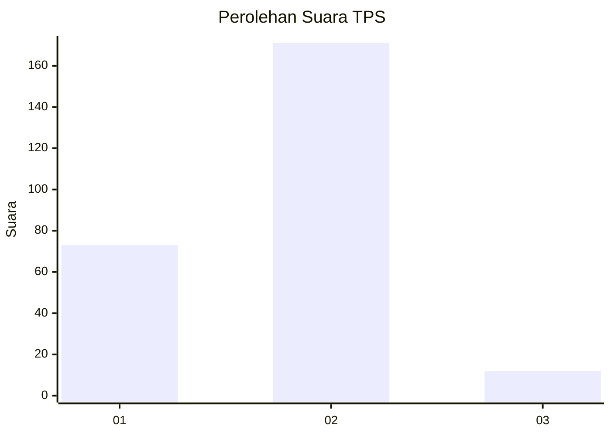
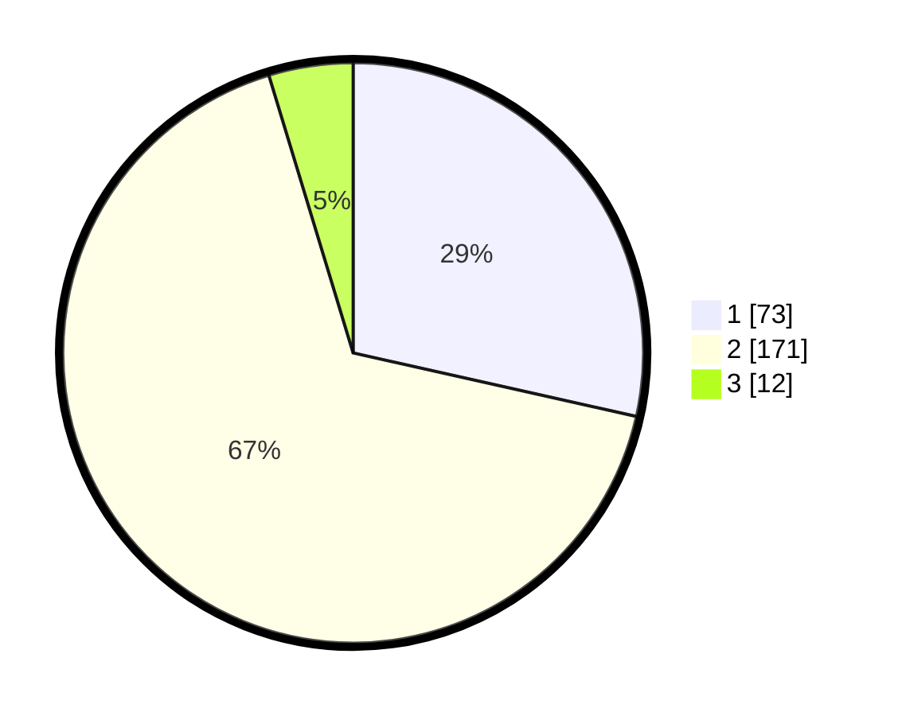

# Hasil

## Grafik

## Tabel

| No. | Nama Paslon    | Suara | Suara (raw) | Persentase |
|:--- |:-------------- | -----:| -----------:| ----------:|
| 1   | ANIES MUHAIMIN | 73    | [73][p-1]   | 28,52      |
| 2   | PRABOWO GIBRAN | 171   | [171][p-2]  | 66,80      |
| 3   | GANJAR MAHFUD  | 12    | [12][p-3]   | 4,69       |

[p-1]: https://github.com/gigit-pemilu/pemilu-2024/blob/main/pilpres/hitung-suara/sub/35-jawa-timur/sub/29-sumenep/sub/07-lenteng/sub/2017-jambu/sub/003-tps/sub/paslon-1.txt
[p-2]: https://github.com/gigit-pemilu/pemilu-2024/blob/main/pilpres/hitung-suara/sub/35-jawa-timur/sub/29-sumenep/sub/07-lenteng/sub/2017-jambu/sub/003-tps/sub/paslon-2.txt
[p-3]: https://github.com/gigit-pemilu/pemilu-2024/blob/main/pilpres/hitung-suara/sub/35-jawa-timur/sub/29-sumenep/sub/07-lenteng/sub/2017-jambu/sub/003-tps/sub/paslon-3.txt

## Foto C Plano

https://sirekap-obj-formc.kpu.go.id/2eb3/pemilu/ppwp/35/29/07/20/17/3529072017003-20240215-124115--52233117-b3d5-4ce4-89ac-b415dfe87e24.jpg

https://sirekap-obj-formc.kpu.go.id/2eb3/pemilu/ppwp/35/29/07/20/17/3529072017003-20240215-124231--2c4bbfb3-7976-4dff-b9c2-8c18851e824e.jpg

https://sirekap-obj-formc.kpu.go.id/2eb3/pemilu/ppwp/35/29/07/20/17/3529072017003-20240215-124343--d961770f-cf2a-4b7a-9f92-46d049e3ee20.jpg

## Metadata

| Key        | Value               |
| ---------- | ------------------- |
| Time Stamp | 2024-02-25 21:00:00 |

