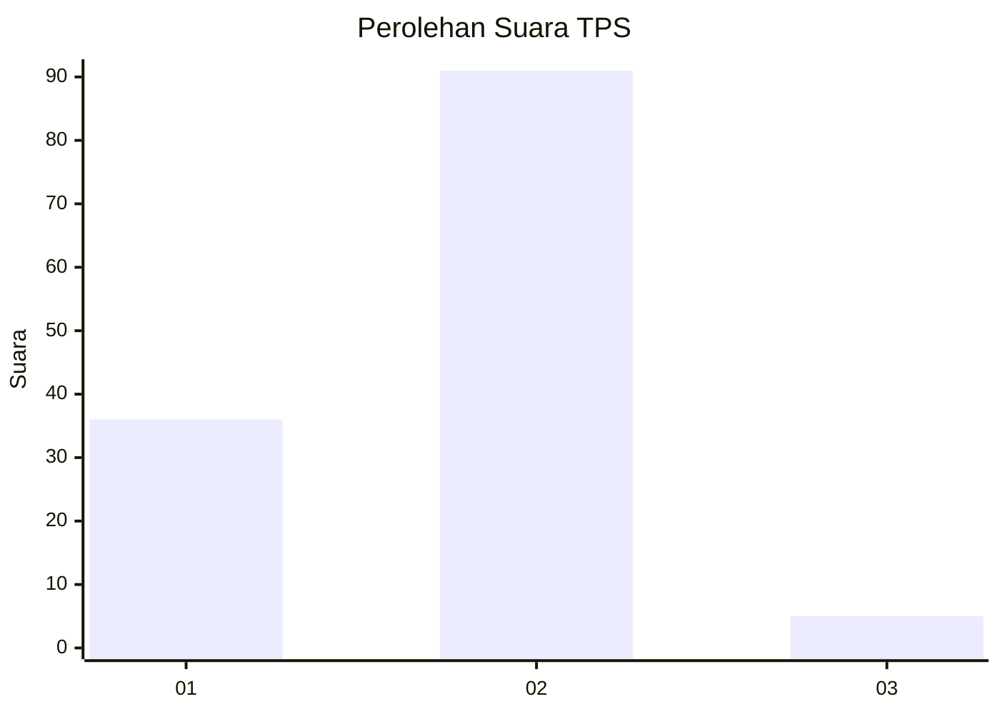
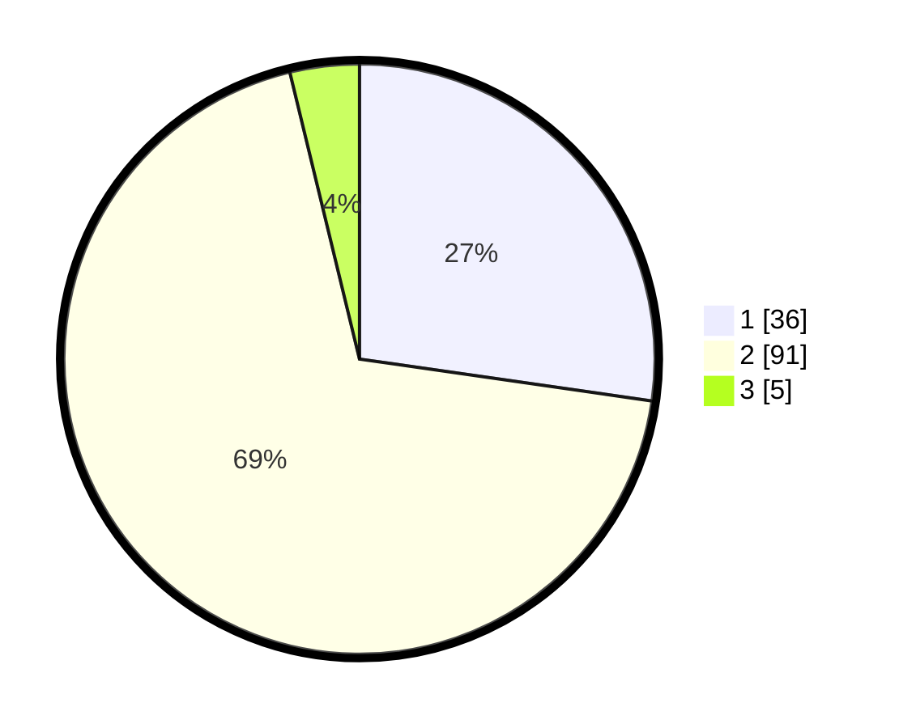

# Hasil

## Grafik

## Tabel

| No. | Nama Paslon    | Suara | Suara (raw) | Persentase |
|:--- |:-------------- | -----:| -----------:| ----------:|
| 1   | ANIES MUHAIMIN | 36    | [36][p-1]   | 27,27      |
| 2   | PRABOWO GIBRAN | 91    | [91][p-2]   | 68,94      |
| 3   | GANJAR MAHFUD  | 5     | [5][p-3]    | 3,79       |

[p-1]: https://github.com/gigit-pemilu/pemilu-2024/blob/main/pilpres/hitung-suara/sub/35-jawa-timur/sub/29-sumenep/sub/08-giliginting/sub/2001-galis/sub/002-tps/sub/paslon-1.txt
[p-2]: https://github.com/gigit-pemilu/pemilu-2024/blob/main/pilpres/hitung-suara/sub/35-jawa-timur/sub/29-sumenep/sub/08-giliginting/sub/2001-galis/sub/002-tps/sub/paslon-2.txt
[p-3]: https://github.com/gigit-pemilu/pemilu-2024/blob/main/pilpres/hitung-suara/sub/35-jawa-timur/sub/29-sumenep/sub/08-giliginting/sub/2001-galis/sub/002-tps/sub/paslon-3.txt

## Foto C Plano

https://sirekap-obj-formc.kpu.go.id/104d/pemilu/ppwp/35/29/08/20/01/3529082001002-20240221-160614--457cc722-613b-485a-8cd2-bf04842f6e38.jpg

https://sirekap-obj-formc.kpu.go.id/104d/pemilu/ppwp/35/29/08/20/01/3529082001002-20240221-160616--2ca5df2c-dea7-4be1-832a-ae4ca8a1bbb6.jpg

https://sirekap-obj-formc.kpu.go.id/104d/pemilu/ppwp/35/29/08/20/01/3529082001002-20240221-160615--bc6bdc6d-7e28-4aef-99c8-2a4e56361d43.jpg

## Metadata

| Key        | Value               |
| ---------- | ------------------- |
| Time Stamp | 2024-02-21 22:00:00 |

## DATA PEMILIH TETAP

Jumlah pemilih dalam DPT: **136**.
 * L: **58**.
 * P: **78**.

## DATA PENGGUNA HAK PILIH

Jumlah pengguna hak pilih dalam DPT: **135**.
 * L: **57**.
 * P: **78**.

Jumlah pengguna hak pilih dalam DPTb: **0**.
 * L: **0**.
 * P: **0**.

Jumlah pengguna hak pilih dalam DPK: **0**.
 * L: **0**.
 * P: **0**.

Jumlah pengguna hak pilih: **135**.
 * L: **57**.
 * P: **78**.

## JUMLAH SUARA SAH DAN TIDAK SAH

JUMLAH SELURUH SUARA SAH: **132**.

JUMLAH SUARA TIDAK SAH: **3**.

JUMLAH SELURUH SUARA SAH DAN SUARA TIDAK SAH: **135**.

