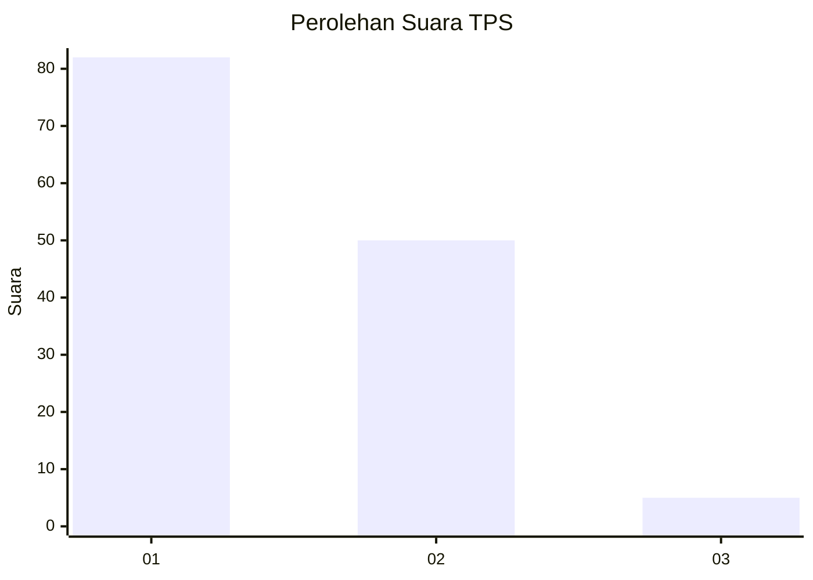
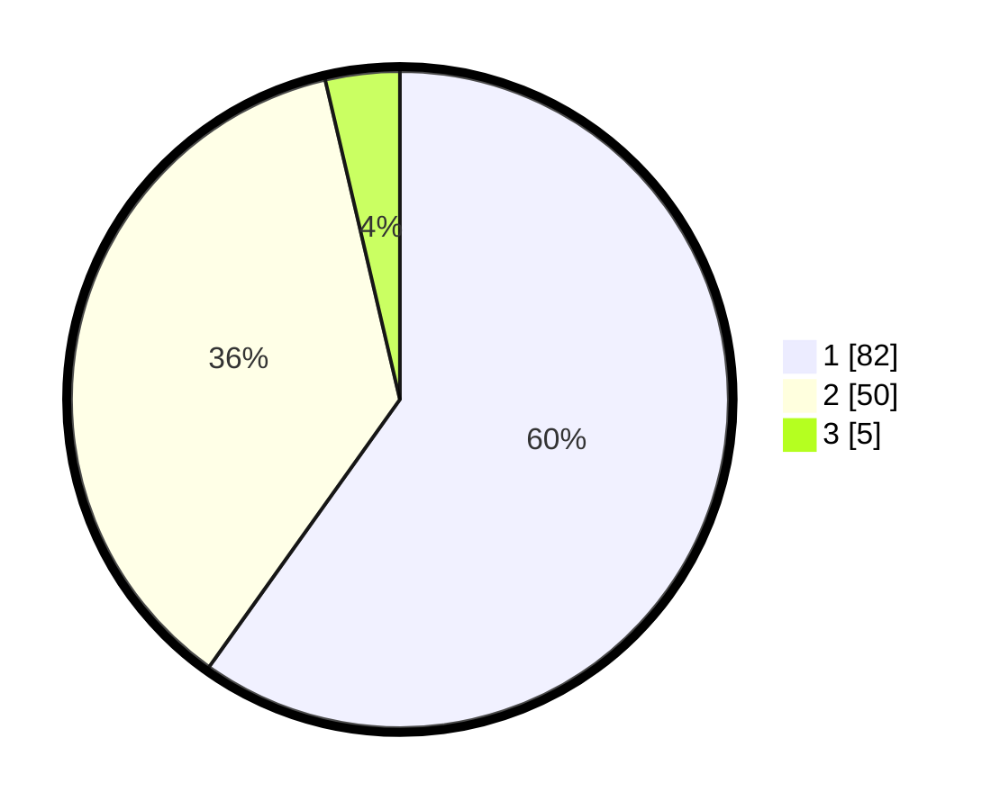

# Hasil

## Grafik

## Tabel

| No. | Nama Paslon    | Suara | Suara (raw) | Persentase |
|:--- |:-------------- | -----:| -----------:| ----------:|
| 1   | ANIES MUHAIMIN | 82    | [82][p-1]   | 59,85      |
| 2   | PRABOWO GIBRAN | 50    | [50][p-2]   | 36,50      |
| 3   | GANJAR MAHFUD  | 5     | [5][p-3]    | 3,65       |

[p-1]: https://github.com/gigit-pemilu/pemilu-2024/blob/main/pilpres/hitung-suara/sub/35-jawa-timur/sub/29-sumenep/sub/08-giliginting/sub/2001-galis/sub/003-tps/sub/paslon-1.txt
[p-2]: https://github.com/gigit-pemilu/pemilu-2024/blob/main/pilpres/hitung-suara/sub/35-jawa-timur/sub/29-sumenep/sub/08-giliginting/sub/2001-galis/sub/003-tps/sub/paslon-2.txt
[p-3]: https://github.com/gigit-pemilu/pemilu-2024/blob/main/pilpres/hitung-suara/sub/35-jawa-timur/sub/29-sumenep/sub/08-giliginting/sub/2001-galis/sub/003-tps/sub/paslon-3.txt

## Foto C Plano

https://sirekap-obj-formc.kpu.go.id/d1ed/pemilu/ppwp/35/29/08/20/01/3529082001003-20240214-191345--445d373d-533a-4e3c-87ac-46d207c2ff86.jpg

https://sirekap-obj-formc.kpu.go.id/d1ed/pemilu/ppwp/35/29/08/20/01/3529082001003-20240214-191524--638c1cc0-e783-4b1d-895d-a16cd6de8f2f.jpg

https://sirekap-obj-formc.kpu.go.id/d1ed/pemilu/ppwp/35/29/08/20/01/3529082001003-20240214-191648--9ad4434d-2603-41c8-8154-2d4a2e1929ff.jpg

## Metadata

| Key        | Value               |
| ---------- | ------------------- |
| Time Stamp | 2024-02-14 21:46:01 |

## DATA PEMILIH TETAP

Jumlah pemilih dalam DPT: **140**.
 * L: **59**.
 * P: **81**.

## DATA PENGGUNA HAK PILIH

Jumlah pengguna hak pilih dalam DPT: **137**.
 * L: **58**.
 * P: **79**.

Jumlah pengguna hak pilih dalam DPTb: **0**.
 * L: **0**.
 * P: **0**.

Jumlah pengguna hak pilih dalam DPK: **0**.
 * L: **0**.
 * P: **0**.

Jumlah pengguna hak pilih: **137**.
 * L: **58**.
 * P: **79**.

## JUMLAH SUARA SAH DAN TIDAK SAH

JUMLAH SELURUH SUARA SAH: **137**.

JUMLAH SUARA TIDAK SAH: **0**.

JUMLAH SELURUH SUARA SAH DAN SUARA TIDAK SAH: **137**.

