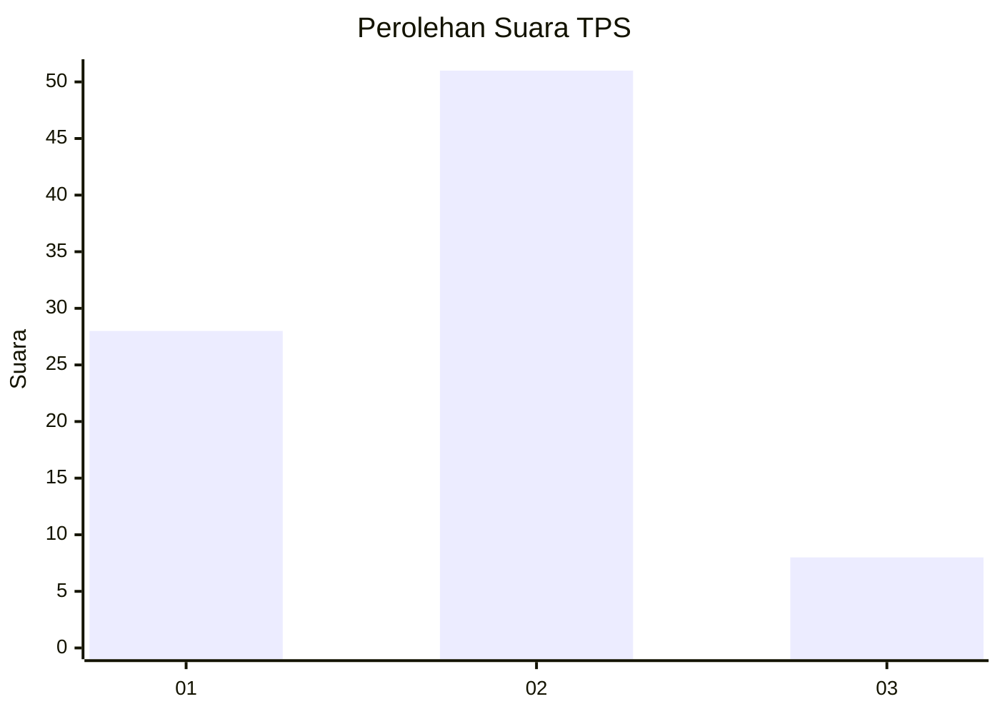
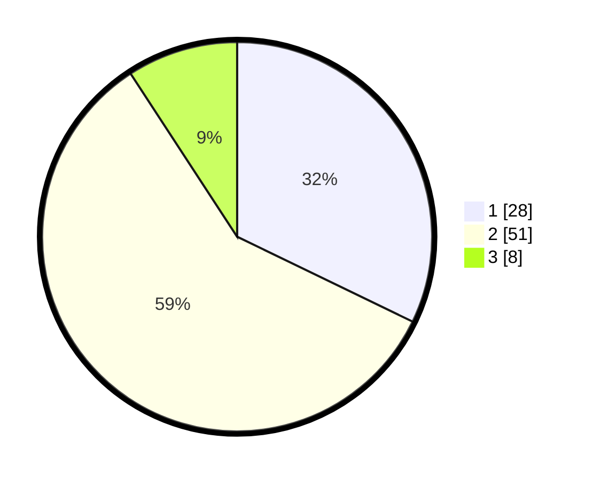

# Hasil

## Grafik

## Tabel

| No. | Nama Paslon    | Suara | Suara (raw) | Persentase |
|:--- |:-------------- | -----:| -----------:| ----------:|
| 1   | ANIES MUHAIMIN | 28    | [28][p-1]   | 32,18      |
| 2   | PRABOWO GIBRAN | 51    | [51][p-2]   | 58,62      |
| 3   | GANJAR MAHFUD  | 8     | [8][p-3]    | 9,20       |

[p-1]: https://github.com/gigit-pemilu/pemilu-2024/blob/main/pilpres/hitung-suara/sub/35-jawa-timur/sub/29-sumenep/sub/08-giliginting/sub/2003-bringsang/sub/008-tps/sub/paslon-1.txt
[p-2]: https://github.com/gigit-pemilu/pemilu-2024/blob/main/pilpres/hitung-suara/sub/35-jawa-timur/sub/29-sumenep/sub/08-giliginting/sub/2003-bringsang/sub/008-tps/sub/paslon-2.txt
[p-3]: https://github.com/gigit-pemilu/pemilu-2024/blob/main/pilpres/hitung-suara/sub/35-jawa-timur/sub/29-sumenep/sub/08-giliginting/sub/2003-bringsang/sub/008-tps/sub/paslon-3.txt

## Foto C Plano

https://sirekap-obj-formc.kpu.go.id/d8cd/pemilu/ppwp/35/29/08/20/03/3529082003008-20240218-202603--3e4b9da0-73a5-499d-84d0-75b4bdff63cb.jpg

https://sirekap-obj-formc.kpu.go.id/d8cd/pemilu/ppwp/35/29/08/20/03/3529082003008-20240218-203411--bdbfe0c3-cb14-4044-b594-d5b493fd430b.jpg

https://sirekap-obj-formc.kpu.go.id/d8cd/pemilu/ppwp/35/29/08/20/03/3529082003008-20240218-202900--e80ca5ed-8ac6-4396-aee1-fd76b4b087a7.jpg

## Metadata

| Key        | Value               |
| ---------- | ------------------- |
| Time Stamp | 2024-02-19 10:00:00 |

## DATA PEMILIH TETAP

Jumlah pemilih dalam DPT: **108**.
 * L: **47**.
 * P: **61**.

## DATA PENGGUNA HAK PILIH

Jumlah pengguna hak pilih dalam DPT: **90**.
 * L: **41**.
 * P: **49**.

Jumlah pengguna hak pilih dalam DPTb: **108**.
 * L: **47**.
 * P: **61**.

Jumlah pengguna hak pilih dalam DPK: **0**.
 * L: **0**.
 * P: **0**.

Jumlah pengguna hak pilih: **90**.
 * L: **41**.
 * P: **49**.

## JUMLAH SUARA SAH DAN TIDAK SAH

JUMLAH SELURUH SUARA SAH: **87**.

JUMLAH SUARA TIDAK SAH: **3**.

JUMLAH SELURUH SUARA SAH DAN SUARA TIDAK SAH: **90**.

