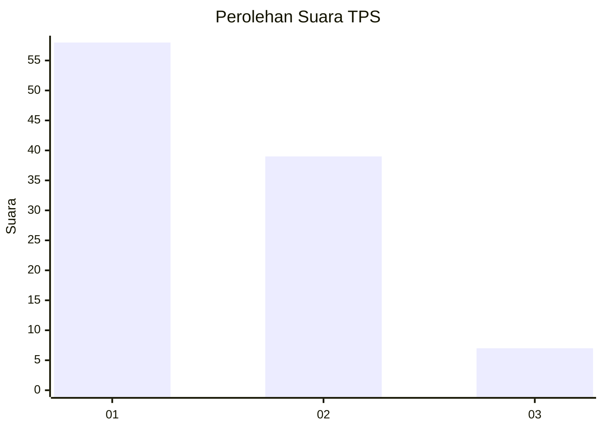
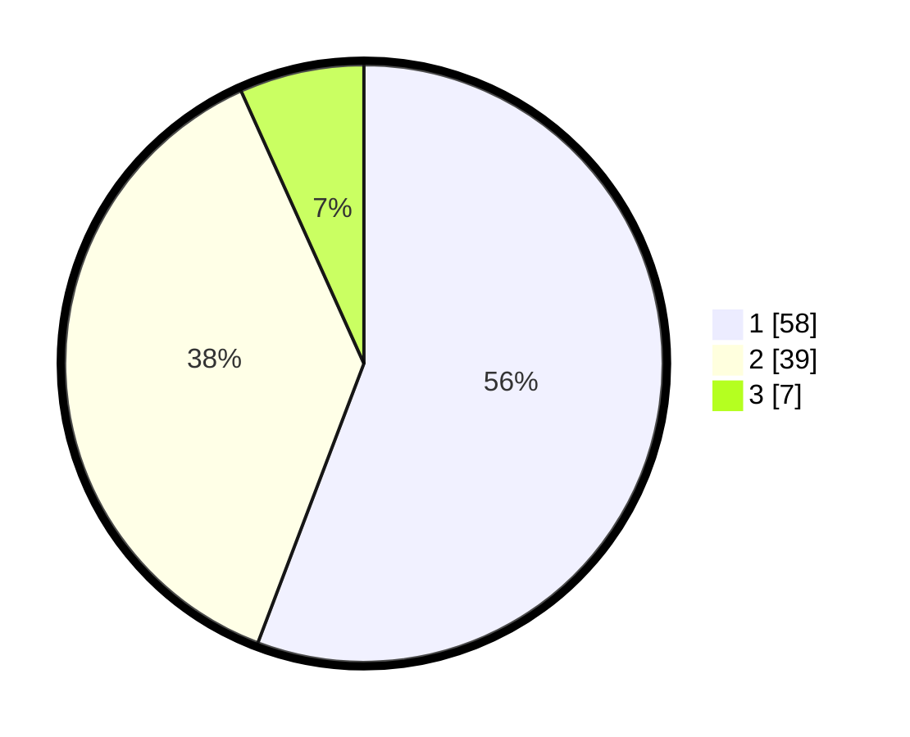

# Hasil

## Grafik

## Tabel

| No. | Nama Paslon    | Suara | Suara (raw) | Persentase |
|:--- |:-------------- | -----:| -----------:| ----------:|
| 1   | ANIES MUHAIMIN | 58    | [58][p-1]   | 55,77      |
| 2   | PRABOWO GIBRAN | 39    | [39][p-2]   | 37,50      |
| 3   | GANJAR MAHFUD  | 7     | [7][p-3]    | 6,73       |

[p-1]: https://github.com/gigit-pemilu/pemilu-2024/blob/main/pilpres/hitung-suara/sub/35-jawa-timur/sub/29-sumenep/sub/08-giliginting/sub/2006-jate/sub/001-tps/sub/paslon-1.txt
[p-2]: https://github.com/gigit-pemilu/pemilu-2024/blob/main/pilpres/hitung-suara/sub/35-jawa-timur/sub/29-sumenep/sub/08-giliginting/sub/2006-jate/sub/001-tps/sub/paslon-2.txt
[p-3]: https://github.com/gigit-pemilu/pemilu-2024/blob/main/pilpres/hitung-suara/sub/35-jawa-timur/sub/29-sumenep/sub/08-giliginting/sub/2006-jate/sub/001-tps/sub/paslon-3.txt

## Foto C Plano

https://sirekap-obj-formc.kpu.go.id/99a9/pemilu/ppwp/35/29/08/20/06/3529082006001-20240222-225256--2cd44eba-674e-424a-85c1-b88b55c6bd7a.jpg

https://sirekap-obj-formc.kpu.go.id/99a9/pemilu/ppwp/35/29/08/20/06/3529082006001-20240222-225446--aa2bf7a7-e793-48be-a6e6-a8017c7f4374.jpg

https://sirekap-obj-formc.kpu.go.id/99a9/pemilu/ppwp/35/29/08/20/06/3529082006001-20240222-225920--a1132cd9-f05d-4447-80dd-4874f6098858.jpg

## Metadata

| Key        | Value               |
| ---------- | ------------------- |
| Time Stamp | 2024-02-24 22:31:28 |

## DATA PEMILIH TETAP

Jumlah pemilih dalam DPT: **190**.
 * L: **96**.
 * P: **94**.

## DATA PENGGUNA HAK PILIH

Jumlah pengguna hak pilih dalam DPT: **162**.
 * L: **82**.
 * P: **80**.

Jumlah pengguna hak pilih dalam DPTb: **0**.
 * L: **0**.
 * P: **0**.

Jumlah pengguna hak pilih dalam DPK: **0**.
 * L: **0**.
 * P: **0**.

Jumlah pengguna hak pilih: **162**.
 * L: **82**.
 * P: **80**.

## JUMLAH SUARA SAH DAN TIDAK SAH

JUMLAH SELURUH SUARA SAH: **104**.

JUMLAH SUARA TIDAK SAH: **58**.

JUMLAH SELURUH SUARA SAH DAN SUARA TIDAK SAH: **162**.

