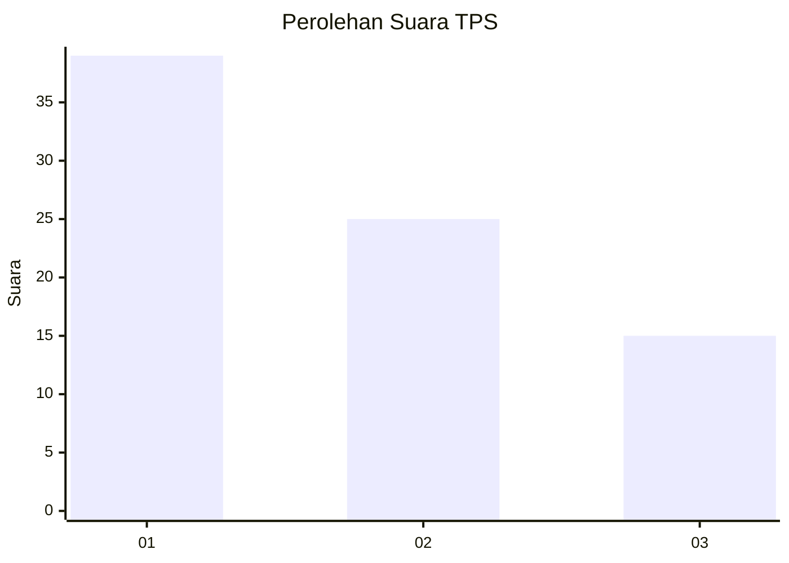
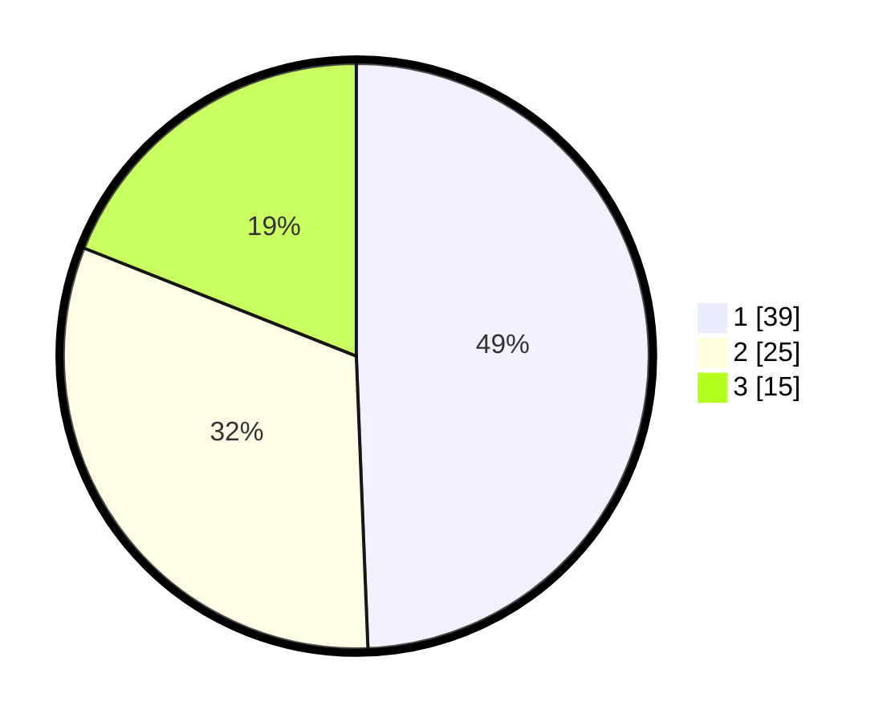

# Hasil

## Grafik

## Tabel

| No. | Nama Paslon    | Suara | Suara (raw) | Persentase |
|:--- |:-------------- | -----:| -----------:| ----------:|
| 1   | ANIES MUHAIMIN | 39    | [39][p-1]   | 49,37      |
| 2   | PRABOWO GIBRAN | 25    | [25][p-2]   | 31,65      |
| 3   | GANJAR MAHFUD  | 15    | [15][p-3]   | 18,99      |

[p-1]: https://github.com/gigit-pemilu/pemilu-2024-35-jawa-timur/blob/main/pilpres/hitung-suara/sub/35-jawa-timur/sub/29-sumenep/sub/08-giliginting/sub/2006-jate/sub/004-tps/sub/paslon-1.txt
[p-2]: https://github.com/gigit-pemilu/pemilu-2024-35-jawa-timur/blob/main/pilpres/hitung-suara/sub/35-jawa-timur/sub/29-sumenep/sub/08-giliginting/sub/2006-jate/sub/004-tps/sub/paslon-2.txt
[p-3]: https://github.com/gigit-pemilu/pemilu-2024-35-jawa-timur/blob/main/pilpres/hitung-suara/sub/35-jawa-timur/sub/29-sumenep/sub/08-giliginting/sub/2006-jate/sub/004-tps/sub/paslon-3.txt

## Foto C Plano

https://sirekap-obj-formc.kpu.go.id/d57d/pemilu/ppwp/35/29/08/20/06/3529082006004-20240223-221710--b2fa9c8b-4aa5-474b-af10-4bce126c319f.jpg

https://sirekap-obj-formc.kpu.go.id/d57d/pemilu/ppwp/35/29/08/20/06/3529082006004-20240223-221920--e99bd315-ba40-4c3b-99fa-46d7a7f604b5.jpg

https://sirekap-obj-formc.kpu.go.id/d57d/pemilu/ppwp/35/29/08/20/06/3529082006004-20240223-222345--afd9639c-583e-4827-8b52-c783ecb419f5.jpg

## Metadata

| Key        | Value               |
| ---------- | ------------------- |
| Time Stamp | 2024-02-24 22:31:28 |

## DATA PEMILIH TETAP

Jumlah pemilih dalam DPT: **157**.
 * L: **68**.
 * P: **89**.

## DATA PENGGUNA HAK PILIH

Jumlah pengguna hak pilih dalam DPT: **140**.
 * L: **58**.
 * P: **82**.

Jumlah pengguna hak pilih dalam DPTb: **0**.
 * L: **0**.
 * P: **0**.

Jumlah pengguna hak pilih dalam DPK: **0**.
 * L: **0**.
 * P: **0**.

Jumlah pengguna hak pilih: **140**.
 * L: **58**.
 * P: **82**.

## JUMLAH SUARA SAH DAN TIDAK SAH

JUMLAH SELURUH SUARA SAH: **79**.

JUMLAH SUARA TIDAK SAH: **61**.

JUMLAH SELURUH SUARA SAH DAN SUARA TIDAK SAH: **140**.

