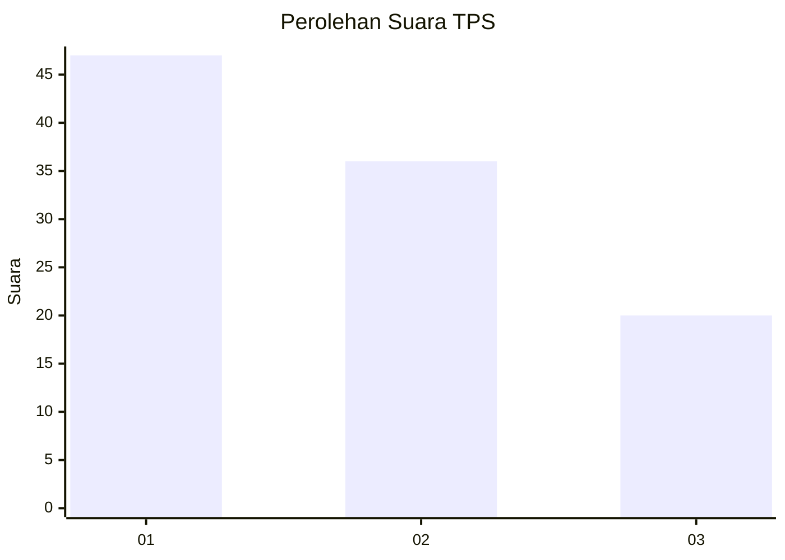
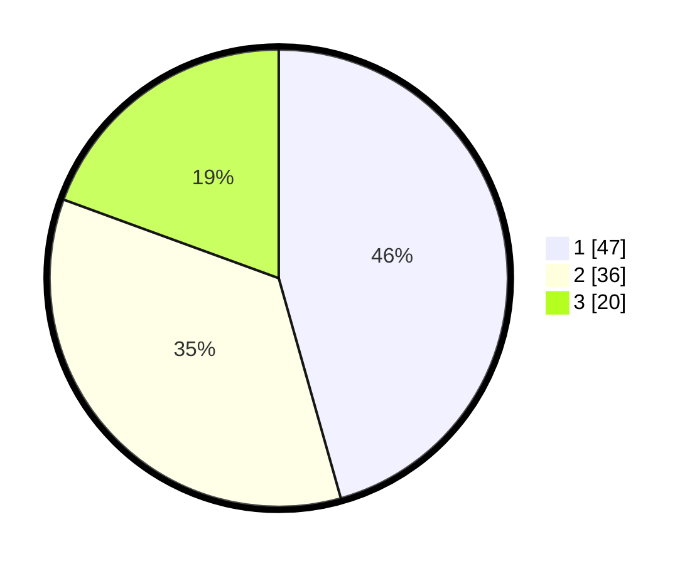

# Hasil

## Grafik

## Tabel

| No. | Nama Paslon    | Suara | Suara (raw) | Persentase |
|:--- |:-------------- | -----:| -----------:| ----------:|
| 1   | ANIES MUHAIMIN | 47    | [47][p-1]   | 45,63      |
| 2   | PRABOWO GIBRAN | 36    | [36][p-2]   | 34,95      |
| 3   | GANJAR MAHFUD  | 20    | [20][p-3]   | 19,42      |

[p-1]: https://github.com/gigit-pemilu/pemilu-2024/blob/main/pilpres/hitung-suara/sub/35-jawa-timur/sub/29-sumenep/sub/08-giliginting/sub/2006-jate/sub/005-tps/sub/paslon-1.txt
[p-2]: https://github.com/gigit-pemilu/pemilu-2024/blob/main/pilpres/hitung-suara/sub/35-jawa-timur/sub/29-sumenep/sub/08-giliginting/sub/2006-jate/sub/005-tps/sub/paslon-2.txt
[p-3]: https://github.com/gigit-pemilu/pemilu-2024/blob/main/pilpres/hitung-suara/sub/35-jawa-timur/sub/29-sumenep/sub/08-giliginting/sub/2006-jate/sub/005-tps/sub/paslon-3.txt

## Foto C Plano

https://sirekap-obj-formc.kpu.go.id/664d/pemilu/ppwp/35/29/08/20/06/3529082006005-20240224-021415--bb264d13-c5c9-4939-b75f-2216ab4c8f96.jpg

https://sirekap-obj-formc.kpu.go.id/664d/pemilu/ppwp/35/29/08/20/06/3529082006005-20240224-021712--31cc1166-0a5e-4834-9e96-5267aa3b57eb.jpg

https://sirekap-obj-formc.kpu.go.id/664d/pemilu/ppwp/35/29/08/20/06/3529082006005-20240224-022416--9caf4523-c328-4c87-bb97-75a0b103138f.jpg

## Metadata

| Key        | Value               |
| ---------- | ------------------- |
| Time Stamp | 2024-02-24 22:31:28 |

## DATA PEMILIH TETAP

Jumlah pemilih dalam DPT: **181**.
 * L: **88**.
 * P: **93**.

## DATA PENGGUNA HAK PILIH

Jumlah pengguna hak pilih dalam DPT: **159**.
 * L: **72**.
 * P: **87**.

Jumlah pengguna hak pilih dalam DPTb: **0**.
 * L: **0**.
 * P: **0**.

Jumlah pengguna hak pilih dalam DPK: **0**.
 * L: **0**.
 * P: **0**.

Jumlah pengguna hak pilih: **159**.
 * L: **72**.
 * P: **87**.

## JUMLAH SUARA SAH DAN TIDAK SAH

JUMLAH SELURUH SUARA SAH: **103**.

JUMLAH SUARA TIDAK SAH: **56**.

JUMLAH SELURUH SUARA SAH DAN SUARA TIDAK SAH: **159**.

