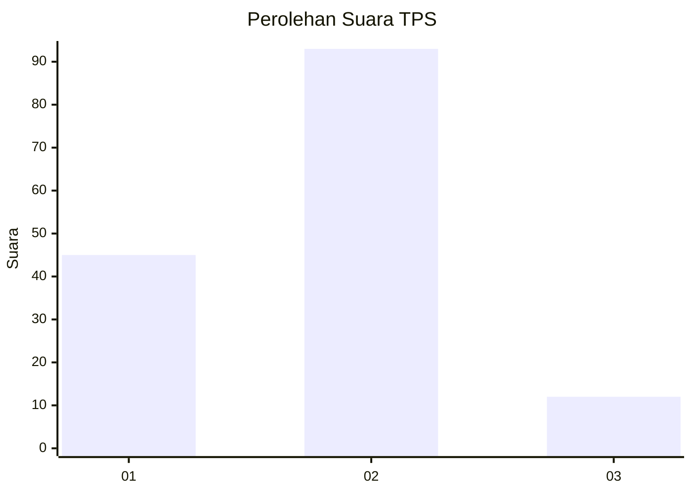
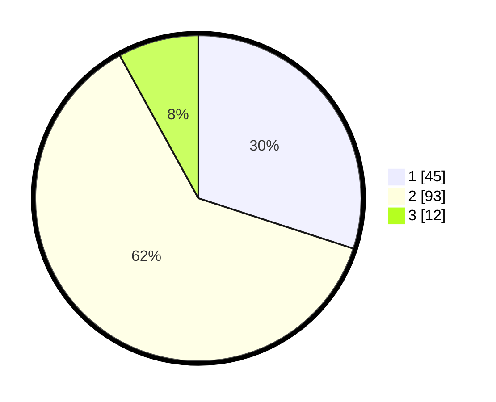

# Hasil

## Grafik

## Tabel

| No. | Nama Paslon    | Suara | Suara (raw) | Persentase |
|:--- |:-------------- | -----:| -----------:| ----------:|
| 1   | ANIES MUHAIMIN | 45    | [45][p-1]   | 30,00      |
| 2   | PRABOWO GIBRAN | 93    | [93][p-2]   | 62,00      |
| 3   | GANJAR MAHFUD  | 12    | [12][p-3]   | 8,00       |

[p-1]: https://github.com/gigit-pemilu/pemilu-2024/blob/main/pilpres/hitung-suara/sub/35-jawa-timur/sub/29-sumenep/sub/08-giliginting/sub/2007-banbaru/sub/001-tps/sub/paslon-1.txt
[p-2]: https://github.com/gigit-pemilu/pemilu-2024/blob/main/pilpres/hitung-suara/sub/35-jawa-timur/sub/29-sumenep/sub/08-giliginting/sub/2007-banbaru/sub/001-tps/sub/paslon-2.txt
[p-3]: https://github.com/gigit-pemilu/pemilu-2024/blob/main/pilpres/hitung-suara/sub/35-jawa-timur/sub/29-sumenep/sub/08-giliginting/sub/2007-banbaru/sub/001-tps/sub/paslon-3.txt

## Foto C Plano

https://sirekap-obj-formc.kpu.go.id/d2b4/pemilu/ppwp/35/29/08/20/07/3529082007001-20240222-210310--322a8b66-b7e1-4fb5-bd2b-e1835bbdfa24.jpg

https://sirekap-obj-formc.kpu.go.id/d2b4/pemilu/ppwp/35/29/08/20/07/3529082007001-20240222-211215--caaa1e77-3543-41a0-8420-b76f9406a3d5.jpg

https://sirekap-obj-formc.kpu.go.id/d2b4/pemilu/ppwp/35/29/08/20/07/3529082007001-20240222-211342--720eb6b7-6ef9-4ae8-9c45-a8ab3cc63ab3.jpg

## Metadata

| Key        | Value               |
| ---------- | ------------------- |
| Time Stamp | 2024-02-22 22:00:00 |

## DATA PEMILIH TETAP

Jumlah pemilih dalam DPT: **249**.
 * L: **115**.
 * P: **134**.

## DATA PENGGUNA HAK PILIH

Jumlah pengguna hak pilih dalam DPT: **223**.
 * L: **98**.
 * P: **125**.

Jumlah pengguna hak pilih dalam DPTb: **0**.
 * L: **0**.
 * P: **0**.

Jumlah pengguna hak pilih dalam DPK: **0**.
 * L: **0**.
 * P: **0**.

Jumlah pengguna hak pilih: **223**.
 * L: **98**.
 * P: **125**.

## JUMLAH SUARA SAH DAN TIDAK SAH

JUMLAH SELURUH SUARA SAH: **150**.

JUMLAH SUARA TIDAK SAH: **73**.

JUMLAH SELURUH SUARA SAH DAN SUARA TIDAK SAH: **223**.

