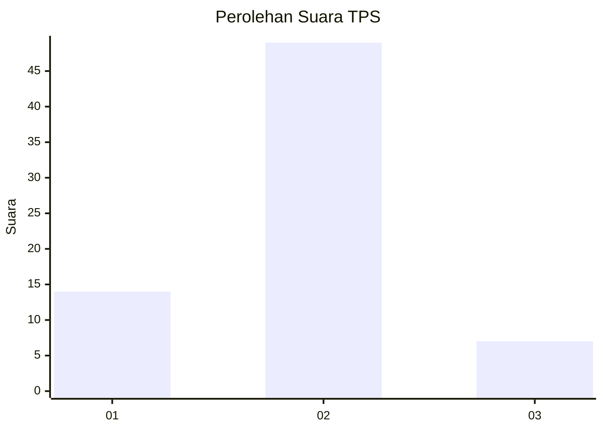
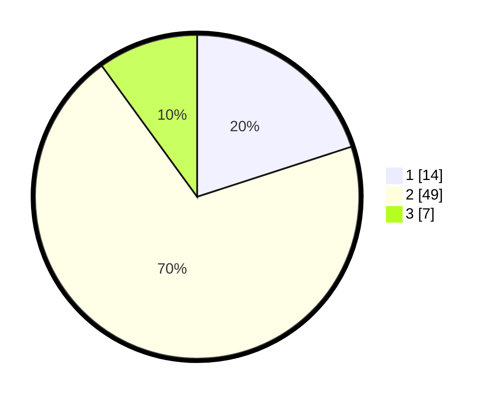

# Hasil

## Grafik

## Tabel

| No. | Nama Paslon    | Suara | Suara (raw) | Persentase |
|:--- |:-------------- | -----:| -----------:| ----------:|
| 1   | ANIES MUHAIMIN | 14    | [14][p-1]   | 20,00      |
| 2   | PRABOWO GIBRAN | 49    | [49][p-2]   | 70,00      |
| 3   | GANJAR MAHFUD  | 7     | [7][p-3]    | 10,00      |

[p-1]: https://github.com/gigit-pemilu/pemilu-2024/blob/main/pilpres/hitung-suara/sub/35-jawa-timur/sub/29-sumenep/sub/08-giliginting/sub/2007-banbaru/sub/011-tps/sub/paslon-1.txt
[p-2]: https://github.com/gigit-pemilu/pemilu-2024/blob/main/pilpres/hitung-suara/sub/35-jawa-timur/sub/29-sumenep/sub/08-giliginting/sub/2007-banbaru/sub/011-tps/sub/paslon-2.txt
[p-3]: https://github.com/gigit-pemilu/pemilu-2024/blob/main/pilpres/hitung-suara/sub/35-jawa-timur/sub/29-sumenep/sub/08-giliginting/sub/2007-banbaru/sub/011-tps/sub/paslon-3.txt

## Foto C Plano

https://sirekap-obj-formc.kpu.go.id/2a2d/pemilu/ppwp/35/29/08/20/07/3529082007011-20240223-232547--e62d813c-e64e-4c0b-9943-be8850231910.jpg

https://sirekap-obj-formc.kpu.go.id/2a2d/pemilu/ppwp/35/29/08/20/07/3529082007011-20240223-232548--5d6cacd5-5d23-47cd-991c-6f76b890c5c8.jpg

https://sirekap-obj-formc.kpu.go.id/2a2d/pemilu/ppwp/35/29/08/20/07/3529082007011-20240223-232548--c284b5c5-c883-4d1d-898b-d82f6898ecd6.jpg

## Metadata

| Key        | Value               |
| ---------- | ------------------- |
| Time Stamp | 2024-02-24 22:31:28 |

## DATA PEMILIH TETAP

Jumlah pemilih dalam DPT: **74**.
 * L: **36**.
 * P: **36**.

## DATA PENGGUNA HAK PILIH

Jumlah pengguna hak pilih dalam DPT: **72**.
 * L: **34**.
 * P: **38**.

Jumlah pengguna hak pilih dalam DPTb: **0**.
 * L: **0**.
 * P: **0**.

Jumlah pengguna hak pilih dalam DPK: **0**.
 * L: **0**.
 * P: **0**.

Jumlah pengguna hak pilih: **72**.
 * L: **34**.
 * P: **38**.

## JUMLAH SUARA SAH DAN TIDAK SAH

JUMLAH SELURUH SUARA SAH: **70**.

JUMLAH SUARA TIDAK SAH: **2**.

JUMLAH SELURUH SUARA SAH DAN SUARA TIDAK SAH: **72**.

