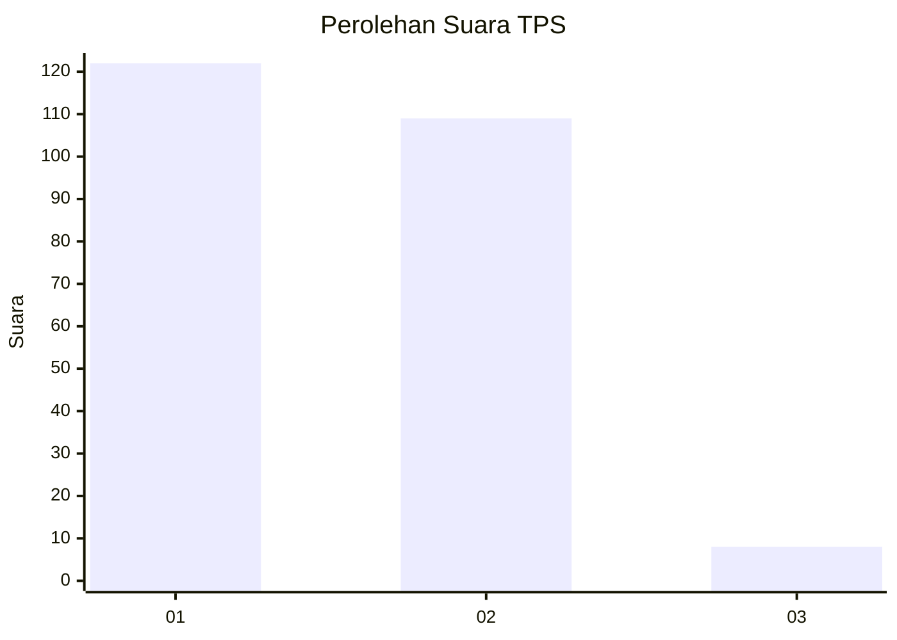
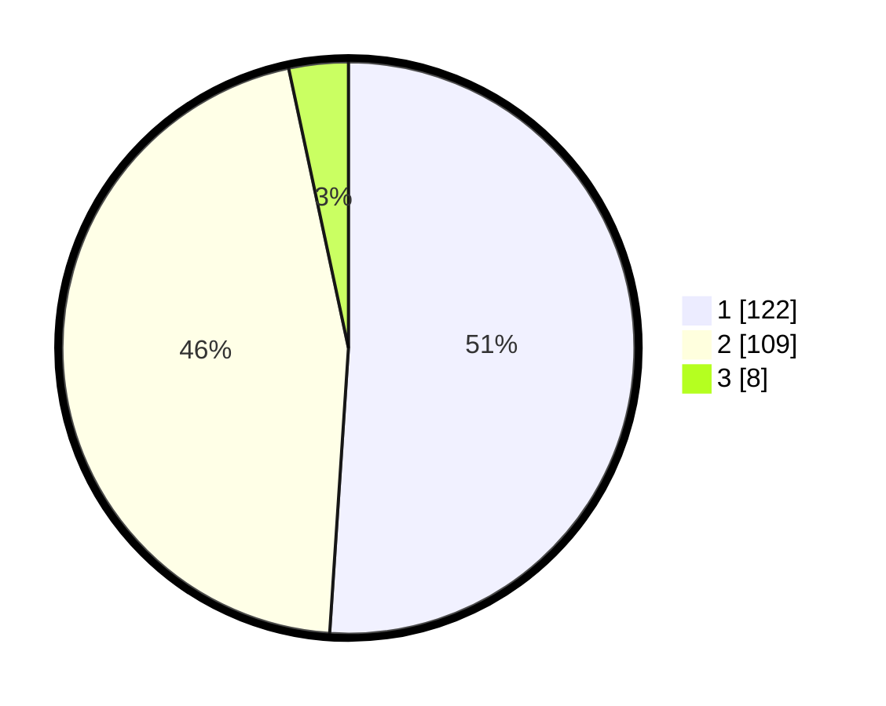

# Hasil

## Grafik

## Tabel

| No. | Nama Paslon    | Suara | Suara (raw) | Persentase |
|:--- |:-------------- | -----:| -----------:| ----------:|
| 1   | ANIES MUHAIMIN | 122   | [122][p-1]  | 51,05      |
| 2   | PRABOWO GIBRAN | 109   | [109][p-2]  | 45,61      |
| 3   | GANJAR MAHFUD  | 8     | [8][p-3]    | 3,35       |

[p-1]: https://github.com/gigit-pemilu/pemilu-2024/blob/main/pilpres/hitung-suara/sub/35-jawa-timur/sub/29-sumenep/sub/09-guluk-guluk/sub/2001-bakeong/sub/001-tps/sub/paslon-1.txt
[p-2]: https://github.com/gigit-pemilu/pemilu-2024/blob/main/pilpres/hitung-suara/sub/35-jawa-timur/sub/29-sumenep/sub/09-guluk-guluk/sub/2001-bakeong/sub/001-tps/sub/paslon-2.txt
[p-3]: https://github.com/gigit-pemilu/pemilu-2024/blob/main/pilpres/hitung-suara/sub/35-jawa-timur/sub/29-sumenep/sub/09-guluk-guluk/sub/2001-bakeong/sub/001-tps/sub/paslon-3.txt

## Foto C Plano

https://sirekap-obj-formc.kpu.go.id/2026/pemilu/ppwp/35/29/09/20/01/3529092001001-20240225-211555--d26f6a2e-0168-40c0-bb29-60ed07682f1c.jpg

https://sirekap-obj-formc.kpu.go.id/2026/pemilu/ppwp/35/29/09/20/01/3529092001001-20240225-211838--7d351113-d90f-4ef9-8cbe-34fe202468a1.jpg

https://sirekap-obj-formc.kpu.go.id/2026/pemilu/ppwp/35/29/09/20/01/3529092001001-20240225-211735--1fddfa36-083a-49ad-94bc-3ce937cc7b44.jpg

## Metadata

| Key        | Value               |
| ---------- | ------------------- |
| Time Stamp | 2024-02-28 19:00:00 |

