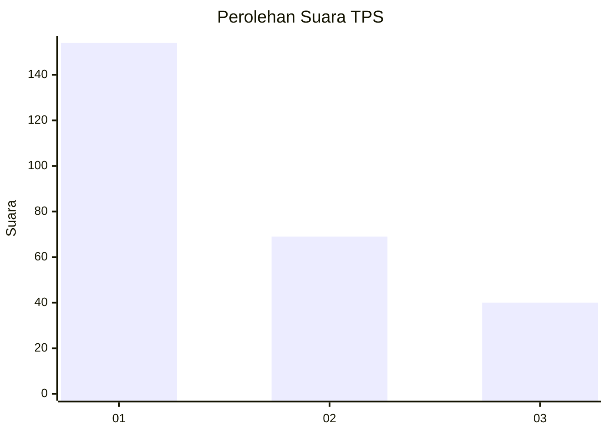
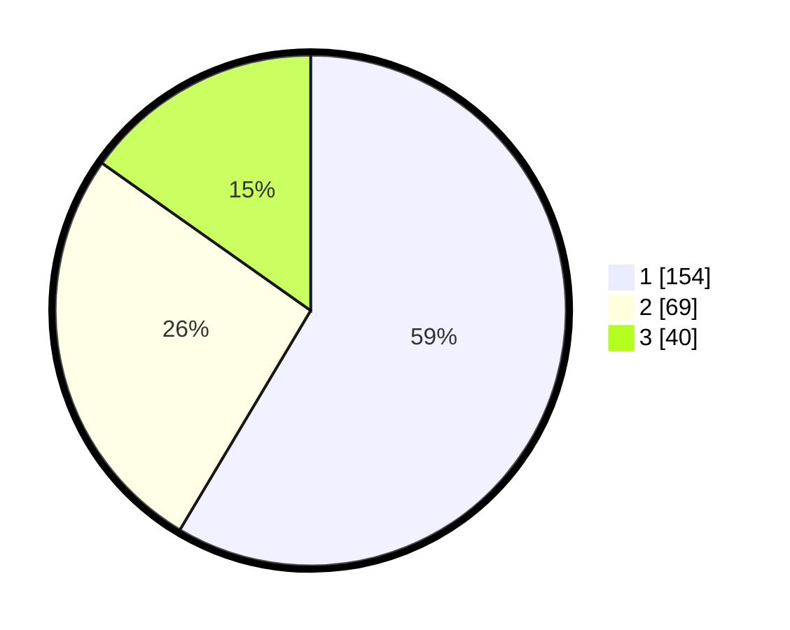

# Hasil

## Grafik

## Tabel

| No. | Nama Paslon    | Suara | Suara (raw) | Persentase |
|:--- |:-------------- | -----:| -----------:| ----------:|
| 1   | ANIES MUHAIMIN | 154   | [154][p-1]  | 58,56      |
| 2   | PRABOWO GIBRAN | 69    | [69][p-2]   | 26,24      |
| 3   | GANJAR MAHFUD  | 40    | [40][p-3]   | 15,21      |

[p-1]: https://github.com/gigit-pemilu/pemilu-2024-35-jawa-timur/blob/main/pilpres/hitung-suara/sub/35-jawa-timur/sub/29-sumenep/sub/09-guluk-guluk/sub/2001-bakeong/sub/002-tps/sub/paslon-1.txt
[p-2]: https://github.com/gigit-pemilu/pemilu-2024-35-jawa-timur/blob/main/pilpres/hitung-suara/sub/35-jawa-timur/sub/29-sumenep/sub/09-guluk-guluk/sub/2001-bakeong/sub/002-tps/sub/paslon-2.txt
[p-3]: https://github.com/gigit-pemilu/pemilu-2024-35-jawa-timur/blob/main/pilpres/hitung-suara/sub/35-jawa-timur/sub/29-sumenep/sub/09-guluk-guluk/sub/2001-bakeong/sub/002-tps/sub/paslon-3.txt

## Foto C Plano

https://sirekap-obj-formc.kpu.go.id/3736/pemilu/ppwp/35/29/09/20/01/3529092001002-20240225-213154--19c82488-4461-418a-96e7-fcf6c4ac9ab4.jpg

https://sirekap-obj-formc.kpu.go.id/3736/pemilu/ppwp/35/29/09/20/01/3529092001002-20240225-213225--79400d3e-07f2-4668-8b27-0632699fe0af.jpg

https://sirekap-obj-formc.kpu.go.id/3736/pemilu/ppwp/35/29/09/20/01/3529092001002-20240225-213246--676f4428-a9e7-4398-850f-279a706aad69.jpg

## Metadata

| Key        | Value               |
| ---------- | ------------------- |
| Time Stamp | 2024-03-01 16:00:00 |

