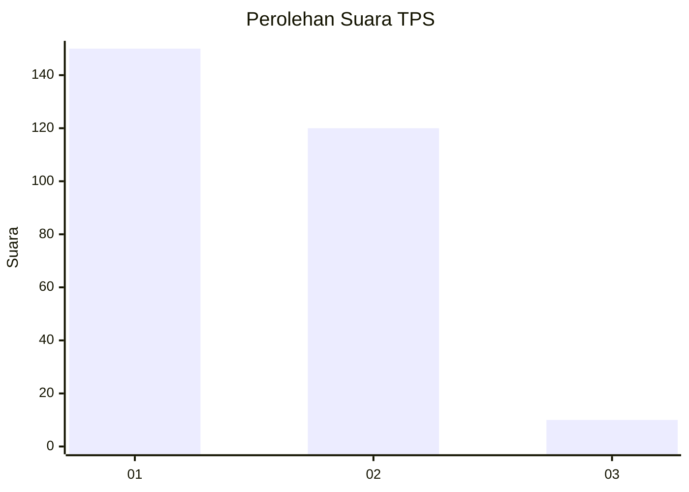
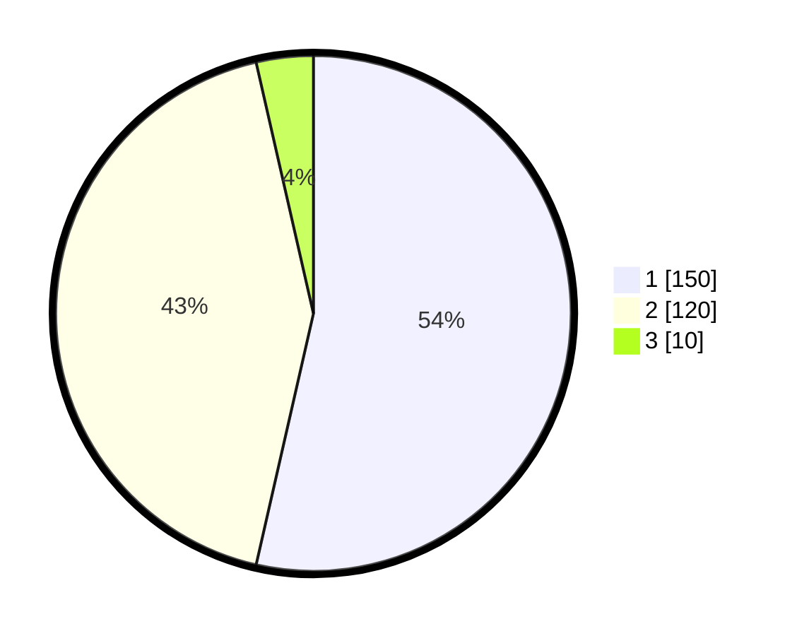

# Hasil

## Grafik

## Tabel

| No. | Nama Paslon    | Suara | Suara (raw) | Persentase |
|:--- |:-------------- | -----:| -----------:| ----------:|
| 1   | ANIES MUHAIMIN | 150   | [150][p-1]  | 53,57      |
| 2   | PRABOWO GIBRAN | 120   | [120][p-2]  | 42,86      |
| 3   | GANJAR MAHFUD  | 10    | [10][p-3]   | 3,57       |

[p-1]: https://github.com/gigit-pemilu/pemilu-2024/blob/main/pilpres/hitung-suara/sub/35-jawa-timur/sub/29-sumenep/sub/09-guluk-guluk/sub/2001-bakeong/sub/003-tps/sub/paslon-1.txt
[p-2]: https://github.com/gigit-pemilu/pemilu-2024/blob/main/pilpres/hitung-suara/sub/35-jawa-timur/sub/29-sumenep/sub/09-guluk-guluk/sub/2001-bakeong/sub/003-tps/sub/paslon-2.txt
[p-3]: https://github.com/gigit-pemilu/pemilu-2024/blob/main/pilpres/hitung-suara/sub/35-jawa-timur/sub/29-sumenep/sub/09-guluk-guluk/sub/2001-bakeong/sub/003-tps/sub/paslon-3.txt

## Foto C Plano

https://sirekap-obj-formc.kpu.go.id/18f6/pemilu/ppwp/35/29/09/20/01/3529092001003-20240225-214955--04d9f689-6cd0-46b4-a84c-792fd3a62350.jpg

https://sirekap-obj-formc.kpu.go.id/18f6/pemilu/ppwp/35/29/09/20/01/3529092001003-20240225-215018--fe4914e0-f7b9-40c1-a1c0-6440f6a90617.jpg

https://sirekap-obj-formc.kpu.go.id/18f6/pemilu/ppwp/35/29/09/20/01/3529092001003-20240225-215038--61266aae-b8c0-41f2-8e87-72295f0e9701.jpg

## Metadata

| Key        | Value               |
| ---------- | ------------------- |
| Time Stamp | 2024-03-01 16:00:00 |

