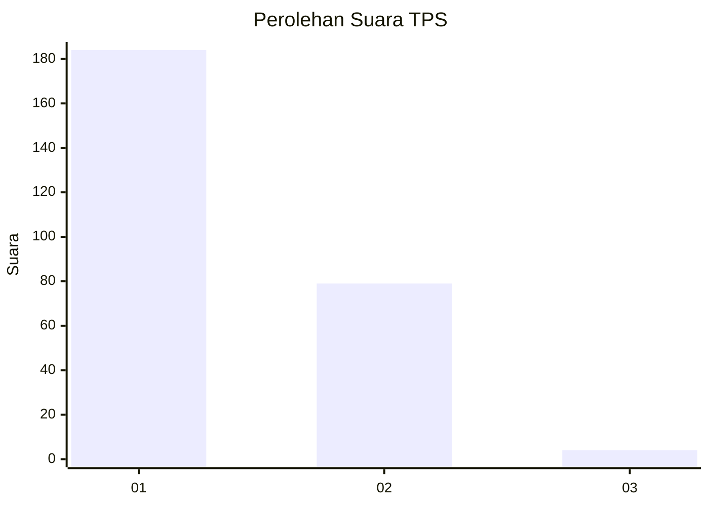
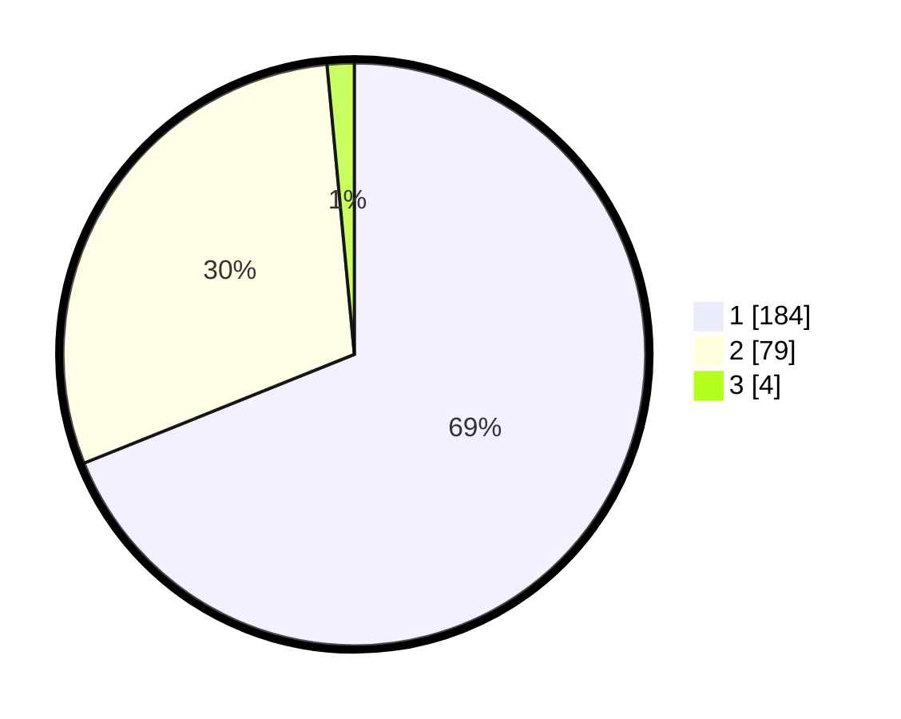

# Hasil

## Grafik

## Tabel

| No. | Nama Paslon    | Suara | Suara (raw) | Persentase |
|:--- |:-------------- | -----:| -----------:| ----------:|
| 1   | ANIES MUHAIMIN | 184   | [184][p-1]  | 68,91      |
| 2   | PRABOWO GIBRAN | 79    | [79][p-2]   | 29,59      |
| 3   | GANJAR MAHFUD  | 4     | [4][p-3]    | 1,50       |

[p-1]: https://github.com/gigit-pemilu/pemilu-2024/blob/main/pilpres/hitung-suara/sub/35-jawa-timur/sub/29-sumenep/sub/09-guluk-guluk/sub/2001-bakeong/sub/004-tps/sub/paslon-1.txt
[p-2]: https://github.com/gigit-pemilu/pemilu-2024/blob/main/pilpres/hitung-suara/sub/35-jawa-timur/sub/29-sumenep/sub/09-guluk-guluk/sub/2001-bakeong/sub/004-tps/sub/paslon-2.txt
[p-3]: https://github.com/gigit-pemilu/pemilu-2024/blob/main/pilpres/hitung-suara/sub/35-jawa-timur/sub/29-sumenep/sub/09-guluk-guluk/sub/2001-bakeong/sub/004-tps/sub/paslon-3.txt

## Foto C Plano

https://sirekap-obj-formc.kpu.go.id/952e/pemilu/ppwp/35/29/09/20/01/3529092001004-20240225-220305--106c10f5-9f20-4aee-bfbd-5dcf62ece63d.jpg

https://sirekap-obj-formc.kpu.go.id/952e/pemilu/ppwp/35/29/09/20/01/3529092001004-20240225-220325--8b0538cd-998d-423c-bd6d-d8875d2a5487.jpg

https://sirekap-obj-formc.kpu.go.id/952e/pemilu/ppwp/35/29/09/20/01/3529092001004-20240225-220345--a19da4bd-d8f1-42ce-b1ab-a33517067225.jpg

## Metadata

| Key        | Value               |
| ---------- | ------------------- |
| Time Stamp | 2024-02-28 19:00:00 |

