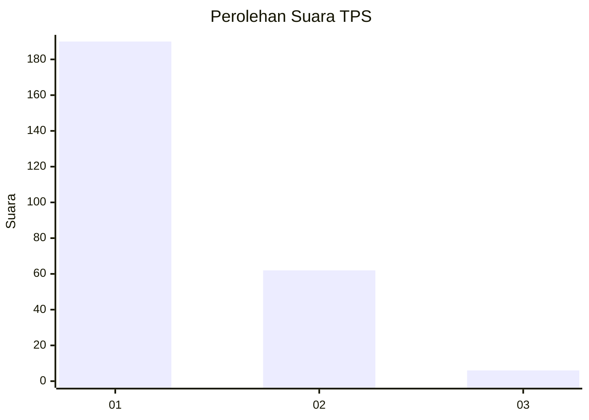
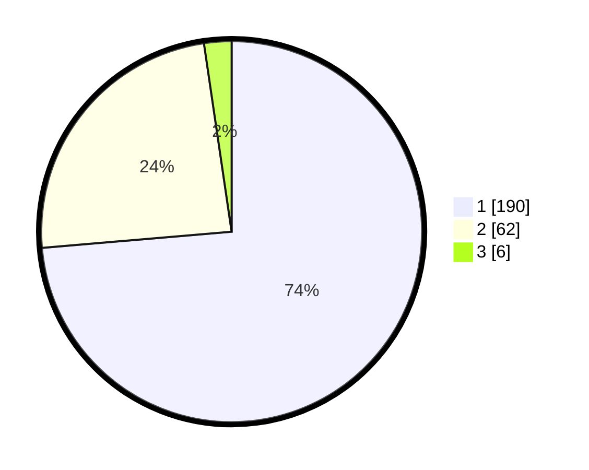

# Hasil

## Grafik

## Tabel

| No. | Nama Paslon    | Suara | Suara (raw) | Persentase |
|:--- |:-------------- | -----:| -----------:| ----------:|
| 1   | ANIES MUHAIMIN | 190   | [190][p-1]  | 73,64      |
| 2   | PRABOWO GIBRAN | 62    | [62][p-2]   | 24,03      |
| 3   | GANJAR MAHFUD  | 6     | [6][p-3]    | 2,33       |

[p-1]: https://github.com/gigit-pemilu/pemilu-2024-35-jawa-timur/blob/main/pilpres/hitung-suara/sub/35-jawa-timur/sub/29-sumenep/sub/09-guluk-guluk/sub/2001-bakeong/sub/006-tps/sub/paslon-1.txt
[p-2]: https://github.com/gigit-pemilu/pemilu-2024-35-jawa-timur/blob/main/pilpres/hitung-suara/sub/35-jawa-timur/sub/29-sumenep/sub/09-guluk-guluk/sub/2001-bakeong/sub/006-tps/sub/paslon-2.txt
[p-3]: https://github.com/gigit-pemilu/pemilu-2024-35-jawa-timur/blob/main/pilpres/hitung-suara/sub/35-jawa-timur/sub/29-sumenep/sub/09-guluk-guluk/sub/2001-bakeong/sub/006-tps/sub/paslon-3.txt

## Foto C Plano

https://sirekap-obj-formc.kpu.go.id/b0d5/pemilu/ppwp/35/29/09/20/01/3529092001006-20240225-225824--2d594dcf-0078-418f-a803-54f28bf09d33.jpg

https://sirekap-obj-formc.kpu.go.id/b0d5/pemilu/ppwp/35/29/09/20/01/3529092001006-20240225-225935--3c04c1ed-e01f-403c-94c5-12d39b608497.jpg

https://sirekap-obj-formc.kpu.go.id/b0d5/pemilu/ppwp/35/29/09/20/01/3529092001006-20240225-230002--2f8b6dab-86e0-4e64-8b6f-1a11658405d4.jpg

## Metadata

| Key        | Value               |
| ---------- | ------------------- |
| Time Stamp | 2024-02-29 14:00:00 |

