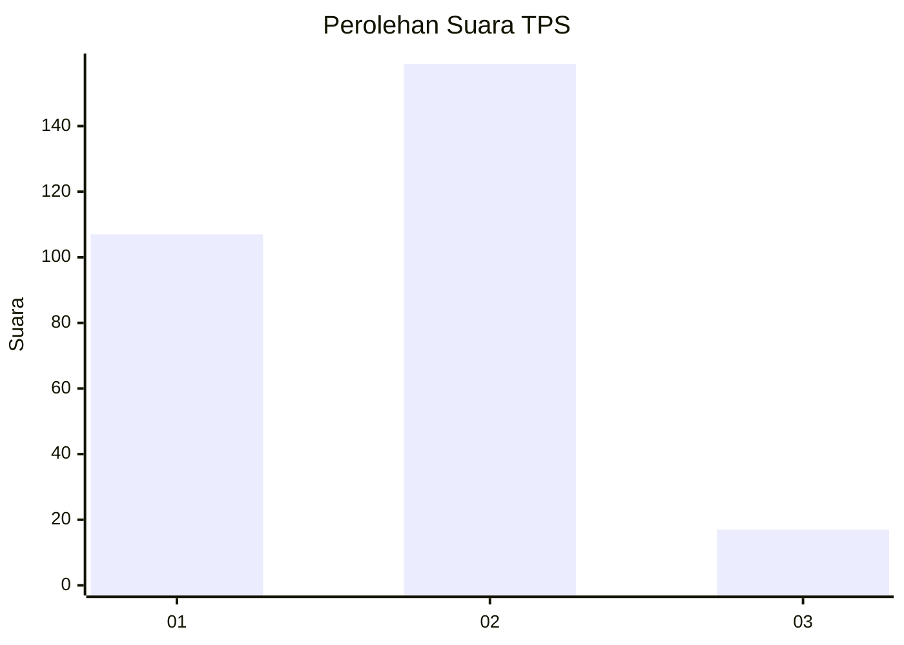
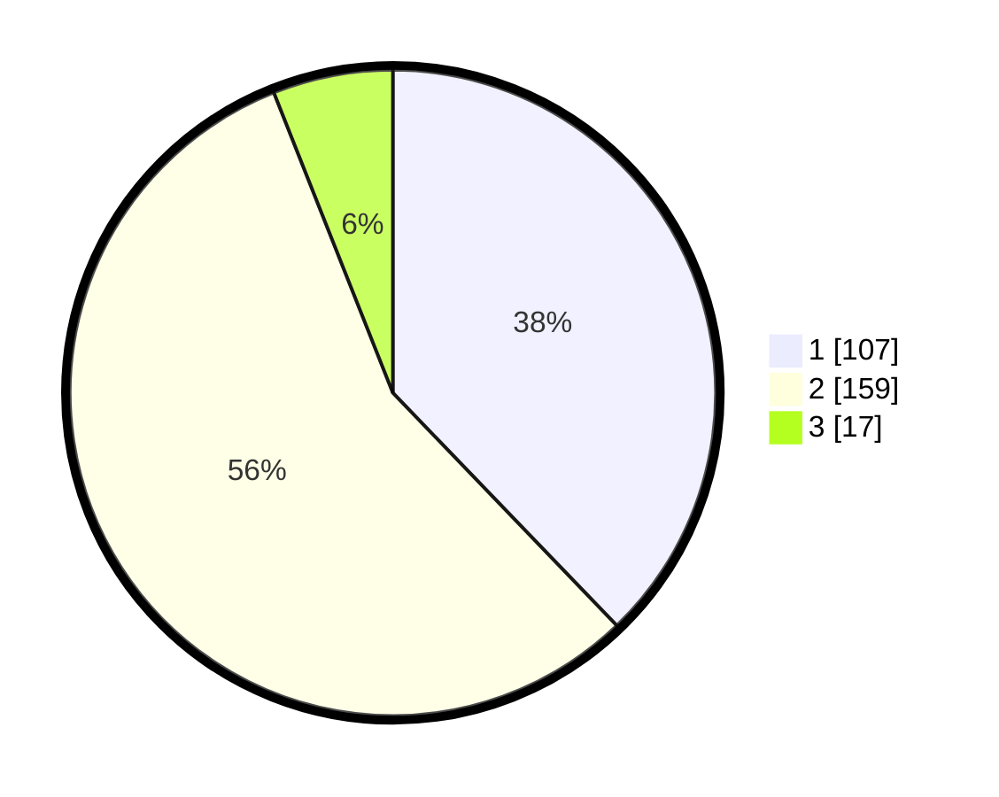

# Hasil

## Grafik

## Tabel

| No. | Nama Paslon    | Suara | Suara (raw) | Persentase |
|:--- |:-------------- | -----:| -----------:| ----------:|
| 1   | ANIES MUHAIMIN | 107   | [107][p-1]  | 37,81      |
| 2   | PRABOWO GIBRAN | 159   | [159][p-2]  | 56,18      |
| 3   | GANJAR MAHFUD  | 17    | [17][p-3]   | 6,01       |

[p-1]: https://github.com/gigit-pemilu/pemilu-2024/blob/main/pilpres/hitung-suara/sub/35-jawa-timur/sub/29-sumenep/sub/09-guluk-guluk/sub/2001-bakeong/sub/007-tps/sub/paslon-1.txt
[p-2]: https://github.com/gigit-pemilu/pemilu-2024/blob/main/pilpres/hitung-suara/sub/35-jawa-timur/sub/29-sumenep/sub/09-guluk-guluk/sub/2001-bakeong/sub/007-tps/sub/paslon-2.txt
[p-3]: https://github.com/gigit-pemilu/pemilu-2024/blob/main/pilpres/hitung-suara/sub/35-jawa-timur/sub/29-sumenep/sub/09-guluk-guluk/sub/2001-bakeong/sub/007-tps/sub/paslon-3.txt

## Foto C Plano

https://sirekap-obj-formc.kpu.go.id/d75c/pemilu/ppwp/35/29/09/20/01/3529092001007-20240225-231649--bd11a3df-d90c-4e5c-a119-9d1a44954b68.jpg

https://sirekap-obj-formc.kpu.go.id/d75c/pemilu/ppwp/35/29/09/20/01/3529092001007-20240225-231719--d8703ddc-d4ef-46d9-b8ae-9498089137e5.jpg

https://sirekap-obj-formc.kpu.go.id/d75c/pemilu/ppwp/35/29/09/20/01/3529092001007-20240225-231803--8f466dbb-46ff-4c31-bf6c-0586cbf70ca3.jpg

## Metadata

| Key        | Value               |
| ---------- | ------------------- |
| Time Stamp | 2024-02-28 19:00:00 |

