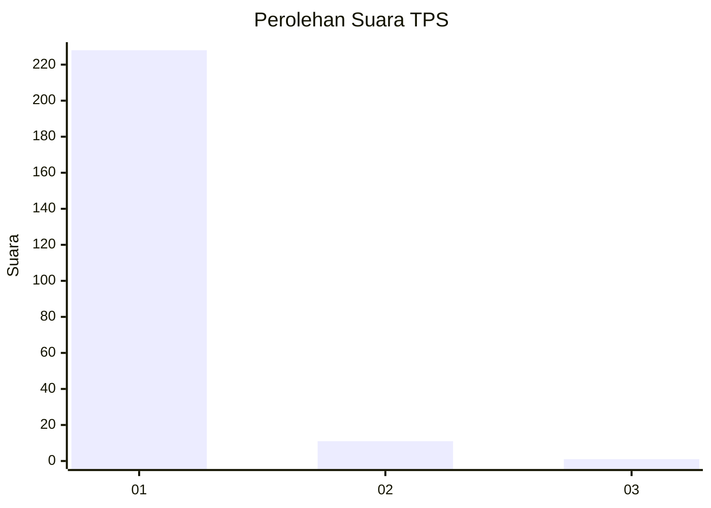
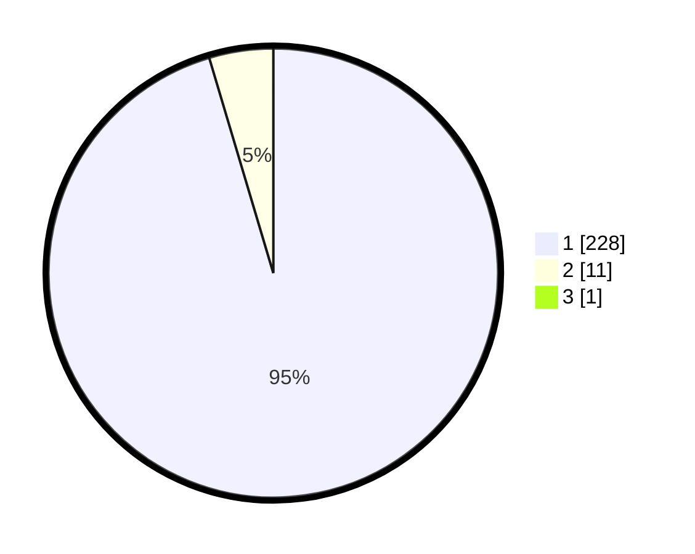

# Hasil

## Grafik

## Tabel

| No. | Nama Paslon    | Suara | Suara (raw) | Persentase |
|:--- |:-------------- | -----:| -----------:| ----------:|
| 1   | ANIES MUHAIMIN | 228   | [228][p-1]  | 95,00      |
| 2   | PRABOWO GIBRAN | 11    | [11][p-2]   | 4,58       |
| 3   | GANJAR MAHFUD  | 1     | [1][p-3]    | 0,42       |

[p-1]: https://github.com/gigit-pemilu/pemilu-2024-35-jawa-timur/blob/main/pilpres/hitung-suara/sub/35-jawa-timur/sub/29-sumenep/sub/09-guluk-guluk/sub/2001-bakeong/sub/008-tps/sub/paslon-1.txt
[p-2]: https://github.com/gigit-pemilu/pemilu-2024-35-jawa-timur/blob/main/pilpres/hitung-suara/sub/35-jawa-timur/sub/29-sumenep/sub/09-guluk-guluk/sub/2001-bakeong/sub/008-tps/sub/paslon-2.txt
[p-3]: https://github.com/gigit-pemilu/pemilu-2024-35-jawa-timur/blob/main/pilpres/hitung-suara/sub/35-jawa-timur/sub/29-sumenep/sub/09-guluk-guluk/sub/2001-bakeong/sub/008-tps/sub/paslon-3.txt

## Foto C Plano

https://sirekap-obj-formc.kpu.go.id/070e/pemilu/ppwp/35/29/09/20/01/3529092001008-20240225-232339--d9cbc685-4209-4b55-a29e-83f068ce1b37.jpg

https://sirekap-obj-formc.kpu.go.id/070e/pemilu/ppwp/35/29/09/20/01/3529092001008-20240225-232420--f053a821-45a8-46a2-8b9a-fd638fa29a8e.jpg

https://sirekap-obj-formc.kpu.go.id/070e/pemilu/ppwp/35/29/09/20/01/3529092001008-20240225-232606--7dd08d0f-eae8-4436-b0bf-11b4be818a02.jpg

## Metadata

| Key        | Value               |
| ---------- | ------------------- |
| Time Stamp | 2024-02-28 20:00:00 |

