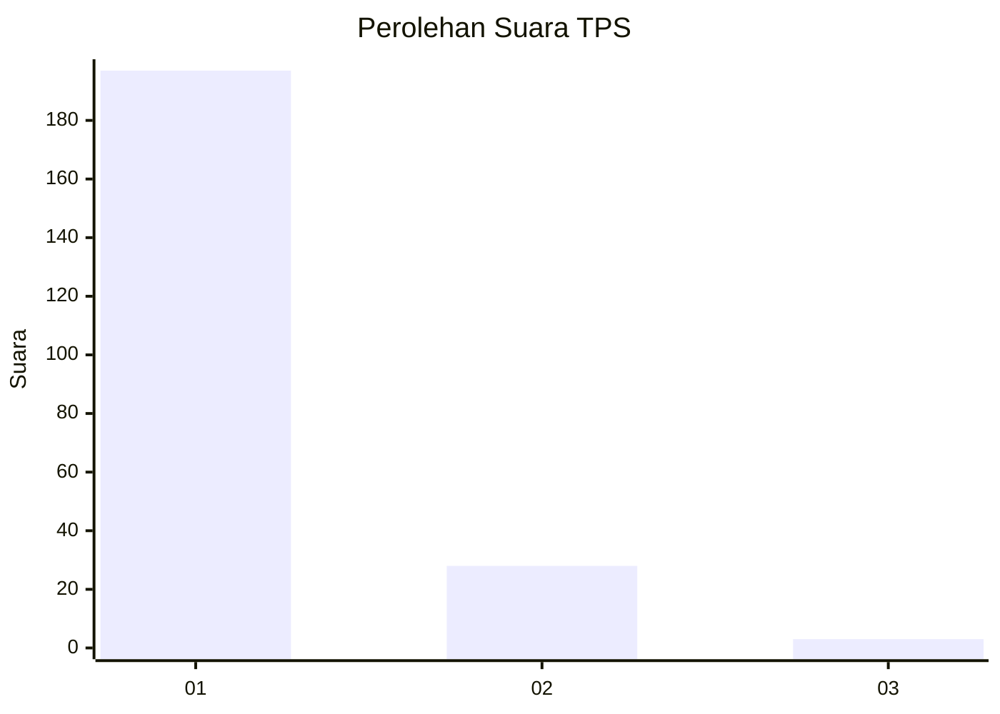
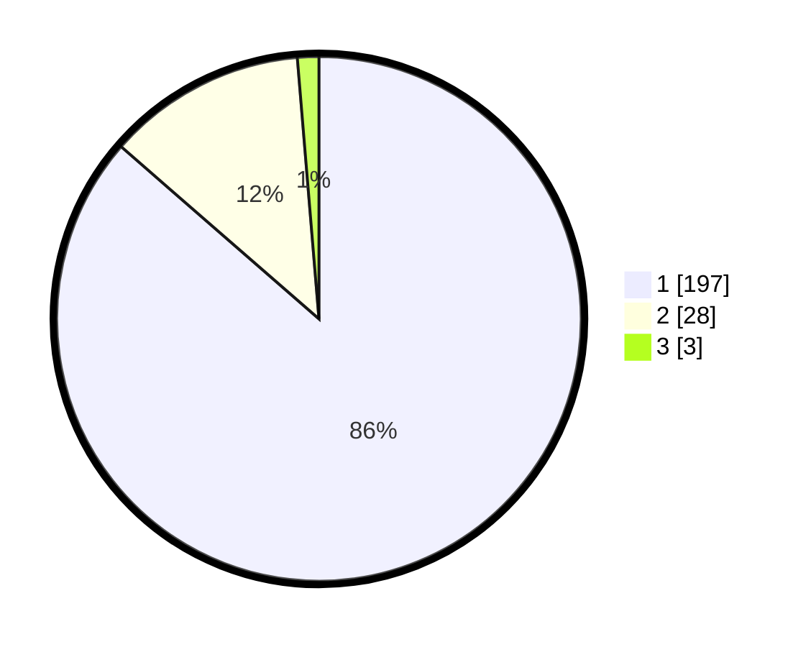

# Hasil

## Grafik

## Tabel

| No. | Nama Paslon    | Suara | Suara (raw) | Persentase |
|:--- |:-------------- | -----:| -----------:| ----------:|
| 1   | ANIES MUHAIMIN | 197   | [197][p-1]  | 86,40      |
| 2   | PRABOWO GIBRAN | 28    | [28][p-2]   | 12,28      |
| 3   | GANJAR MAHFUD  | 3     | [3][p-3]    | 1,32       |

[p-1]: https://github.com/gigit-pemilu/pemilu-2024-35-jawa-timur/blob/main/pilpres/hitung-suara/sub/35-jawa-timur/sub/29-sumenep/sub/09-guluk-guluk/sub/2002-payudan-dundang/sub/002-tps/sub/paslon-1.txt
[p-2]: https://github.com/gigit-pemilu/pemilu-2024-35-jawa-timur/blob/main/pilpres/hitung-suara/sub/35-jawa-timur/sub/29-sumenep/sub/09-guluk-guluk/sub/2002-payudan-dundang/sub/002-tps/sub/paslon-2.txt
[p-3]: https://github.com/gigit-pemilu/pemilu-2024-35-jawa-timur/blob/main/pilpres/hitung-suara/sub/35-jawa-timur/sub/29-sumenep/sub/09-guluk-guluk/sub/2002-payudan-dundang/sub/002-tps/sub/paslon-3.txt

## Foto C Plano

https://sirekap-obj-formc.kpu.go.id/936b/pemilu/ppwp/35/29/09/20/02/3529092002002-20240225-120614--3d00d58b-d3be-480b-8266-16e838a2c7c0.jpg

https://sirekap-obj-formc.kpu.go.id/936b/pemilu/ppwp/35/29/09/20/02/3529092002002-20240225-120646--35ba44ea-792b-4ea5-ad77-d7070c2d8f05.jpg

https://sirekap-obj-formc.kpu.go.id/936b/pemilu/ppwp/35/29/09/20/02/3529092002002-20240225-120543--2a2033be-5c83-4bf5-ad87-260da9f99b1e.jpg

## Metadata

| Key        | Value               |
| ---------- | ------------------- |
| Time Stamp | 2024-02-28 19:00:00 |

