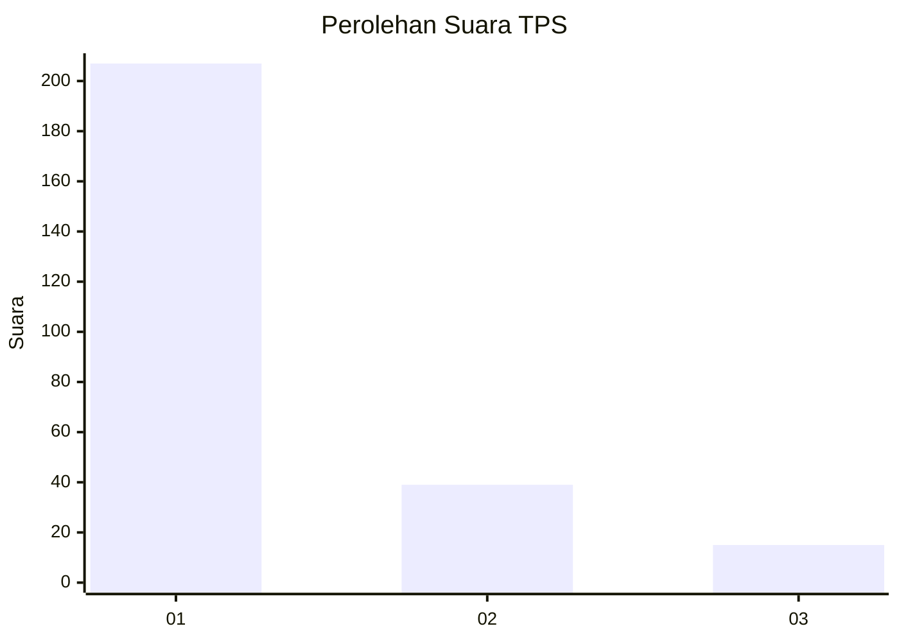
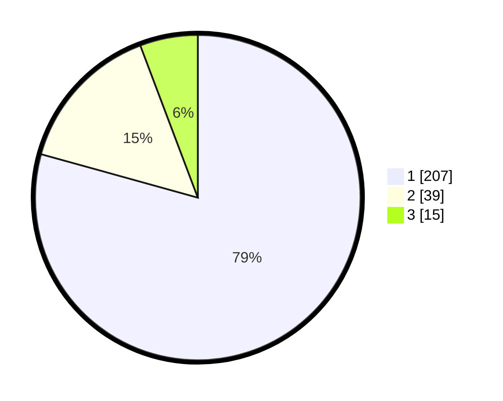

# Hasil

## Grafik

## Tabel

| No. | Nama Paslon    | Suara | Suara (raw) | Persentase |
|:--- |:-------------- | -----:| -----------:| ----------:|
| 1   | ANIES MUHAIMIN | 207   | [207][p-1]  | 79,31      |
| 2   | PRABOWO GIBRAN | 39    | [39][p-2]   | 14,94      |
| 3   | GANJAR MAHFUD  | 15    | [15][p-3]   | 5,75       |

[p-1]: https://github.com/gigit-pemilu/pemilu-2024-35-jawa-timur/blob/main/pilpres/hitung-suara/sub/35-jawa-timur/sub/29-sumenep/sub/09-guluk-guluk/sub/2002-payudan-dundang/sub/003-tps/sub/paslon-1.txt
[p-2]: https://github.com/gigit-pemilu/pemilu-2024-35-jawa-timur/blob/main/pilpres/hitung-suara/sub/35-jawa-timur/sub/29-sumenep/sub/09-guluk-guluk/sub/2002-payudan-dundang/sub/003-tps/sub/paslon-2.txt
[p-3]: https://github.com/gigit-pemilu/pemilu-2024-35-jawa-timur/blob/main/pilpres/hitung-suara/sub/35-jawa-timur/sub/29-sumenep/sub/09-guluk-guluk/sub/2002-payudan-dundang/sub/003-tps/sub/paslon-3.txt

## Foto C Plano

https://sirekap-obj-formc.kpu.go.id/944d/pemilu/ppwp/35/29/09/20/02/3529092002003-20240225-122112--117c13c1-08bb-454f-825a-c3c0aba36907.jpg

https://sirekap-obj-formc.kpu.go.id/944d/pemilu/ppwp/35/29/09/20/02/3529092002003-20240225-122139--26b7b628-ab0c-4c3c-ab58-c1d262262015.jpg

https://sirekap-obj-formc.kpu.go.id/944d/pemilu/ppwp/35/29/09/20/02/3529092002003-20240225-122205--8cfd7171-baf4-4983-96eb-375759b35746.jpg

## Metadata

| Key        | Value               |
| ---------- | ------------------- |
| Time Stamp | 2024-02-28 19:00:00 |

