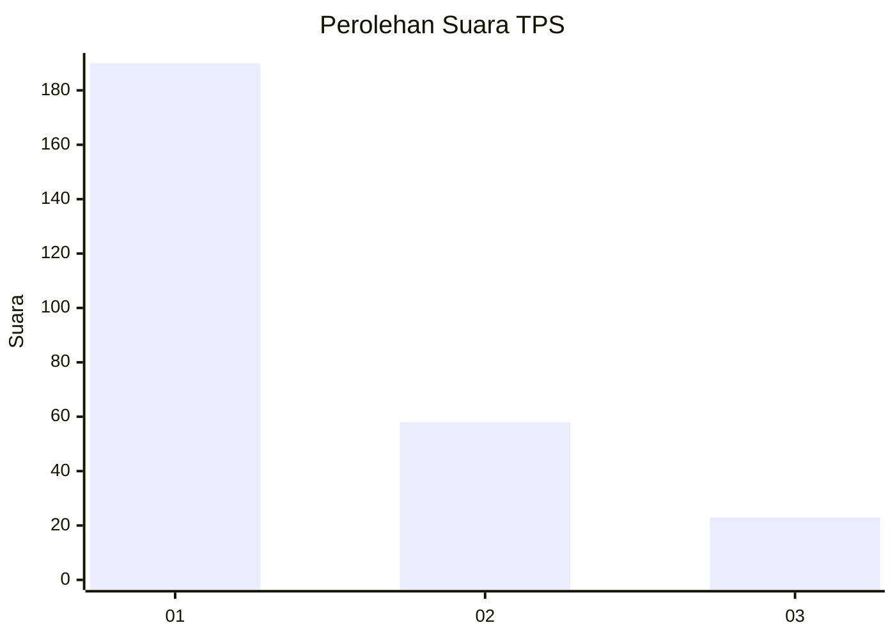
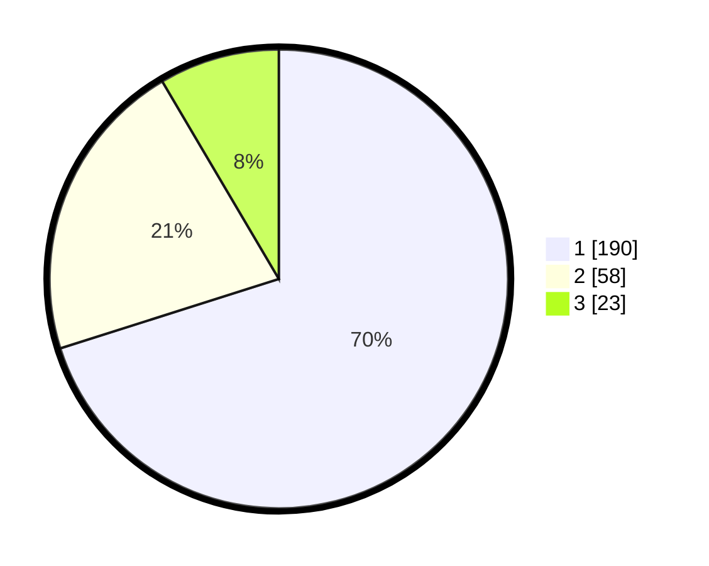

# Hasil

## Grafik

## Tabel

| No. | Nama Paslon    | Suara | Suara (raw) | Persentase |
|:--- |:-------------- | -----:| -----------:| ----------:|
| 1   | ANIES MUHAIMIN | 190   | [190][p-1]  | 70,11      |
| 2   | PRABOWO GIBRAN | 58    | [58][p-2]   | 21,40      |
| 3   | GANJAR MAHFUD  | 23    | [23][p-3]   | 8,49       |

[p-1]: https://github.com/gigit-pemilu/pemilu-2024-35-jawa-timur/blob/main/pilpres/hitung-suara/sub/35-jawa-timur/sub/29-sumenep/sub/09-guluk-guluk/sub/2002-payudan-dundang/sub/004-tps/sub/paslon-1.txt
[p-2]: https://github.com/gigit-pemilu/pemilu-2024-35-jawa-timur/blob/main/pilpres/hitung-suara/sub/35-jawa-timur/sub/29-sumenep/sub/09-guluk-guluk/sub/2002-payudan-dundang/sub/004-tps/sub/paslon-2.txt
[p-3]: https://github.com/gigit-pemilu/pemilu-2024-35-jawa-timur/blob/main/pilpres/hitung-suara/sub/35-jawa-timur/sub/29-sumenep/sub/09-guluk-guluk/sub/2002-payudan-dundang/sub/004-tps/sub/paslon-3.txt

## Foto C Plano

https://sirekap-obj-formc.kpu.go.id/84c4/pemilu/ppwp/35/29/09/20/02/3529092002004-20240225-142455--f882e058-6ff7-4757-bf1e-4c2fc5dad0cb.jpg

https://sirekap-obj-formc.kpu.go.id/84c4/pemilu/ppwp/35/29/09/20/02/3529092002004-20240225-142533--15ebe3b1-76b9-438d-878c-976b90318c6a.jpg

https://sirekap-obj-formc.kpu.go.id/84c4/pemilu/ppwp/35/29/09/20/02/3529092002004-20240225-142559--2882cb59-e3e3-4296-9378-323c74a84cc3.jpg

## Metadata

| Key        | Value               |
| ---------- | ------------------- |
| Time Stamp | 2024-02-28 19:00:00 |

