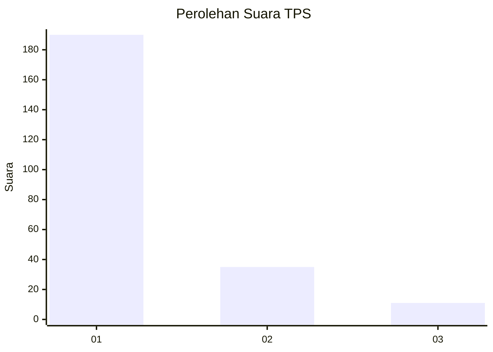
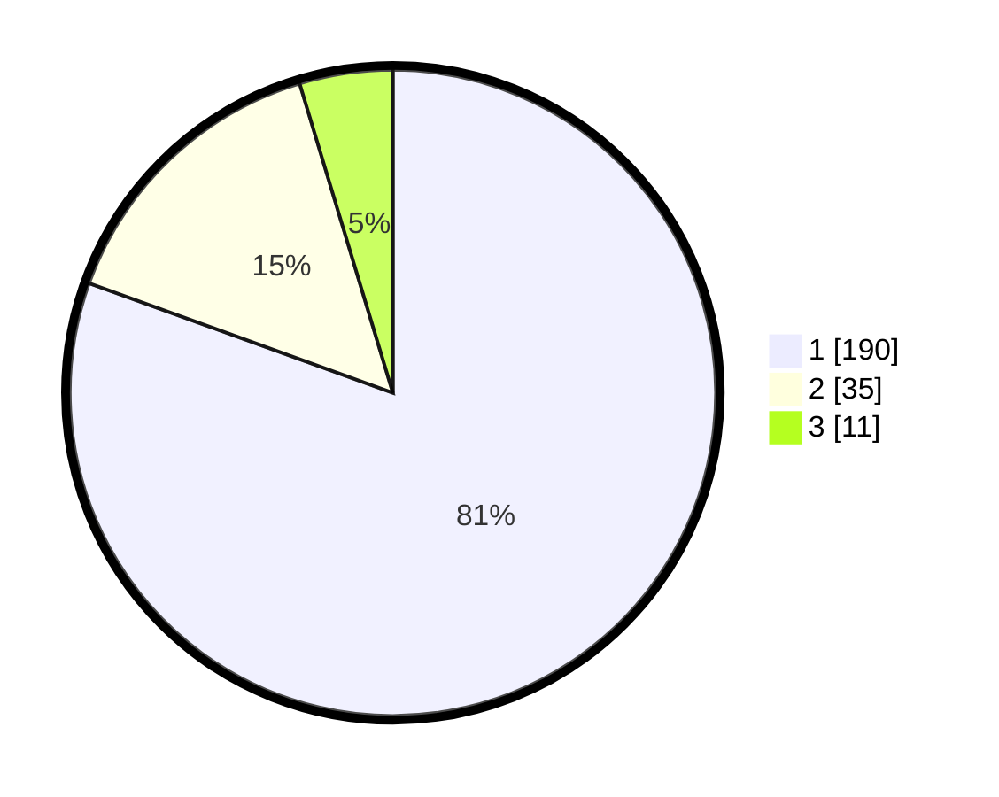

# Hasil

## Grafik

## Tabel

| No. | Nama Paslon    | Suara | Suara (raw) | Persentase |
|:--- |:-------------- | -----:| -----------:| ----------:|
| 1   | ANIES MUHAIMIN | 190   | [190][p-1]  | 80,51      |
| 2   | PRABOWO GIBRAN | 35    | [35][p-2]   | 14,83      |
| 3   | GANJAR MAHFUD  | 11    | [11][p-3]   | 4,66       |

[p-1]: https://github.com/gigit-pemilu/pemilu-2024-35-jawa-timur/blob/main/pilpres/hitung-suara/sub/35-jawa-timur/sub/29-sumenep/sub/09-guluk-guluk/sub/2002-payudan-dundang/sub/005-tps/sub/paslon-1.txt
[p-2]: https://github.com/gigit-pemilu/pemilu-2024-35-jawa-timur/blob/main/pilpres/hitung-suara/sub/35-jawa-timur/sub/29-sumenep/sub/09-guluk-guluk/sub/2002-payudan-dundang/sub/005-tps/sub/paslon-2.txt
[p-3]: https://github.com/gigit-pemilu/pemilu-2024-35-jawa-timur/blob/main/pilpres/hitung-suara/sub/35-jawa-timur/sub/29-sumenep/sub/09-guluk-guluk/sub/2002-payudan-dundang/sub/005-tps/sub/paslon-3.txt

## Foto C Plano

https://sirekap-obj-formc.kpu.go.id/d618/pemilu/ppwp/35/29/09/20/02/3529092002005-20240225-114243--578d7a75-141b-42e3-abf4-41df8cc9abdc.jpg

https://sirekap-obj-formc.kpu.go.id/d618/pemilu/ppwp/35/29/09/20/02/3529092002005-20240225-114147--d1f41b4c-7854-4f9a-8d94-77e789cb5262.jpg

https://sirekap-obj-formc.kpu.go.id/d618/pemilu/ppwp/35/29/09/20/02/3529092002005-20240225-114208--13ac9a12-9a13-4a3f-8067-46d1d2260bfb.jpg

## Metadata

| Key        | Value               |
| ---------- | ------------------- |
| Time Stamp | 2024-02-26 10:00:00 |

## DATA PEMILIH TETAP

Jumlah pemilih dalam DPT: **282**.
 * L: **411**.
 * P: **131**.

## DATA PENGGUNA HAK PILIH

Jumlah pengguna hak pilih dalam DPT: **262**.
 * L: **222**.
 * P: **266**.

Jumlah pengguna hak pilih dalam DPTb: **550**.
 * L: **110**.
 * P: **50**.

Jumlah pengguna hak pilih dalam DPK: **0**.
 * L: **70**.
 * P: **0**.

Jumlah pengguna hak pilih: **237**.
 * L: **111**.
 * P: **126**.

## JUMLAH SUARA SAH DAN TIDAK SAH

JUMLAH SELURUH SUARA SAH: **236**.

JUMLAH SUARA TIDAK SAH: **1**.

JUMLAH SELURUH SUARA SAH DAN SUARA TIDAK SAH: **237**.

