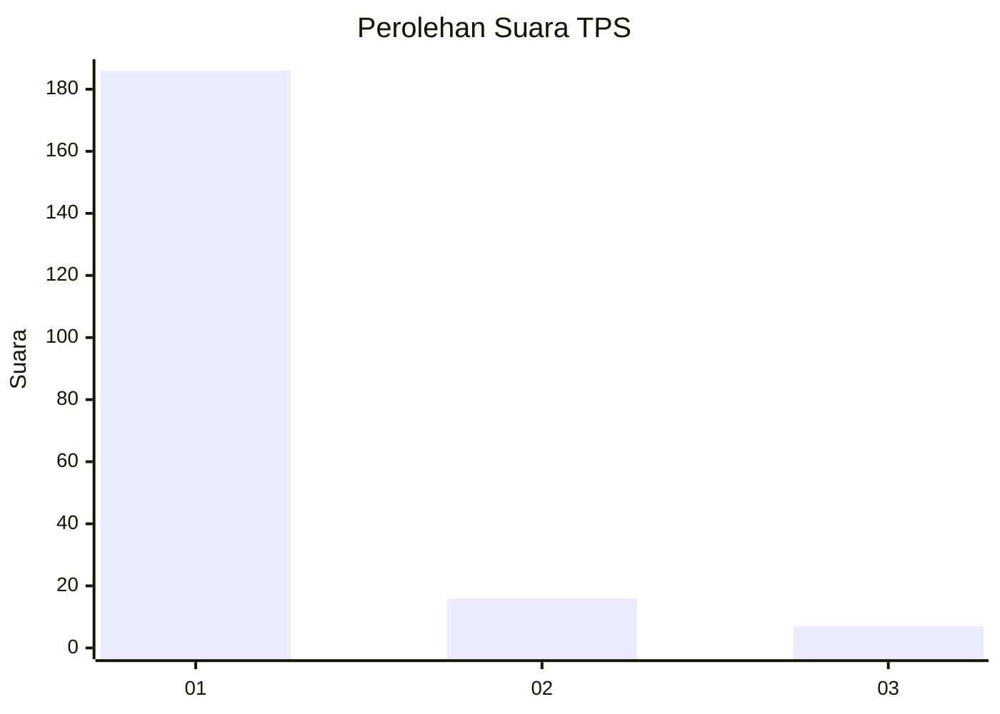
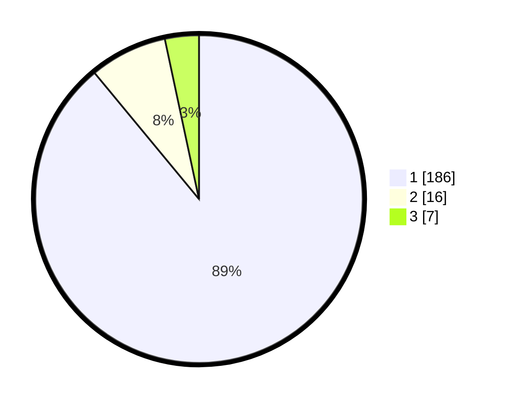

# Hasil

## Grafik

## Tabel

| No. | Nama Paslon    | Suara | Suara (raw) | Persentase |
|:--- |:-------------- | -----:| -----------:| ----------:|
| 1   | ANIES MUHAIMIN | 186   | [186][p-1]  | 89,00      |
| 2   | PRABOWO GIBRAN | 16    | [16][p-2]   | 7,66       |
| 3   | GANJAR MAHFUD  | 7     | [7][p-3]    | 3,35       |

[p-1]: https://github.com/gigit-pemilu/pemilu-2024/blob/main/pilpres/hitung-suara/sub/35-jawa-timur/sub/29-sumenep/sub/09-guluk-guluk/sub/2002-payudan-dundang/sub/007-tps/sub/paslon-1.txt
[p-2]: https://github.com/gigit-pemilu/pemilu-2024/blob/main/pilpres/hitung-suara/sub/35-jawa-timur/sub/29-sumenep/sub/09-guluk-guluk/sub/2002-payudan-dundang/sub/007-tps/sub/paslon-2.txt
[p-3]: https://github.com/gigit-pemilu/pemilu-2024/blob/main/pilpres/hitung-suara/sub/35-jawa-timur/sub/29-sumenep/sub/09-guluk-guluk/sub/2002-payudan-dundang/sub/007-tps/sub/paslon-3.txt

## Foto C Plano

https://sirekap-obj-formc.kpu.go.id/e72b/pemilu/ppwp/35/29/09/20/02/3529092002007-20240225-114945--503a0f07-394b-49bc-8b3e-d4a93f7fbd07.jpg

https://sirekap-obj-formc.kpu.go.id/e72b/pemilu/ppwp/35/29/09/20/02/3529092002007-20240225-115024--78a27125-cba9-4e1e-9fc4-0f76efa35ec8.jpg

https://sirekap-obj-formc.kpu.go.id/e72b/pemilu/ppwp/35/29/09/20/02/3529092002007-20240225-115041--e636cb4b-70d0-4487-9286-2bd072471296.jpg

## Metadata

| Key        | Value               |
| ---------- | ------------------- |
| Time Stamp | 2024-02-28 19:00:00 |

