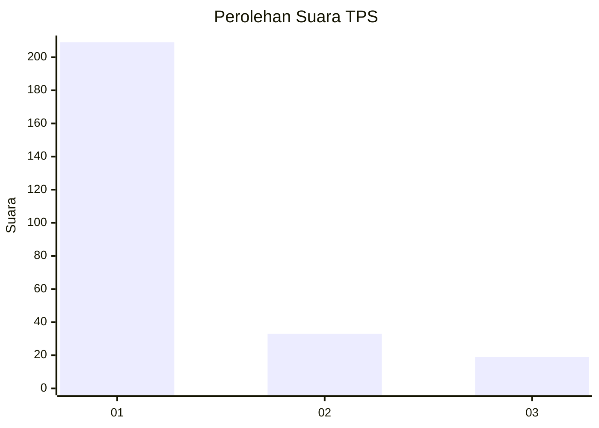
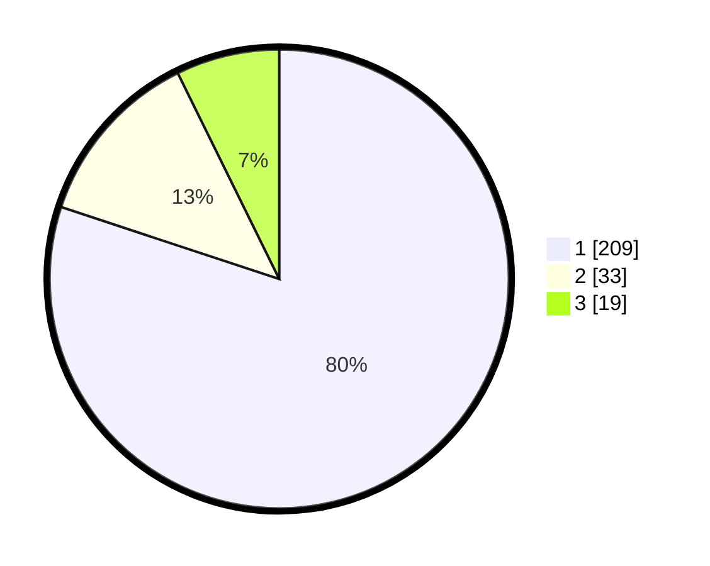

# Hasil

## Grafik

## Tabel

| No. | Nama Paslon    | Suara | Suara (raw) | Persentase |
|:--- |:-------------- | -----:| -----------:| ----------:|
| 1   | ANIES MUHAIMIN | 209   | [209][p-1]  | 80,08      |
| 2   | PRABOWO GIBRAN | 33    | [33][p-2]   | 12,64      |
| 3   | GANJAR MAHFUD  | 19    | [19][p-3]   | 7,28       |

[p-1]: https://github.com/gigit-pemilu/pemilu-2024/blob/main/pilpres/hitung-suara/sub/35-jawa-timur/sub/29-sumenep/sub/09-guluk-guluk/sub/2002-payudan-dundang/sub/008-tps/sub/paslon-1.txt
[p-2]: https://github.com/gigit-pemilu/pemilu-2024/blob/main/pilpres/hitung-suara/sub/35-jawa-timur/sub/29-sumenep/sub/09-guluk-guluk/sub/2002-payudan-dundang/sub/008-tps/sub/paslon-2.txt
[p-3]: https://github.com/gigit-pemilu/pemilu-2024/blob/main/pilpres/hitung-suara/sub/35-jawa-timur/sub/29-sumenep/sub/09-guluk-guluk/sub/2002-payudan-dundang/sub/008-tps/sub/paslon-3.txt

## Foto C Plano

https://sirekap-obj-formc.kpu.go.id/775a/pemilu/ppwp/35/29/09/20/02/3529092002008-20240225-114736--158ee487-38b3-436a-86ac-1b9f1f5f7815.jpg

https://sirekap-obj-formc.kpu.go.id/775a/pemilu/ppwp/35/29/09/20/02/3529092002008-20240225-114804--fec848cd-431f-40d9-8860-0e89b753b1ec.jpg

https://sirekap-obj-formc.kpu.go.id/775a/pemilu/ppwp/35/29/09/20/02/3529092002008-20240225-114823--89768631-9683-4e2f-9c34-2c0ee9875eea.jpg

## Metadata

| Key        | Value               |
| ---------- | ------------------- |
| Time Stamp | 2024-02-28 19:00:00 |

