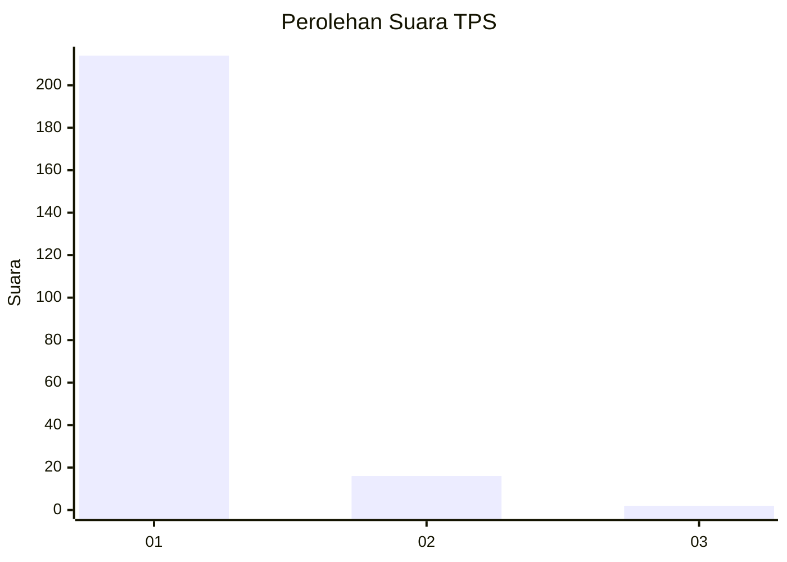
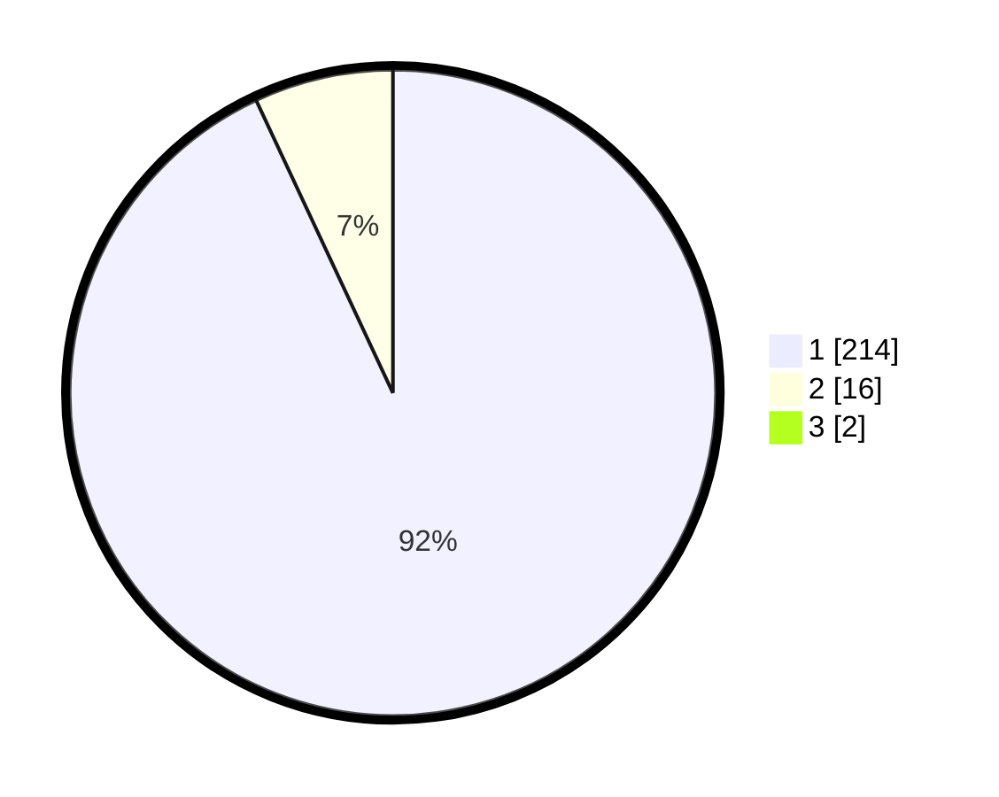

# Hasil

## Grafik

## Tabel

| No. | Nama Paslon    | Suara | Suara (raw) | Persentase |
|:--- |:-------------- | -----:| -----------:| ----------:|
| 1   | ANIES MUHAIMIN | 214   | [214][p-1]  | 92,24      |
| 2   | PRABOWO GIBRAN | 16    | [16][p-2]   | 6,90       |
| 3   | GANJAR MAHFUD  | 2     | [2][p-3]    | 0,86       |

[p-1]: https://github.com/gigit-pemilu/pemilu-2024/blob/main/pilpres/hitung-suara/sub/35-jawa-timur/sub/29-sumenep/sub/09-guluk-guluk/sub/2002-payudan-dundang/sub/009-tps/sub/paslon-1.txt
[p-2]: https://github.com/gigit-pemilu/pemilu-2024/blob/main/pilpres/hitung-suara/sub/35-jawa-timur/sub/29-sumenep/sub/09-guluk-guluk/sub/2002-payudan-dundang/sub/009-tps/sub/paslon-2.txt
[p-3]: https://github.com/gigit-pemilu/pemilu-2024/blob/main/pilpres/hitung-suara/sub/35-jawa-timur/sub/29-sumenep/sub/09-guluk-guluk/sub/2002-payudan-dundang/sub/009-tps/sub/paslon-3.txt

## Foto C Plano

https://sirekap-obj-formc.kpu.go.id/d390/pemilu/ppwp/35/29/09/20/02/3529092002009-20240225-124042--fb742c3d-9fad-487a-9a8a-c8ed72e95f3a.jpg

https://sirekap-obj-formc.kpu.go.id/d390/pemilu/ppwp/35/29/09/20/02/3529092002009-20240225-124259--739d3fed-2c24-45d8-b4c3-869455b949b0.jpg

https://sirekap-obj-formc.kpu.go.id/d390/pemilu/ppwp/35/29/09/20/02/3529092002009-20240225-124407--9f77b819-ea17-4b1b-8570-c398d8e73a74.jpg

## Metadata

| Key        | Value               |
| ---------- | ------------------- |
| Time Stamp | 2024-02-28 19:00:00 |

