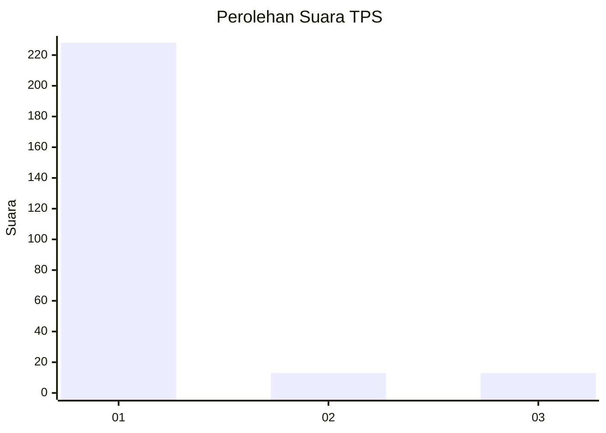
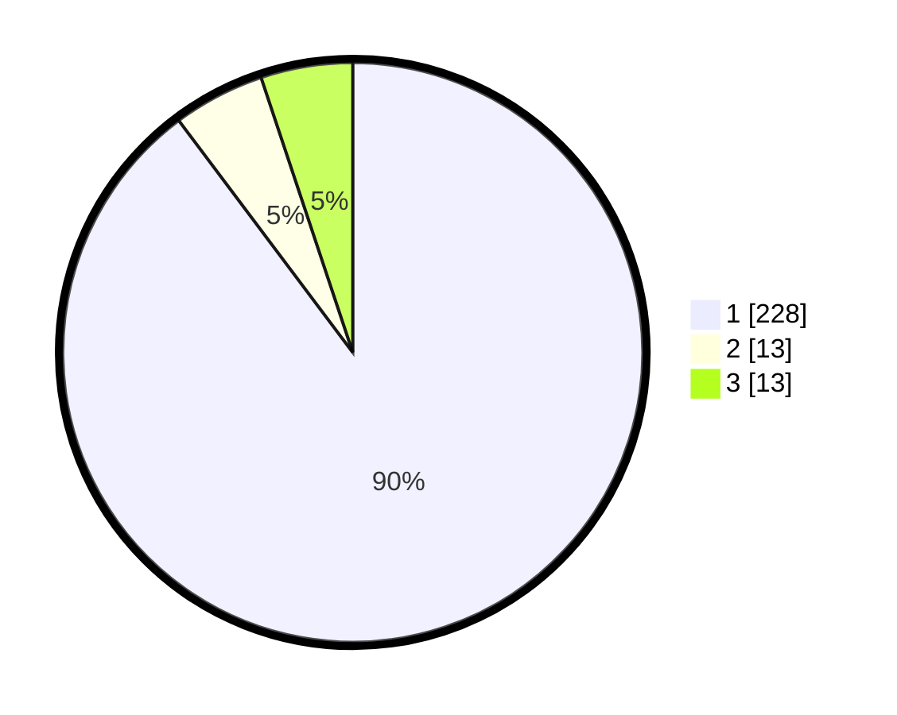

# Hasil

## Grafik

## Tabel

| No. | Nama Paslon    | Suara | Suara (raw) | Persentase |
|:--- |:-------------- | -----:| -----------:| ----------:|
| 1   | ANIES MUHAIMIN | 228   | [228][p-1]  | 89,76      |
| 2   | PRABOWO GIBRAN | 13    | [13][p-2]   | 5,12       |
| 3   | GANJAR MAHFUD  | 13    | [13][p-3]   | 5,12       |

[p-1]: https://github.com/gigit-pemilu/pemilu-2024-35-jawa-timur/blob/main/pilpres/hitung-suara/sub/35-jawa-timur/sub/29-sumenep/sub/09-guluk-guluk/sub/2002-payudan-dundang/sub/010-tps/sub/paslon-1.txt
[p-2]: https://github.com/gigit-pemilu/pemilu-2024-35-jawa-timur/blob/main/pilpres/hitung-suara/sub/35-jawa-timur/sub/29-sumenep/sub/09-guluk-guluk/sub/2002-payudan-dundang/sub/010-tps/sub/paslon-2.txt
[p-3]: https://github.com/gigit-pemilu/pemilu-2024-35-jawa-timur/blob/main/pilpres/hitung-suara/sub/35-jawa-timur/sub/29-sumenep/sub/09-guluk-guluk/sub/2002-payudan-dundang/sub/010-tps/sub/paslon-3.txt

## Foto C Plano

https://sirekap-obj-formc.kpu.go.id/2860/pemilu/ppwp/35/29/09/20/02/3529092002010-20240225-130320--1f42c49a-6b6c-4ca7-8da0-5bb0444396e2.jpg

https://sirekap-obj-formc.kpu.go.id/2860/pemilu/ppwp/35/29/09/20/02/3529092002010-20240225-130348--8a18c0dd-6e7f-4a67-9961-399dd2a0dc67.jpg

https://sirekap-obj-formc.kpu.go.id/2860/pemilu/ppwp/35/29/09/20/02/3529092002010-20240225-130501--5df019e8-cc02-4054-a837-a1b91b945a67.jpg

## Metadata

| Key        | Value               |
| ---------- | ------------------- |
| Time Stamp | 2024-02-28 19:00:00 |

