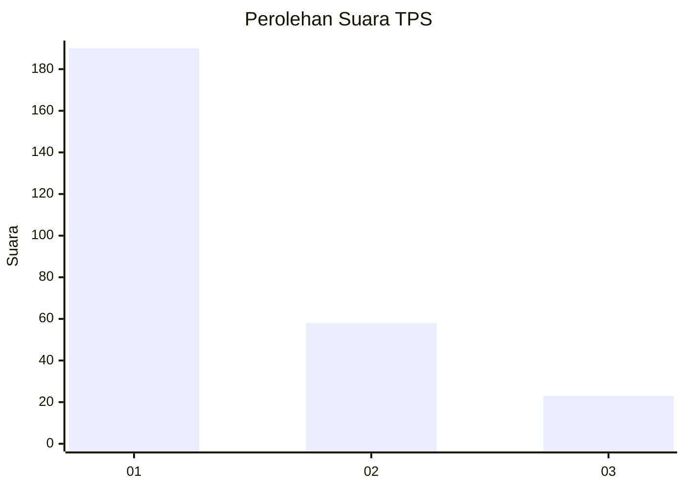
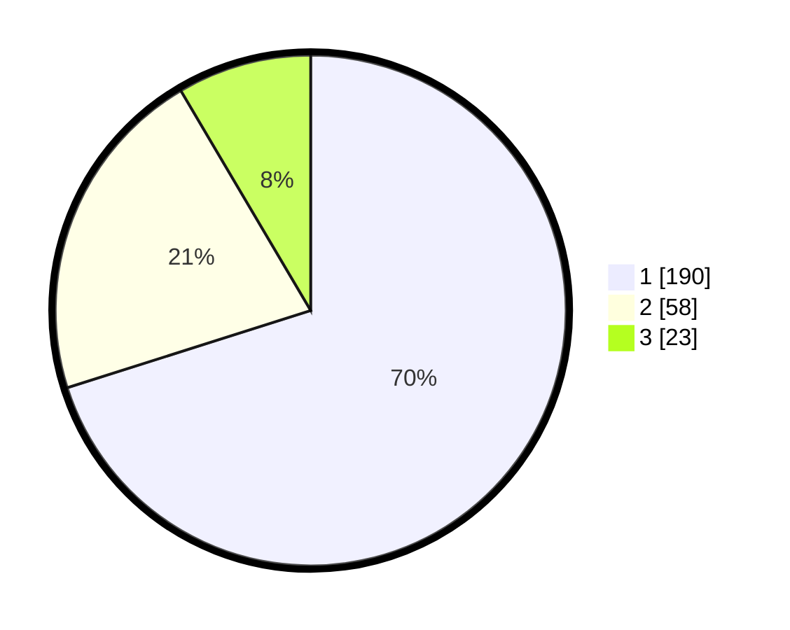

# Hasil

## Grafik

## Tabel

| No. | Nama Paslon    | Suara | Suara (raw) | Persentase |
|:--- |:-------------- | -----:| -----------:| ----------:|
| 1   | ANIES MUHAIMIN | 190   | [190][p-1]  | 70,11      |
| 2   | PRABOWO GIBRAN | 58    | [58][p-2]   | 21,40      |
| 3   | GANJAR MAHFUD  | 23    | [23][p-3]   | 8,49       |

[p-1]: https://github.com/gigit-pemilu/pemilu-2024/blob/main/pilpres/hitung-suara/sub/35-jawa-timur/sub/29-sumenep/sub/09-guluk-guluk/sub/2003-pordapor/sub/004-tps/sub/paslon-1.txt
[p-2]: https://github.com/gigit-pemilu/pemilu-2024/blob/main/pilpres/hitung-suara/sub/35-jawa-timur/sub/29-sumenep/sub/09-guluk-guluk/sub/2003-pordapor/sub/004-tps/sub/paslon-2.txt
[p-3]: https://github.com/gigit-pemilu/pemilu-2024/blob/main/pilpres/hitung-suara/sub/35-jawa-timur/sub/29-sumenep/sub/09-guluk-guluk/sub/2003-pordapor/sub/004-tps/sub/paslon-3.txt

## Foto C Plano

https://sirekap-obj-formc.kpu.go.id/4769/pemilu/ppwp/35/29/09/20/03/3529092003004-20240215-140829--0cdaaa4c-1834-474f-b838-9db8f3e8f1e1.jpg

https://sirekap-obj-formc.kpu.go.id/4769/pemilu/ppwp/35/29/09/20/03/3529092003004-20240215-140942--ba0cd57c-4318-4a82-a024-e4df869c566a.jpg

## Metadata

| Key        | Value               |
| ---------- | ------------------- |
| Time Stamp | 2024-02-25 14:00:00 |

