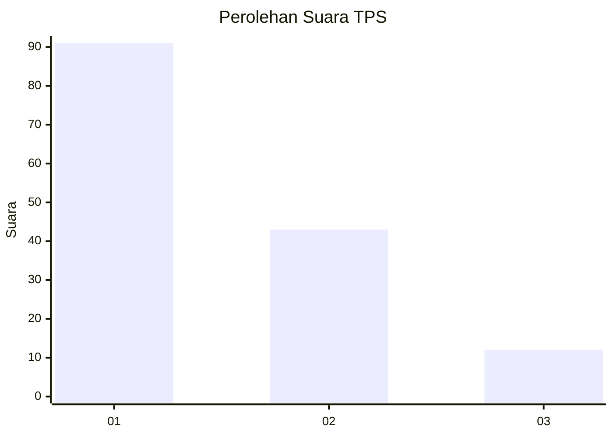
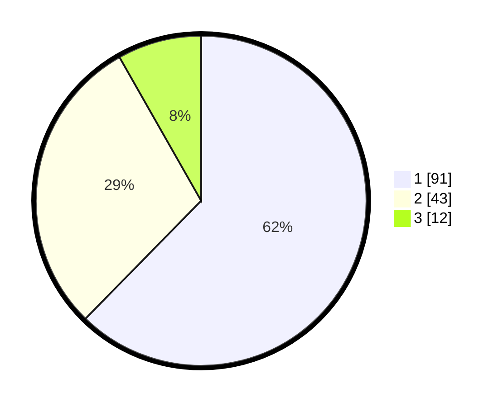

# Hasil

## Grafik

## Tabel

| No. | Nama Paslon    | Suara | Suara (raw) | Persentase |
|:--- |:-------------- | -----:| -----------:| ----------:|
| 1   | ANIES MUHAIMIN | 91    | [91][p-1]   | 62,33      |
| 2   | PRABOWO GIBRAN | 43    | [43][p-2]   | 29,45      |
| 3   | GANJAR MAHFUD  | 12    | [12][p-3]   | 8,22       |

[p-1]: https://github.com/gigit-pemilu/pemilu-2024-35-jawa-timur/blob/main/pilpres/hitung-suara/sub/35-jawa-timur/sub/29-sumenep/sub/09-guluk-guluk/sub/2003-pordapor/sub/006-tps/sub/paslon-1.txt
[p-2]: https://github.com/gigit-pemilu/pemilu-2024-35-jawa-timur/blob/main/pilpres/hitung-suara/sub/35-jawa-timur/sub/29-sumenep/sub/09-guluk-guluk/sub/2003-pordapor/sub/006-tps/sub/paslon-2.txt
[p-3]: https://github.com/gigit-pemilu/pemilu-2024-35-jawa-timur/blob/main/pilpres/hitung-suara/sub/35-jawa-timur/sub/29-sumenep/sub/09-guluk-guluk/sub/2003-pordapor/sub/006-tps/sub/paslon-3.txt

## Foto C Plano

https://sirekap-obj-formc.kpu.go.id/dff2/pemilu/ppwp/35/29/09/20/03/3529092003006-20240225-143032--2f1858cf-2863-4247-9986-ffa35992a7e8.jpg

https://sirekap-obj-formc.kpu.go.id/dff2/pemilu/ppwp/35/29/09/20/03/3529092003006-20240225-143109--7a7c3764-0f05-416b-b8df-c826b38f7d91.jpg

https://sirekap-obj-formc.kpu.go.id/dff2/pemilu/ppwp/35/29/09/20/03/3529092003006-20240225-143208--b5b630b9-9e5e-4c82-bf91-f9160a9aa699.jpg

## Metadata

| Key        | Value               |
| ---------- | ------------------- |
| Time Stamp | 2024-02-29 14:00:00 |

