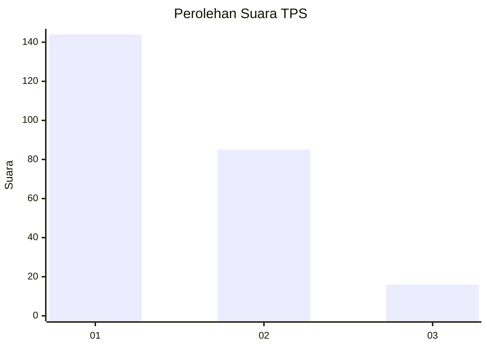
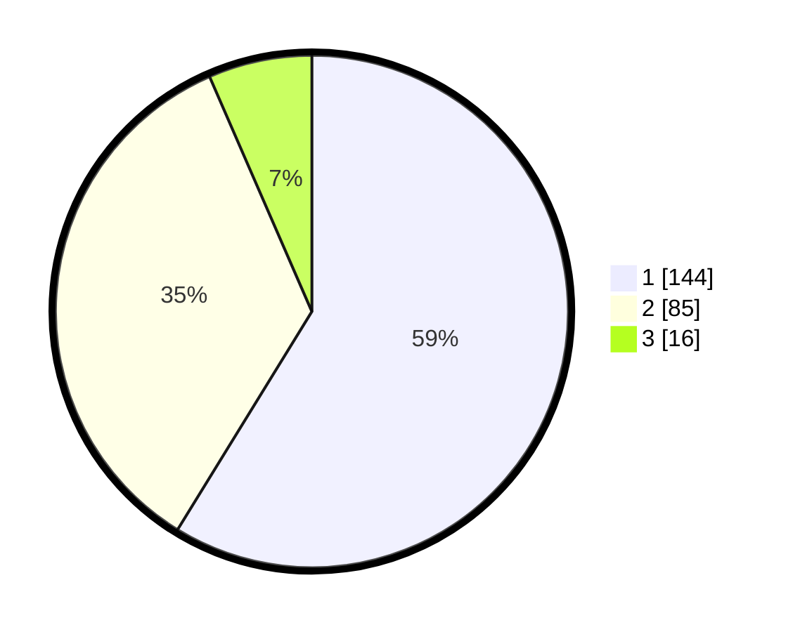

# Hasil

## Grafik

## Tabel

| No. | Nama Paslon    | Suara | Suara (raw) | Persentase |
|:--- |:-------------- | -----:| -----------:| ----------:|
| 1   | ANIES MUHAIMIN | 144   | [144][p-1]  | 58,78      |
| 2   | PRABOWO GIBRAN | 85    | [85][p-2]   | 34,69      |
| 3   | GANJAR MAHFUD  | 16    | [16][p-3]   | 6,53       |

[p-1]: https://github.com/gigit-pemilu/pemilu-2024/blob/main/pilpres/hitung-suara/sub/35-jawa-timur/sub/29-sumenep/sub/09-guluk-guluk/sub/2003-pordapor/sub/008-tps/sub/paslon-1.txt
[p-2]: https://github.com/gigit-pemilu/pemilu-2024/blob/main/pilpres/hitung-suara/sub/35-jawa-timur/sub/29-sumenep/sub/09-guluk-guluk/sub/2003-pordapor/sub/008-tps/sub/paslon-2.txt
[p-3]: https://github.com/gigit-pemilu/pemilu-2024/blob/main/pilpres/hitung-suara/sub/35-jawa-timur/sub/29-sumenep/sub/09-guluk-guluk/sub/2003-pordapor/sub/008-tps/sub/paslon-3.txt

## Foto C Plano

https://sirekap-obj-formc.kpu.go.id/be0b/pemilu/ppwp/35/29/09/20/03/3529092003008-20240225-143425--4731c535-bd3b-485b-bbd7-38ed0a95f2bc.jpg

https://sirekap-obj-formc.kpu.go.id/be0b/pemilu/ppwp/35/29/09/20/03/3529092003008-20240225-143521--0ef2b797-2f0e-49cd-a683-51f430f69ca0.jpg

https://sirekap-obj-formc.kpu.go.id/be0b/pemilu/ppwp/35/29/09/20/03/3529092003008-20240225-143556--e250af1d-22df-4e2a-87de-323680567f52.jpg

## Metadata

| Key        | Value               |
| ---------- | ------------------- |
| Time Stamp | 2024-02-28 20:00:00 |

