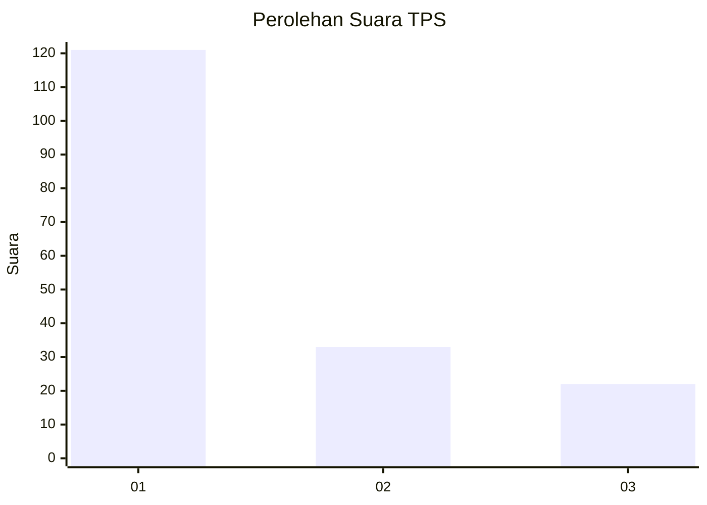
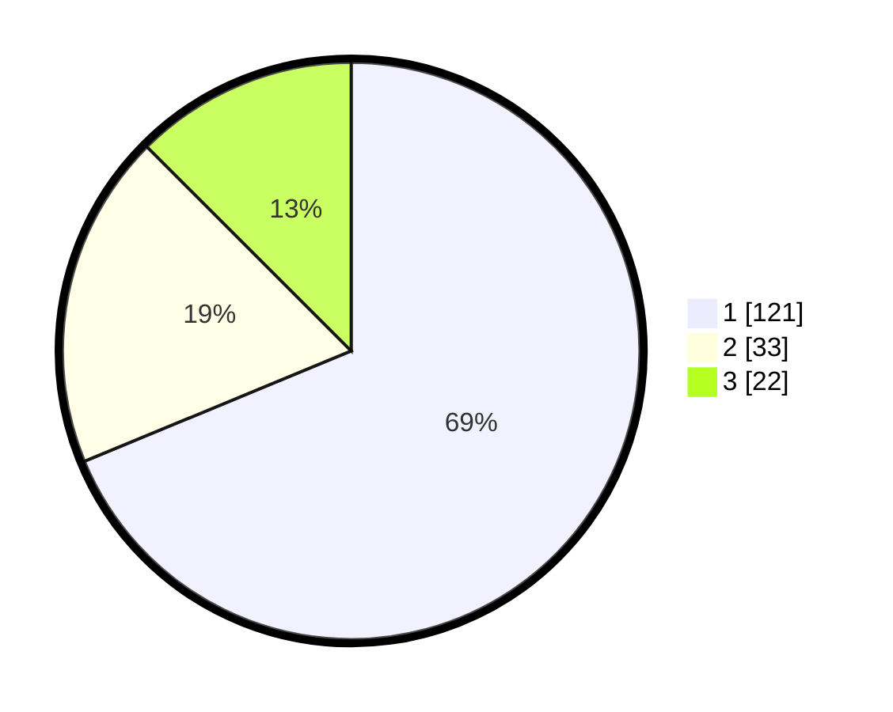

# Hasil

## Grafik

## Tabel

| No. | Nama Paslon    | Suara | Suara (raw) | Persentase |
|:--- |:-------------- | -----:| -----------:| ----------:|
| 1   | ANIES MUHAIMIN | 121   | [121][p-1]  | 68,75      |
| 2   | PRABOWO GIBRAN | 33    | [33][p-2]   | 18,75      |
| 3   | GANJAR MAHFUD  | 22    | [22][p-3]   | 12,50      |

[p-1]: https://github.com/gigit-pemilu/pemilu-2024-35-jawa-timur/blob/main/pilpres/hitung-suara/sub/35-jawa-timur/sub/29-sumenep/sub/09-guluk-guluk/sub/2003-pordapor/sub/009-tps/sub/paslon-1.txt
[p-2]: https://github.com/gigit-pemilu/pemilu-2024-35-jawa-timur/blob/main/pilpres/hitung-suara/sub/35-jawa-timur/sub/29-sumenep/sub/09-guluk-guluk/sub/2003-pordapor/sub/009-tps/sub/paslon-2.txt
[p-3]: https://github.com/gigit-pemilu/pemilu-2024-35-jawa-timur/blob/main/pilpres/hitung-suara/sub/35-jawa-timur/sub/29-sumenep/sub/09-guluk-guluk/sub/2003-pordapor/sub/009-tps/sub/paslon-3.txt

## Foto C Plano

https://sirekap-obj-formc.kpu.go.id/acc8/pemilu/ppwp/35/29/09/20/03/3529092003009-20240225-143713--f43918e1-bfe0-433d-bdd1-07f7fd8dc0ee.jpg

https://sirekap-obj-formc.kpu.go.id/acc8/pemilu/ppwp/35/29/09/20/03/3529092003009-20240225-143805--c2d8fef0-209c-46b6-857c-ceb489dbfbfa.jpg

https://sirekap-obj-formc.kpu.go.id/acc8/pemilu/ppwp/35/29/09/20/03/3529092003009-20240225-143826--f1ec9fce-1237-4aff-80a7-82efc0c42269.jpg

## Metadata

| Key        | Value               |
| ---------- | ------------------- |
| Time Stamp | 2024-02-29 12:00:00 |

