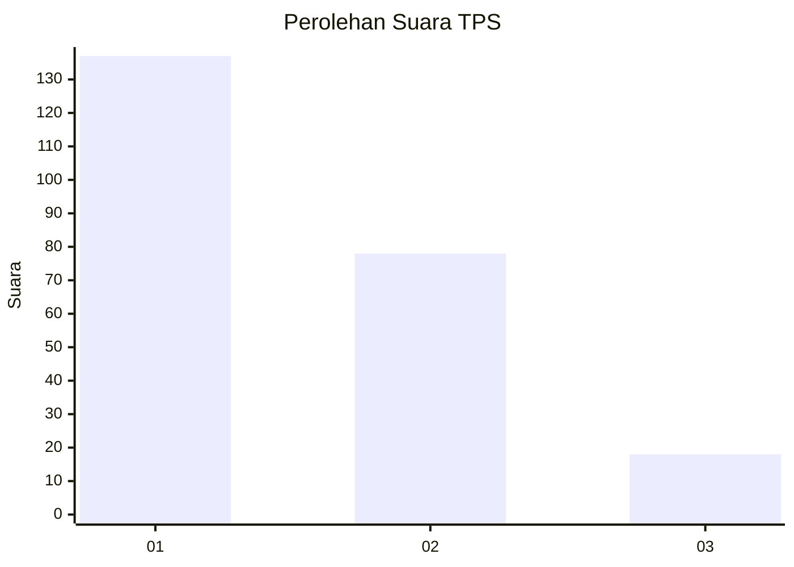
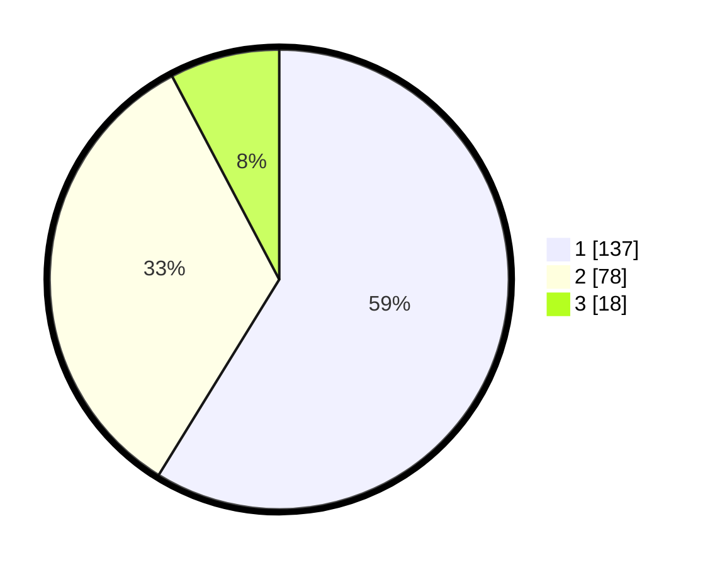

# Hasil

## Grafik

## Tabel

| No. | Nama Paslon    | Suara | Suara (raw) | Persentase |
|:--- |:-------------- | -----:| -----------:| ----------:|
| 1   | ANIES MUHAIMIN | 137   | [137][p-1]  | 58,80      |
| 2   | PRABOWO GIBRAN | 78    | [78][p-2]   | 33,48      |
| 3   | GANJAR MAHFUD  | 18    | [18][p-3]   | 7,73       |

[p-1]: https://github.com/gigit-pemilu/pemilu-2024-35-jawa-timur/blob/main/pilpres/hitung-suara/sub/35-jawa-timur/sub/29-sumenep/sub/09-guluk-guluk/sub/2005-ketawang-laok/sub/002-tps/sub/paslon-1.txt
[p-2]: https://github.com/gigit-pemilu/pemilu-2024-35-jawa-timur/blob/main/pilpres/hitung-suara/sub/35-jawa-timur/sub/29-sumenep/sub/09-guluk-guluk/sub/2005-ketawang-laok/sub/002-tps/sub/paslon-2.txt
[p-3]: https://github.com/gigit-pemilu/pemilu-2024-35-jawa-timur/blob/main/pilpres/hitung-suara/sub/35-jawa-timur/sub/29-sumenep/sub/09-guluk-guluk/sub/2005-ketawang-laok/sub/002-tps/sub/paslon-3.txt

## Foto C Plano

https://sirekap-obj-formc.kpu.go.id/8b83/pemilu/ppwp/35/29/09/20/05/3529092005002-20240224-133124--6c4883e0-be39-45d4-81fe-f33f682defc4.jpg

https://sirekap-obj-formc.kpu.go.id/8b83/pemilu/ppwp/35/29/09/20/05/3529092005002-20240224-133156--d2a970fe-fa52-4750-b6a9-6fa09f3c7421.jpg

https://sirekap-obj-formc.kpu.go.id/8b83/pemilu/ppwp/35/29/09/20/05/3529092005002-20240224-133222--76c37a95-9a1b-4a64-843a-9fd3b04b7505.jpg

## Metadata

| Key        | Value               |
| ---------- | ------------------- |
| Time Stamp | 2024-02-28 22:00:00 |

