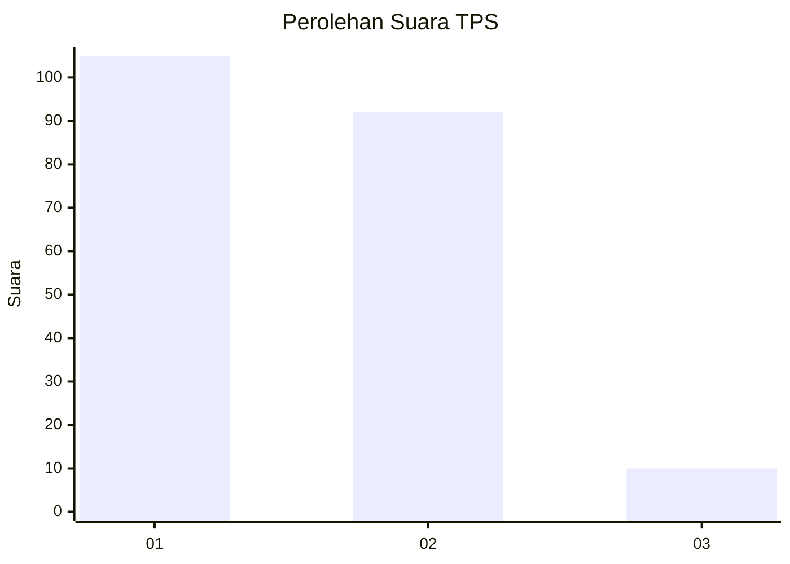
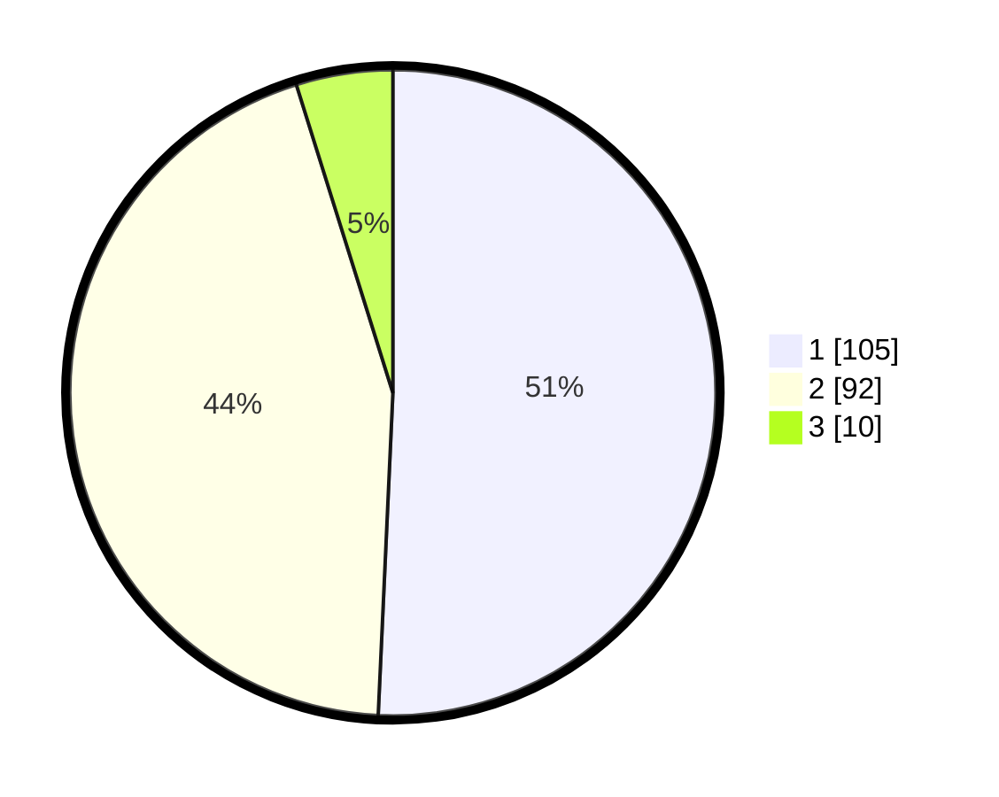

# Hasil

## Grafik

## Tabel

| No. | Nama Paslon    | Suara | Suara (raw) | Persentase |
|:--- |:-------------- | -----:| -----------:| ----------:|
| 1   | ANIES MUHAIMIN | 105   | [105][p-1]  | 50,72      |
| 2   | PRABOWO GIBRAN | 92    | [92][p-2]   | 44,44      |
| 3   | GANJAR MAHFUD  | 10    | [10][p-3]   | 4,83       |

[p-1]: https://github.com/gigit-pemilu/pemilu-2024/blob/main/pilpres/hitung-suara/sub/35-jawa-timur/sub/29-sumenep/sub/09-guluk-guluk/sub/2005-ketawang-laok/sub/004-tps/sub/paslon-1.txt
[p-2]: https://github.com/gigit-pemilu/pemilu-2024/blob/main/pilpres/hitung-suara/sub/35-jawa-timur/sub/29-sumenep/sub/09-guluk-guluk/sub/2005-ketawang-laok/sub/004-tps/sub/paslon-2.txt
[p-3]: https://github.com/gigit-pemilu/pemilu-2024/blob/main/pilpres/hitung-suara/sub/35-jawa-timur/sub/29-sumenep/sub/09-guluk-guluk/sub/2005-ketawang-laok/sub/004-tps/sub/paslon-3.txt

## Foto C Plano

https://sirekap-obj-formc.kpu.go.id/2572/pemilu/ppwp/35/29/09/20/05/3529092005004-20240224-133853--a837cae7-73ed-4457-bdeb-490dacf79082.jpg

https://sirekap-obj-formc.kpu.go.id/2572/pemilu/ppwp/35/29/09/20/05/3529092005004-20240224-133913--1726d73f-41a3-424c-a31a-7abc2aef05d0.jpg

https://sirekap-obj-formc.kpu.go.id/2572/pemilu/ppwp/35/29/09/20/05/3529092005004-20240224-133938--6223f559-507a-4f6b-bd42-d45533e586c3.jpg

## Metadata

| Key        | Value               |
| ---------- | ------------------- |
| Time Stamp | 2024-02-28 19:00:00 |

