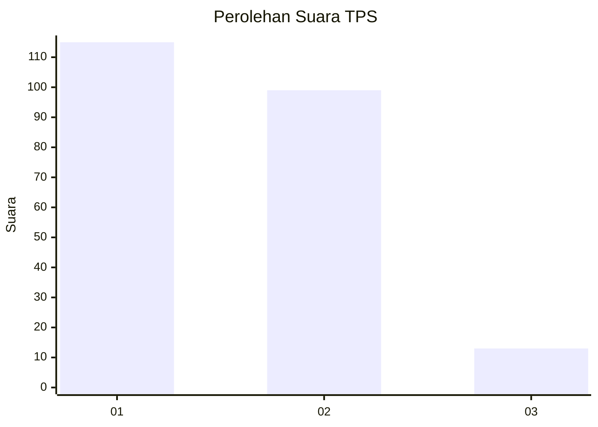
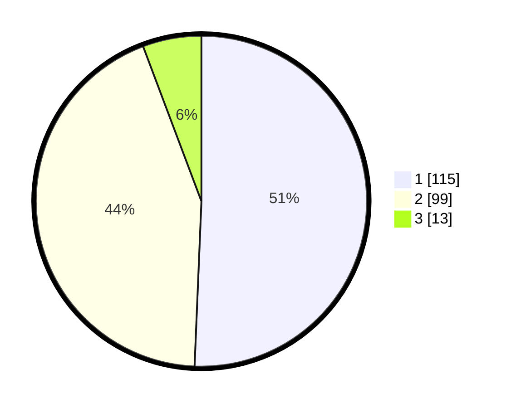

# Hasil

## Grafik

## Tabel

| No. | Nama Paslon    | Suara | Suara (raw) | Persentase |
|:--- |:-------------- | -----:| -----------:| ----------:|
| 1   | ANIES MUHAIMIN | 115   | [115][p-1]  | 50,66      |
| 2   | PRABOWO GIBRAN | 99    | [99][p-2]   | 43,61      |
| 3   | GANJAR MAHFUD  | 13    | [13][p-3]   | 5,73       |

[p-1]: https://github.com/gigit-pemilu/pemilu-2024/blob/main/pilpres/hitung-suara/sub/35-jawa-timur/sub/29-sumenep/sub/09-guluk-guluk/sub/2005-ketawang-laok/sub/005-tps/sub/paslon-1.txt
[p-2]: https://github.com/gigit-pemilu/pemilu-2024/blob/main/pilpres/hitung-suara/sub/35-jawa-timur/sub/29-sumenep/sub/09-guluk-guluk/sub/2005-ketawang-laok/sub/005-tps/sub/paslon-2.txt
[p-3]: https://github.com/gigit-pemilu/pemilu-2024/blob/main/pilpres/hitung-suara/sub/35-jawa-timur/sub/29-sumenep/sub/09-guluk-guluk/sub/2005-ketawang-laok/sub/005-tps/sub/paslon-3.txt

## Foto C Plano

https://sirekap-obj-formc.kpu.go.id/e81b/pemilu/ppwp/35/29/09/20/05/3529092005005-20240224-134115--9255b7db-3738-43a2-ab5f-f7eb57bdbd31.jpg

https://sirekap-obj-formc.kpu.go.id/e81b/pemilu/ppwp/35/29/09/20/05/3529092005005-20240224-134301--50a70e7f-365e-47eb-acf8-a7d26e0e250e.jpg

https://sirekap-obj-formc.kpu.go.id/e81b/pemilu/ppwp/35/29/09/20/05/3529092005005-20240224-134209--ea8a5f93-06b2-4298-aadc-2bcf9b0ef522.jpg

## Metadata

| Key        | Value               |
| ---------- | ------------------- |
| Time Stamp | 2024-02-28 19:00:00 |

