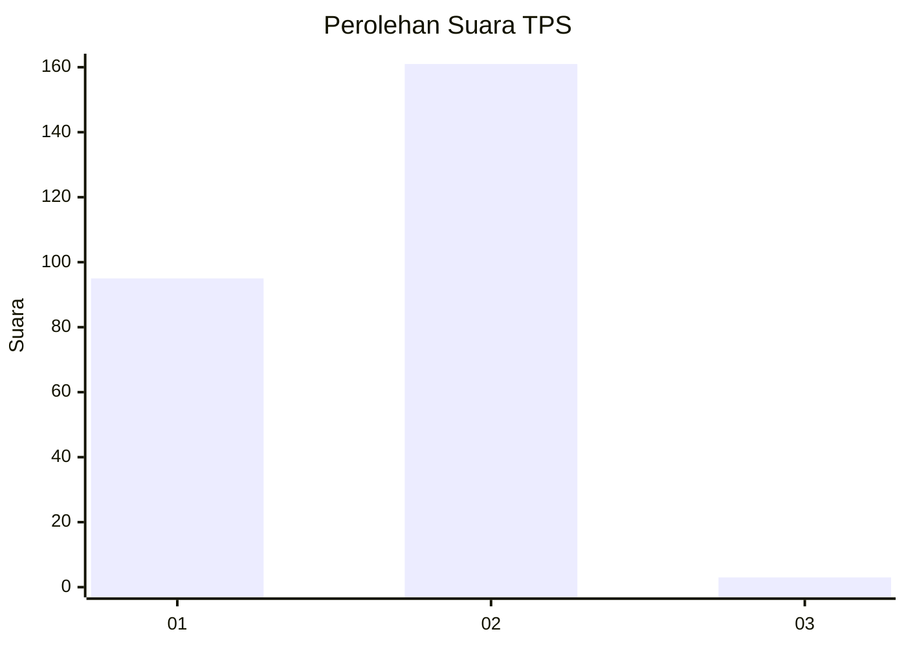
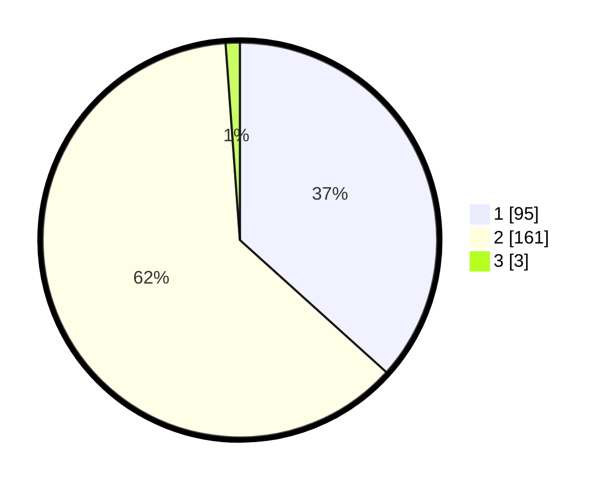

# Hasil

## Grafik

## Tabel

| No. | Nama Paslon    | Suara | Suara (raw) | Persentase |
|:--- |:-------------- | -----:| -----------:| ----------:|
| 1   | ANIES MUHAIMIN | 95    | [95][p-1]   | 36,68      |
| 2   | PRABOWO GIBRAN | 161   | [161][p-2]  | 62,16      |
| 3   | GANJAR MAHFUD  | 3     | [3][p-3]    | 1,16       |

[p-1]: https://github.com/gigit-pemilu/pemilu-2024-35-jawa-timur/blob/main/pilpres/hitung-suara/sub/35-jawa-timur/sub/29-sumenep/sub/09-guluk-guluk/sub/2005-ketawang-laok/sub/006-tps/sub/paslon-1.txt
[p-2]: https://github.com/gigit-pemilu/pemilu-2024-35-jawa-timur/blob/main/pilpres/hitung-suara/sub/35-jawa-timur/sub/29-sumenep/sub/09-guluk-guluk/sub/2005-ketawang-laok/sub/006-tps/sub/paslon-2.txt
[p-3]: https://github.com/gigit-pemilu/pemilu-2024-35-jawa-timur/blob/main/pilpres/hitung-suara/sub/35-jawa-timur/sub/29-sumenep/sub/09-guluk-guluk/sub/2005-ketawang-laok/sub/006-tps/sub/paslon-3.txt

## Foto C Plano

https://sirekap-obj-formc.kpu.go.id/b983/pemilu/ppwp/35/29/09/20/05/3529092005006-20240224-134542--2a7856a4-e4f8-415a-8376-0e8d53fcfa07.jpg

https://sirekap-obj-formc.kpu.go.id/b983/pemilu/ppwp/35/29/09/20/05/3529092005006-20240224-134427--93ed1ea0-3073-4dad-a8ca-acb4179b7446.jpg

https://sirekap-obj-formc.kpu.go.id/b983/pemilu/ppwp/35/29/09/20/05/3529092005006-20240224-134450--690faad7-37a1-4e46-887b-0877e05789de.jpg

## Metadata

| Key        | Value               |
| ---------- | ------------------- |
| Time Stamp | 2024-02-28 21:00:00 |

