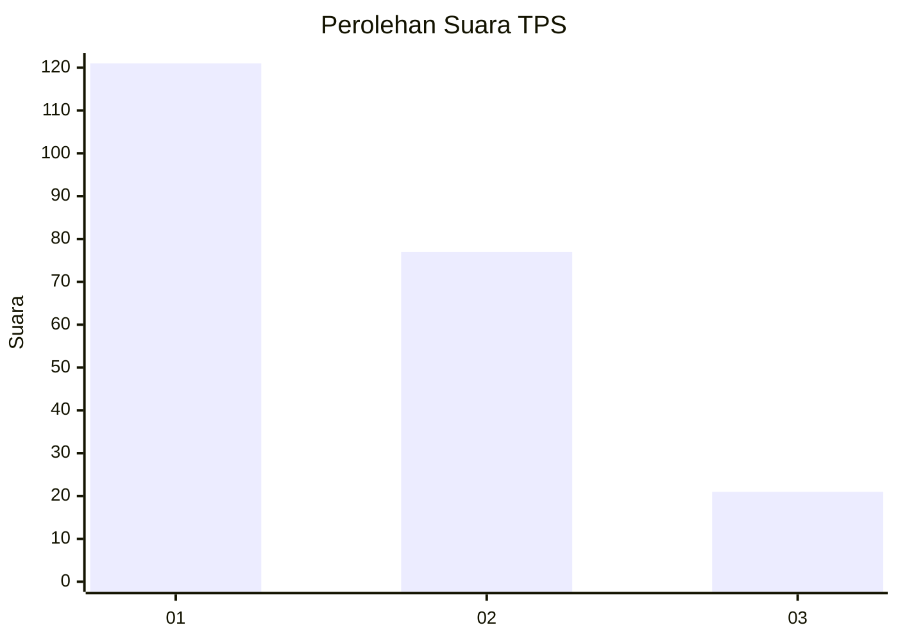
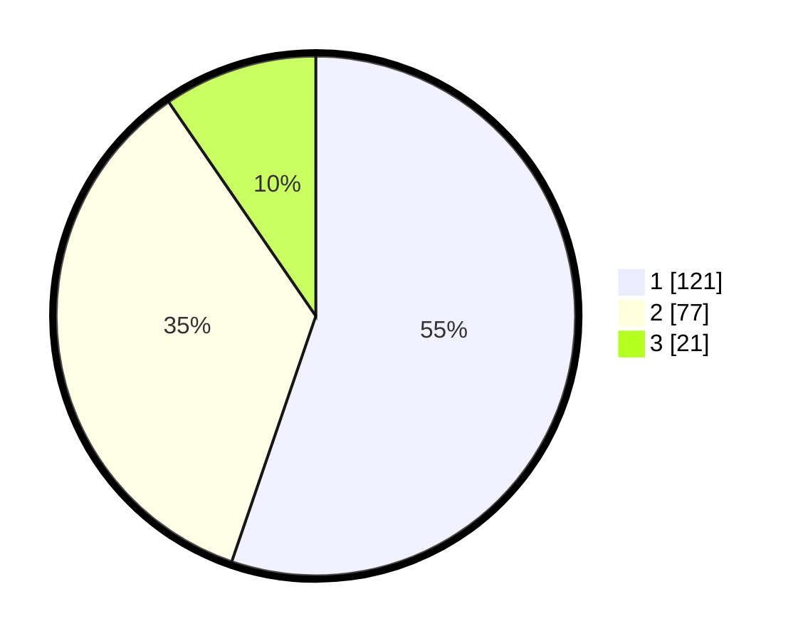

# Hasil

## Grafik

## Tabel

| No. | Nama Paslon    | Suara | Suara (raw) | Persentase |
|:--- |:-------------- | -----:| -----------:| ----------:|
| 1   | ANIES MUHAIMIN | 121   | [121][p-1]  | 55,25      |
| 2   | PRABOWO GIBRAN | 77    | [77][p-2]   | 35,16      |
| 3   | GANJAR MAHFUD  | 21    | [21][p-3]   | 9,59       |

[p-1]: https://github.com/gigit-pemilu/pemilu-2024/blob/main/pilpres/hitung-suara/sub/35-jawa-timur/sub/29-sumenep/sub/09-guluk-guluk/sub/2007-bragung/sub/001-tps/sub/paslon-1.txt
[p-2]: https://github.com/gigit-pemilu/pemilu-2024/blob/main/pilpres/hitung-suara/sub/35-jawa-timur/sub/29-sumenep/sub/09-guluk-guluk/sub/2007-bragung/sub/001-tps/sub/paslon-2.txt
[p-3]: https://github.com/gigit-pemilu/pemilu-2024/blob/main/pilpres/hitung-suara/sub/35-jawa-timur/sub/29-sumenep/sub/09-guluk-guluk/sub/2007-bragung/sub/001-tps/sub/paslon-3.txt

## Foto C Plano

https://sirekap-obj-formc.kpu.go.id/4d68/pemilu/ppwp/35/29/09/20/07/3529092007001-20240225-202614--a7011bc8-8c51-404f-a0bf-420143106e28.jpg

https://sirekap-obj-formc.kpu.go.id/4d68/pemilu/ppwp/35/29/09/20/07/3529092007001-20240225-202706--da35b91f-36bf-438b-a1ff-247673007aaf.jpg

https://sirekap-obj-formc.kpu.go.id/4d68/pemilu/ppwp/35/29/09/20/07/3529092007001-20240225-202804--3bc55c87-7b6c-4a58-b89e-1d1c4a3106e0.jpg

## Metadata

| Key        | Value               |
| ---------- | ------------------- |
| Time Stamp | 2024-02-28 19:00:00 |

