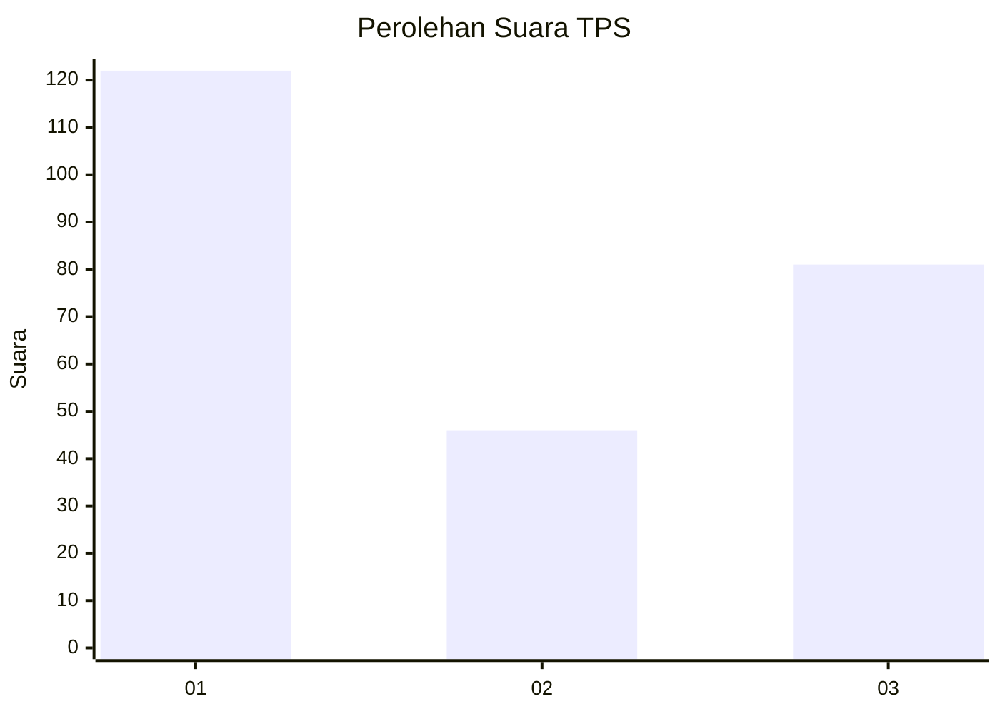
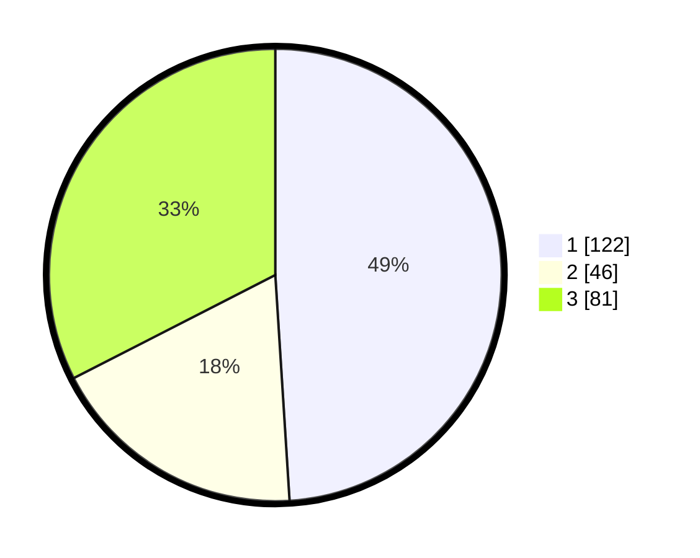

# Hasil

## Grafik

## Tabel

| No. | Nama Paslon    | Suara | Suara (raw) | Persentase |
|:--- |:-------------- | -----:| -----------:| ----------:|
| 1   | ANIES MUHAIMIN | 122   | [122][p-1]  | 49,00      |
| 2   | PRABOWO GIBRAN | 46    | [46][p-2]   | 18,47      |
| 3   | GANJAR MAHFUD  | 81    | [81][p-3]   | 32,53      |

[p-1]: https://github.com/gigit-pemilu/pemilu-2024/blob/main/pilpres/hitung-suara/sub/35-jawa-timur/sub/29-sumenep/sub/09-guluk-guluk/sub/2007-bragung/sub/002-tps/sub/paslon-1.txt
[p-2]: https://github.com/gigit-pemilu/pemilu-2024/blob/main/pilpres/hitung-suara/sub/35-jawa-timur/sub/29-sumenep/sub/09-guluk-guluk/sub/2007-bragung/sub/002-tps/sub/paslon-2.txt
[p-3]: https://github.com/gigit-pemilu/pemilu-2024/blob/main/pilpres/hitung-suara/sub/35-jawa-timur/sub/29-sumenep/sub/09-guluk-guluk/sub/2007-bragung/sub/002-tps/sub/paslon-3.txt

## Foto C Plano

https://sirekap-obj-formc.kpu.go.id/df43/pemilu/ppwp/35/29/09/20/07/3529092007002-20240225-205037--9dbae699-f60f-4121-9e41-69a0742b417a.jpg

https://sirekap-obj-formc.kpu.go.id/df43/pemilu/ppwp/35/29/09/20/07/3529092007002-20240225-205110--e3ea5a3a-878e-4d0c-b521-23d0201f8a2c.jpg

https://sirekap-obj-formc.kpu.go.id/df43/pemilu/ppwp/35/29/09/20/07/3529092007002-20240225-205515--e8114199-106f-44fb-a2e1-52ed5c8ef1a0.jpg

## Metadata

| Key        | Value               |
| ---------- | ------------------- |
| Time Stamp | 2024-02-28 21:00:00 |

