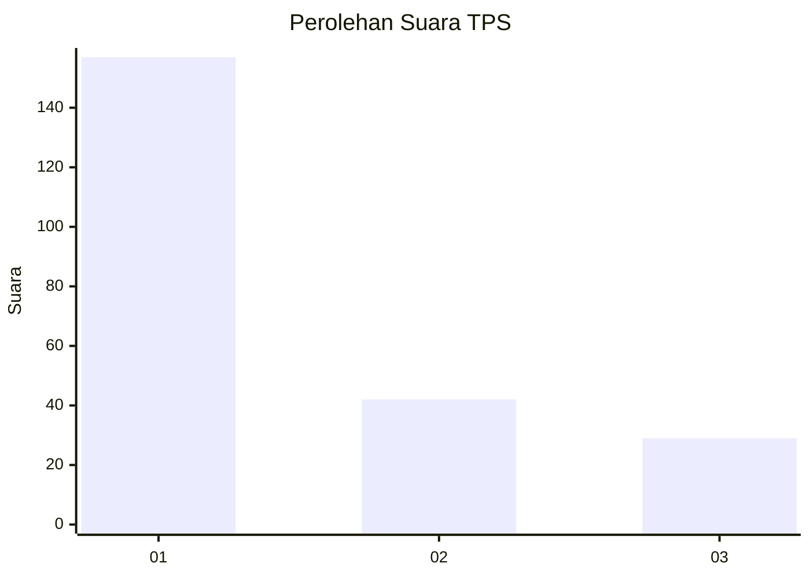
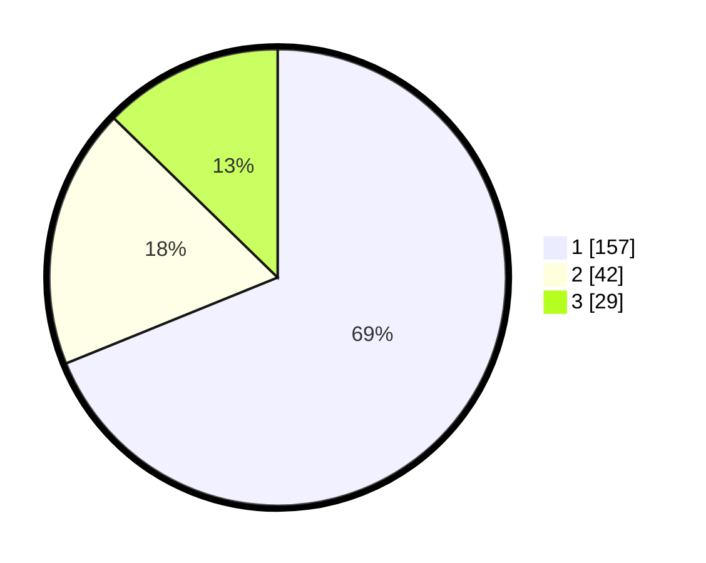

# Hasil

## Grafik

## Tabel

| No. | Nama Paslon    | Suara | Suara (raw) | Persentase |
|:--- |:-------------- | -----:| -----------:| ----------:|
| 1   | ANIES MUHAIMIN | 157   | [157][p-1]  | 68,86      |
| 2   | PRABOWO GIBRAN | 42    | [42][p-2]   | 18,42      |
| 3   | GANJAR MAHFUD  | 29    | [29][p-3]   | 12,72      |

[p-1]: https://github.com/gigit-pemilu/pemilu-2024/blob/main/pilpres/hitung-suara/sub/35-jawa-timur/sub/29-sumenep/sub/09-guluk-guluk/sub/2007-bragung/sub/003-tps/sub/paslon-1.txt
[p-2]: https://github.com/gigit-pemilu/pemilu-2024/blob/main/pilpres/hitung-suara/sub/35-jawa-timur/sub/29-sumenep/sub/09-guluk-guluk/sub/2007-bragung/sub/003-tps/sub/paslon-2.txt
[p-3]: https://github.com/gigit-pemilu/pemilu-2024/blob/main/pilpres/hitung-suara/sub/35-jawa-timur/sub/29-sumenep/sub/09-guluk-guluk/sub/2007-bragung/sub/003-tps/sub/paslon-3.txt

## Foto C Plano

https://sirekap-obj-formc.kpu.go.id/66cf/pemilu/ppwp/35/29/09/20/07/3529092007003-20240225-211242--fc1efd29-21a3-4763-bf62-45475e236f84.jpg

https://sirekap-obj-formc.kpu.go.id/66cf/pemilu/ppwp/35/29/09/20/07/3529092007003-20240225-211309--6636509b-bada-4901-97e9-4f532f08368d.jpg

https://sirekap-obj-formc.kpu.go.id/66cf/pemilu/ppwp/35/29/09/20/07/3529092007003-20240225-211359--029fac3e-395e-4e55-834a-46c8317ca984.jpg

## Metadata

| Key        | Value               |
| ---------- | ------------------- |
| Time Stamp | 2024-03-01 16:00:00 |

