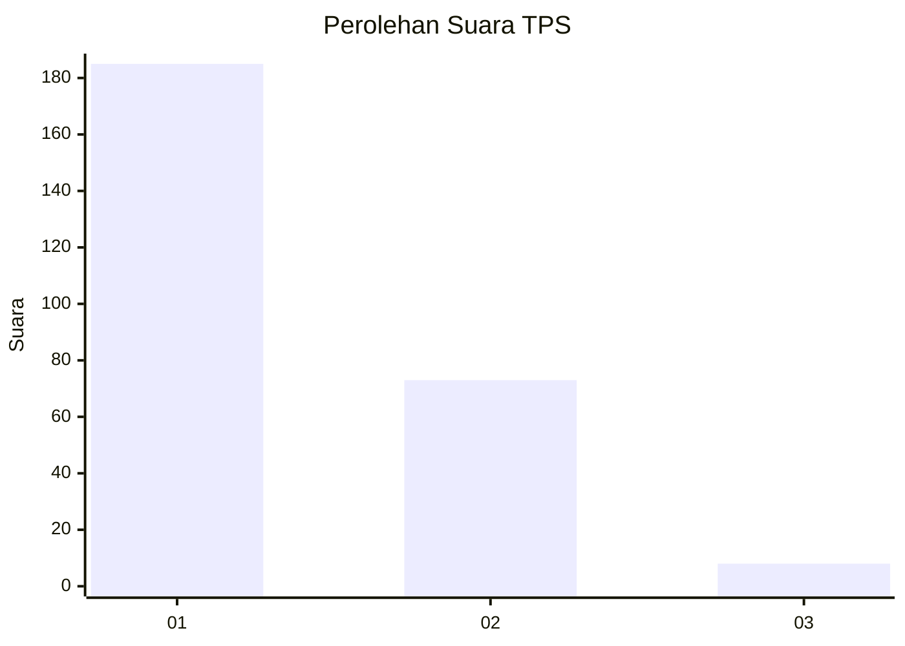
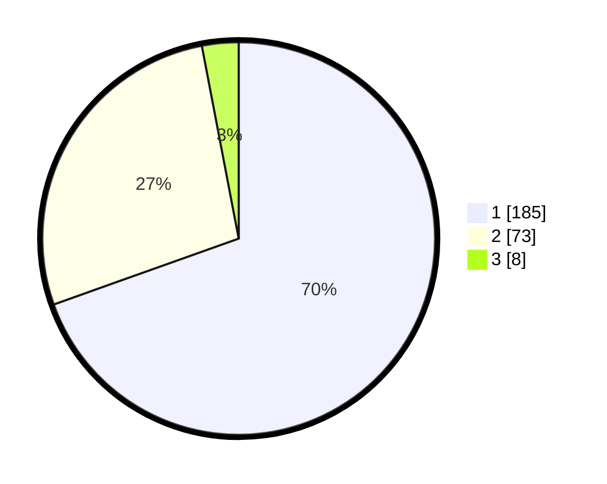

# Hasil

## Grafik

## Tabel

| No. | Nama Paslon    | Suara | Suara (raw) | Persentase |
|:--- |:-------------- | -----:| -----------:| ----------:|
| 1   | ANIES MUHAIMIN | 185   | [185][p-1]  | 69,55      |
| 2   | PRABOWO GIBRAN | 73    | [73][p-2]   | 27,44      |
| 3   | GANJAR MAHFUD  | 8     | [8][p-3]    | 3,01       |

[p-1]: https://github.com/gigit-pemilu/pemilu-2024-35-jawa-timur/blob/main/pilpres/hitung-suara/sub/35-jawa-timur/sub/29-sumenep/sub/09-guluk-guluk/sub/2007-bragung/sub/004-tps/sub/paslon-1.txt
[p-2]: https://github.com/gigit-pemilu/pemilu-2024-35-jawa-timur/blob/main/pilpres/hitung-suara/sub/35-jawa-timur/sub/29-sumenep/sub/09-guluk-guluk/sub/2007-bragung/sub/004-tps/sub/paslon-2.txt
[p-3]: https://github.com/gigit-pemilu/pemilu-2024-35-jawa-timur/blob/main/pilpres/hitung-suara/sub/35-jawa-timur/sub/29-sumenep/sub/09-guluk-guluk/sub/2007-bragung/sub/004-tps/sub/paslon-3.txt

## Foto C Plano

https://sirekap-obj-formc.kpu.go.id/9577/pemilu/ppwp/35/29/09/20/07/3529092007004-20240225-213211--4130c363-f7f8-47f2-8cc8-982681c5fe10.jpg

https://sirekap-obj-formc.kpu.go.id/9577/pemilu/ppwp/35/29/09/20/07/3529092007004-20240225-213247--5945ef2b-6bb5-4710-9f03-68919e6e7958.jpg

https://sirekap-obj-formc.kpu.go.id/9577/pemilu/ppwp/35/29/09/20/07/3529092007004-20240225-213322--60ccf8c1-d808-4644-a378-59b2033351ff.jpg

## Metadata

| Key        | Value               |
| ---------- | ------------------- |
| Time Stamp | 2024-02-28 19:00:00 |

