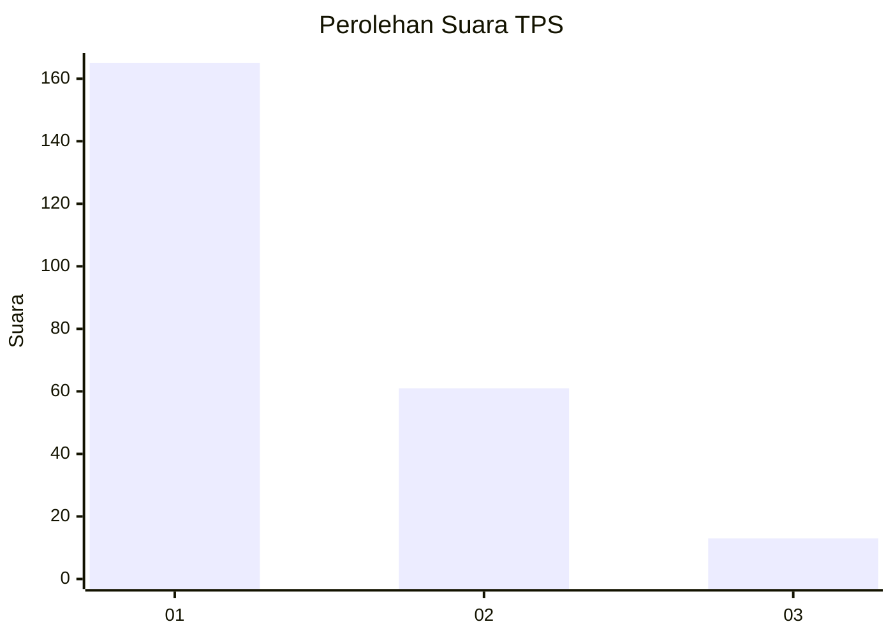
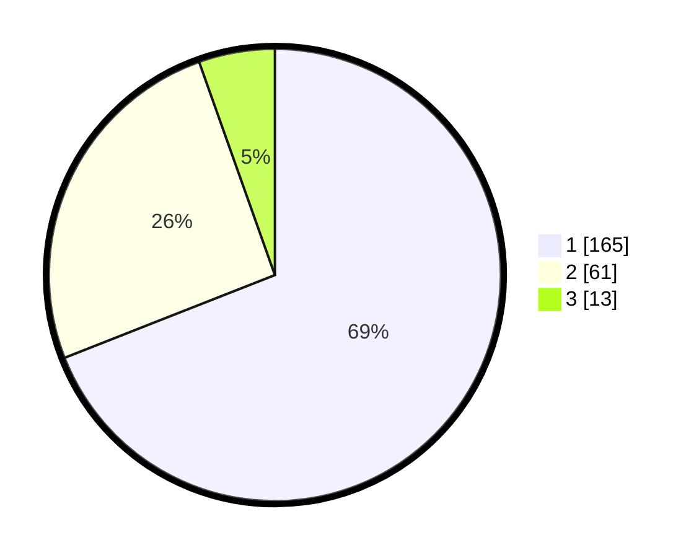

# Hasil

## Grafik

## Tabel

| No. | Nama Paslon    | Suara | Suara (raw) | Persentase |
|:--- |:-------------- | -----:| -----------:| ----------:|
| 1   | ANIES MUHAIMIN | 165   | [165][p-1]  | 69,04      |
| 2   | PRABOWO GIBRAN | 61    | [61][p-2]   | 25,52      |
| 3   | GANJAR MAHFUD  | 13    | [13][p-3]   | 5,44       |

[p-1]: https://github.com/gigit-pemilu/pemilu-2024/blob/main/pilpres/hitung-suara/sub/35-jawa-timur/sub/29-sumenep/sub/09-guluk-guluk/sub/2007-bragung/sub/005-tps/sub/paslon-1.txt
[p-2]: https://github.com/gigit-pemilu/pemilu-2024/blob/main/pilpres/hitung-suara/sub/35-jawa-timur/sub/29-sumenep/sub/09-guluk-guluk/sub/2007-bragung/sub/005-tps/sub/paslon-2.txt
[p-3]: https://github.com/gigit-pemilu/pemilu-2024/blob/main/pilpres/hitung-suara/sub/35-jawa-timur/sub/29-sumenep/sub/09-guluk-guluk/sub/2007-bragung/sub/005-tps/sub/paslon-3.txt

## Foto C Plano

https://sirekap-obj-formc.kpu.go.id/ca21/pemilu/ppwp/35/29/09/20/07/3529092007005-20240225-215016--88d21c5e-3cce-476a-a5b4-081f9d67cc90.jpg

https://sirekap-obj-formc.kpu.go.id/ca21/pemilu/ppwp/35/29/09/20/07/3529092007005-20240225-215122--1185b48f-4dc7-4bda-87ae-17d6b94286d4.jpg

https://sirekap-obj-formc.kpu.go.id/ca21/pemilu/ppwp/35/29/09/20/07/3529092007005-20240225-215158--eeba6d3e-c9d1-4d6b-91c8-e9b69ce7dba3.jpg

## Metadata

| Key        | Value               |
| ---------- | ------------------- |
| Time Stamp | 2024-02-28 19:00:00 |

