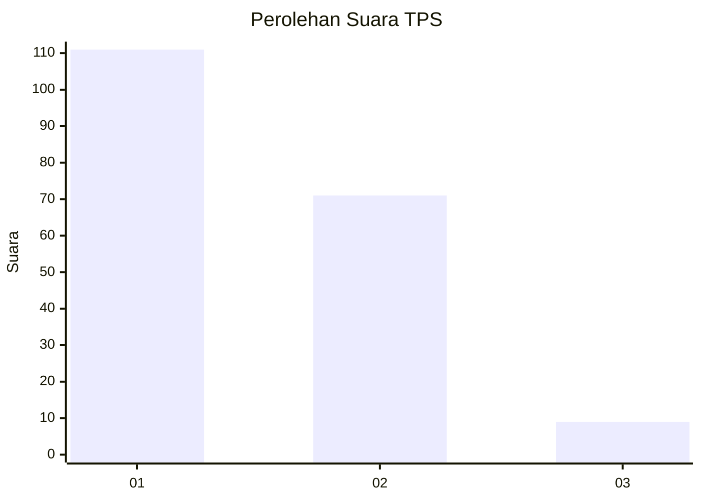
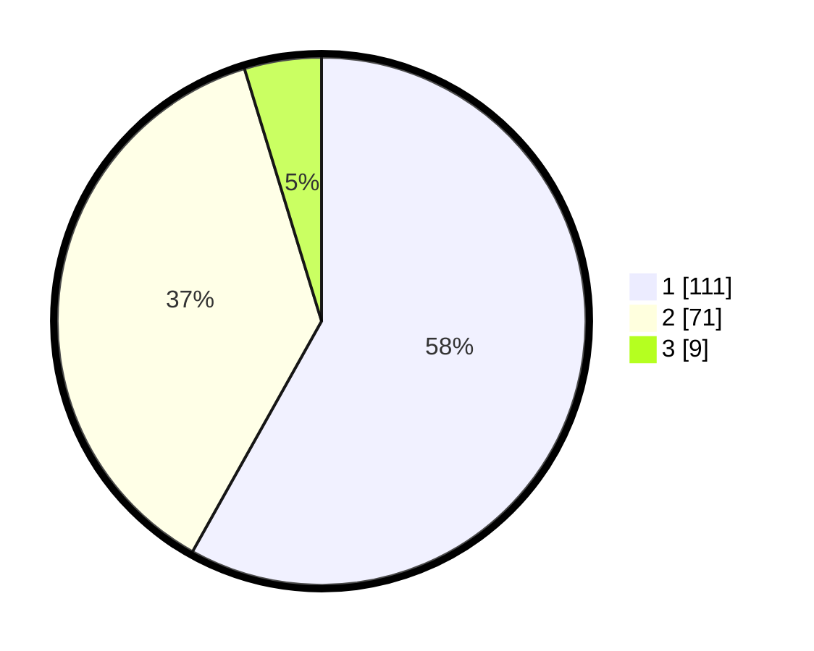

# Hasil

## Grafik

## Tabel

| No. | Nama Paslon    | Suara | Suara (raw) | Persentase |
|:--- |:-------------- | -----:| -----------:| ----------:|
| 1   | ANIES MUHAIMIN | 111   | [111][p-1]  | 58,12      |
| 2   | PRABOWO GIBRAN | 71    | [71][p-2]   | 37,17      |
| 3   | GANJAR MAHFUD  | 9     | [9][p-3]    | 4,71       |

[p-1]: https://github.com/gigit-pemilu/pemilu-2024-35-jawa-timur/blob/main/pilpres/hitung-suara/sub/35-jawa-timur/sub/29-sumenep/sub/09-guluk-guluk/sub/2007-bragung/sub/006-tps/sub/paslon-1.txt
[p-2]: https://github.com/gigit-pemilu/pemilu-2024-35-jawa-timur/blob/main/pilpres/hitung-suara/sub/35-jawa-timur/sub/29-sumenep/sub/09-guluk-guluk/sub/2007-bragung/sub/006-tps/sub/paslon-2.txt
[p-3]: https://github.com/gigit-pemilu/pemilu-2024-35-jawa-timur/blob/main/pilpres/hitung-suara/sub/35-jawa-timur/sub/29-sumenep/sub/09-guluk-guluk/sub/2007-bragung/sub/006-tps/sub/paslon-3.txt

## Foto C Plano

https://sirekap-obj-formc.kpu.go.id/64b3/pemilu/ppwp/35/29/09/20/07/3529092007006-20240225-220701--a8f0f35f-c251-4a7a-8d97-464c36974a7d.jpg

https://sirekap-obj-formc.kpu.go.id/64b3/pemilu/ppwp/35/29/09/20/07/3529092007006-20240225-220552--9ca9a8ef-3a98-4735-81db-936ca49cc9da.jpg

https://sirekap-obj-formc.kpu.go.id/64b3/pemilu/ppwp/35/29/09/20/07/3529092007006-20240225-220739--a7047e3a-0a85-4baa-a464-6184592b11d3.jpg

## Metadata

| Key        | Value               |
| ---------- | ------------------- |
| Time Stamp | 2024-02-28 19:00:00 |

