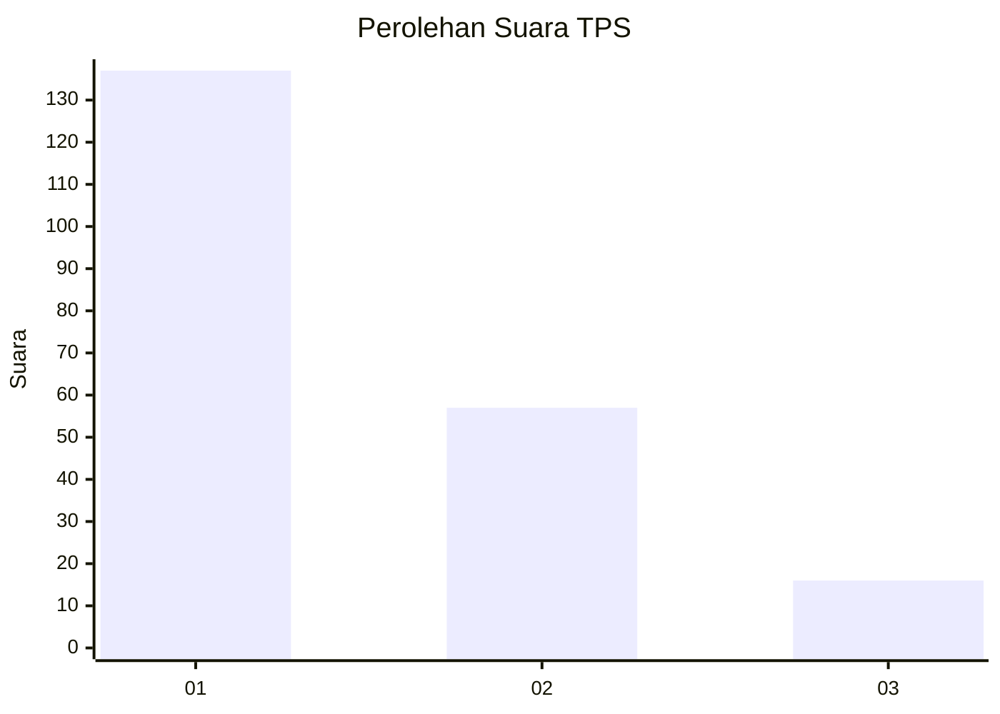
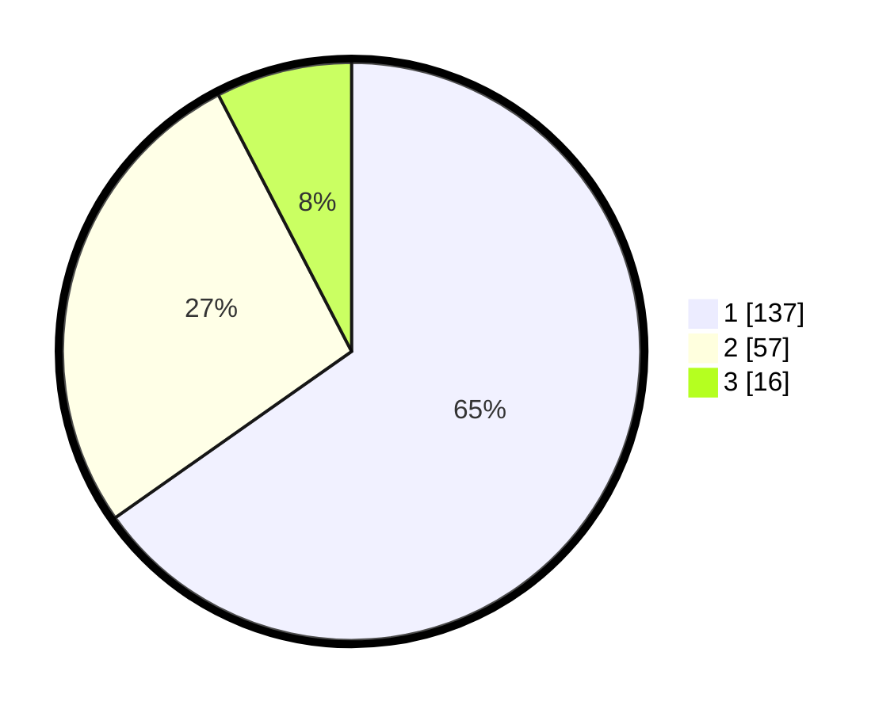

# Hasil

## Grafik

## Tabel

| No. | Nama Paslon    | Suara | Suara (raw) | Persentase |
|:--- |:-------------- | -----:| -----------:| ----------:|
| 1   | ANIES MUHAIMIN | 137   | [137][p-1]  | 65,24      |
| 2   | PRABOWO GIBRAN | 57    | [57][p-2]   | 27,14      |
| 3   | GANJAR MAHFUD  | 16    | [16][p-3]   | 7,62       |

[p-1]: https://github.com/gigit-pemilu/pemilu-2024/blob/main/pilpres/hitung-suara/sub/35-jawa-timur/sub/29-sumenep/sub/09-guluk-guluk/sub/2007-bragung/sub/011-tps/sub/paslon-1.txt
[p-2]: https://github.com/gigit-pemilu/pemilu-2024/blob/main/pilpres/hitung-suara/sub/35-jawa-timur/sub/29-sumenep/sub/09-guluk-guluk/sub/2007-bragung/sub/011-tps/sub/paslon-2.txt
[p-3]: https://github.com/gigit-pemilu/pemilu-2024/blob/main/pilpres/hitung-suara/sub/35-jawa-timur/sub/29-sumenep/sub/09-guluk-guluk/sub/2007-bragung/sub/011-tps/sub/paslon-3.txt

## Foto C Plano

https://sirekap-obj-formc.kpu.go.id/6346/pemilu/ppwp/35/29/09/20/07/3529092007011-20240225-210111--dc0f72fb-4456-4805-b18b-66acd28d9491.jpg

https://sirekap-obj-formc.kpu.go.id/6346/pemilu/ppwp/35/29/09/20/07/3529092007011-20240225-210227--85b087a2-7496-402d-9a7c-3c7adb4eda93.jpg

https://sirekap-obj-formc.kpu.go.id/6346/pemilu/ppwp/35/29/09/20/07/3529092007011-20240225-210321--7aacaf69-cb6d-417e-8c2c-22823d7a4aa1.jpg

## Metadata

| Key        | Value               |
| ---------- | ------------------- |
| Time Stamp | 2024-02-28 19:00:00 |

